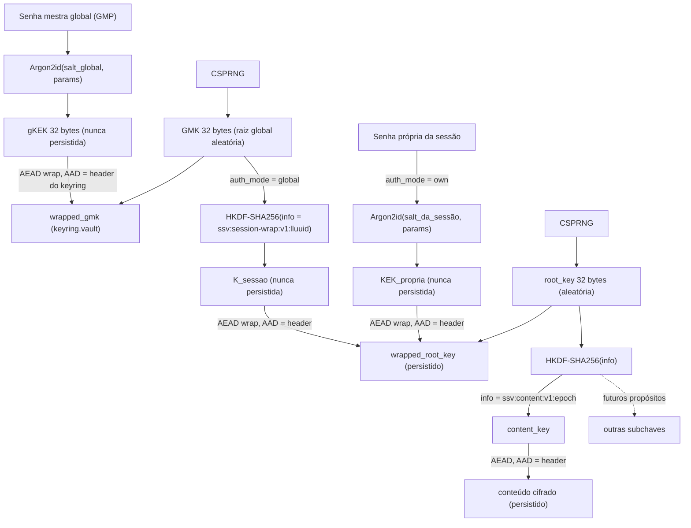

# Formato Criptográfico Versionado — Design (candidato)

**Spec:** [crypto-format/spec.md](./spec.md)
**Status:** Draft — primitivos candidatos, parâmetros provisórios
**Escopo deste design:** apenas o que a fatia **Sessões + desbloqueio** (VAULT-01…05) precisa: KDF, hierarquia de chaves, keyring global (GMP→gKEK→GMK, GKEY-01/02 — atende VAULT-05), envelope autenticado de sessão por `auth_mode` e rotação por reenvelope. Campos de sincronização (INTEG-01) ficam para quando a feature de sync entrar.

> **Aviso de bloqueio (modelo de ameaças §11):** os *parâmetros numéricos* do KDF e a decisão *final* de AEAD/nonce estão presos a PT-01/PT-02. Este design fixa **candidatos** para destravar a implementação; nada aqui certifica os controles. Os valores marcados `⚠️ PT-01`/`⚠️ PT-02` serão revisados após os protótipos.

---

## Primitivos candidatos

| Papel | Escolha candidata | Crate candidata (RustCrypto) | Bloqueio |
| --- | --- | --- | --- |
| KDF memory-hard (senha → KEK) | **Argon2id** | `argon2` | ⚠️ PT-01 (params) |
| AEAD (wrap e conteúdo) | **XChaCha20-Poly1305** | `chacha20poly1305` | ⚠️ PT-02 (nonce/misuse) |
| KDF de expansão (root → subchaves) | **HKDF-SHA-256** | `hkdf` + `sha2` | — |
| Zeroização | `Zeroizing`/`Zeroize` | `zeroize` | — |
| Aleatoriedade | CSPRNG do SO | `getrandom` / `OsRng` | — |
| Serialização do envelope | **CBOR** (self-describing → forward-compat) | `ciborium` + `serde` | ⚠️ §12 #4 (layout) |
| UUID de sessão | v4 aleatório | `uuid` | — |
| Erros | tipados, sem vazar segredo | `thiserror` | — |

**Por que XChaCha20-Poly1305 como candidato:** nonce de 192 bits torna o nonce aleatório seguro por construção (evita reuso catastrófico do GCM), simplificando AEAD-02. AES-256-GCM permanece como alternativa se PT-02/FIPS exigir. **Por que CBOR:** self-describing facilita forward-compat de campos desconhecidos (FMT-03) e migração (FMT-02).

---

## Hierarquia de chaves



- **gKEK** deriva da GMP + `salt_global` (Argon2id); nunca é persistida. Envolve a **GMK** aleatória no `keyring.vault` (GKEY-01, C-01/C-02/C-03).
- **Chave de envelopamento da root_key** depende do `auth_mode` (GKEY-02): em `global`, `K_sessao = HKDF(GMK, "ssv:session-wrap:v1:" ‖ session_uuid)`; em `own`, `KEK_propria = Argon2id(senha_propria, salt_da_sessão)`. Nenhuma é persistida.
- **root_key** é aleatória e independente da senha/GMK; é a raiz de tudo daquela sessão (KEY-01, C-01/C-03).
- **Subchaves** derivam da root_key por HKDF com rótulo de propósito + época; nunca se reutiliza chave entre propósitos (KEY-02).
- **Isolamento (VAULT-03/KEY-01), qualificado por `auth_mode`:** sessões `own` têm salt, chave própria, root_key e arquivo próprios — desbloquear uma não fornece material para outra (isolamento total). Sessões `global` têm root_key e arquivo próprios, mas compartilham o **domínio de confiança da GMP**: sob a GMK abrem em conjunto no desbloqueio do app. Comprometer a GMP expõe todas as sessões `global`; sessões `own` mantêm isolamento (consequência aceita — ver D-03/D-04 em ../ui-screens/context.md).

---

## Keyring global (`keyring.vault`)

Envelope CBOR autenticado que guarda a raiz global. Estrutura lógica, análoga ao vault:

```
KeyringEnvelope {
  header: KeyringHeader,          // autenticado como AAD do wrap
  gmk_wrap: { nonce, ciphertext } // wrapped_gmk = AEAD(gKEK, GMK, aad = header_bytes)
}

KeyringHeader {
  magic: "SSGK",                  // rejeita arquivo não-keyring
  format_version: u16,            // FMT-01; versionado como o vault
  kdf: { id: u8=Argon2id, mem_kib, iters, parallelism },  // ⚠️ PT-01
  salt_global: [u8;16],           // salt do Argon2id da GMP
  aead_id: u8 = XChaCha20Poly1305
}
```

- **gKEK ← Argon2id(GMP, salt_global)**; nunca persistida (GKEY-01).
- **GMK** aleatória (independente da GMP); persistida apenas como `wrapped_gmk`. GMK/gKEK nunca em claro.
- **Prova da GMP:** sem verificador barato; verificar = derivar gKEK e tentar *unwrap* da GMK (falha de autenticação ⇒ GMP errada), simétrico à prova de senha do vault.
- **AAD = bytes canônicos do `KeyringHeader`**: alterar versão, params de KDF ou `salt_global` quebra a autenticação.

### Fluxos globais

- **App-unlock:** deriva gKEK ← GMP, *unwrap* da GMK; em seguida, para cada sessão `auth_mode = global`, deriva `K_sessao = HKDF(GMK, uuid)` e *unwrap* da `root_key` (todas abrem em conjunto). Sessões `auth_mode = own` permanecem bloqueadas até a senha própria de cada uma.
- **Troca de GMP:** *unwrap* da GMK com a GMP atual, gera novo `salt_global`, deriva gKEK' e re-*wrap* da **mesma** GMK; grava o keyring atomicamente. As sessões e seus conteúdos não mudam (nenhum `<uuid>.vault` é reescrito).
- **Alternância `global`↔`own` de uma sessão:** reenvelope só da `root_key` daquela sessão (mesma mecânica de ROT-01), exigindo a chave de origem apropriada (GMK para sair de `global`; senha própria para sair de `own`), atualizando `auth_mode` no header e regravando o `<uuid>.vault`.

---

## Formato do arquivo de cofre (`<uuid>.vault`)

Um envelope CBOR versionado. Estrutura lógica:

```
VaultEnvelope {
  header: Header,                 // autenticado como AAD em TODA operação AEAD
  key_wrap: { nonce, ciphertext } // AEAD(KEK, root_key, aad = header_bytes)
  payload:  { nonce, ciphertext } // AEAD(content_key, session_content, aad = header_bytes)
}

Header {
  magic: "SSV1",                  // rejeita arquivo não-cofre
  format_version: u16,            // FMT-01; incrementa a cada mudança de formato
  session_uuid: [u8;16],          // vinculado à AAD (isolamento/anti-troca de arquivo)
  auth_mode: u8,                  // GKEY-02; global|own — define como a root_key é envolvida; entra na AAD (anti-rebaixamento)
  kdf: { id: u8=Argon2id, mem_kib, iters, parallelism },  // ⚠️ PT-01 (só usado em auth_mode = own)
  salt: [u8;16],                  // por sessão (só usado em auth_mode = own)
  aead_id: u8 = XChaCha20Poly1305,
  epoch: u32,                     // ROT-01; época corrente da chave de conteúdo
  session_name: String            // cópia autenticada do nome → verificada no unlock
}
```

- **AAD = bytes canônicos do `header`.** Qualquer alteração em versão, UUID, `auth_mode`, params de KDF, época ou nome quebra a autenticação (AEAD-01). Como `auth_mode` está na AAD, rebaixar `own`→`global` (sem a GMK) ou `global`→`own` (sem a senha própria) falha na autenticação do wrap.
- **Wrap condicional da root_key (GKEY-02):** em `auth_mode = own`, `wrapped_root_key = AEAD(KEK_propria, root_key, aad = header)` com `KEK_propria = Argon2id(senha_propria, salt)`; em `auth_mode = global`, `wrapped_root_key = AEAD(K_sessao, root_key, aad = header)` com `K_sessao = HKDF(GMK, "ssv:session-wrap:v1:" ‖ session_uuid)`.
- **Prova de senha (KDF-02):** não há verificador barato. Desbloquear = obter a chave de envelopamento conforme o `auth_mode` (derivar `KEK_propria` da senha própria, ou `K_sessao` da GMK já destravada) e tentar *unwrap* da root_key; falha de autenticação ⇒ senha/GMK errada (VAULT-01 AC2).
- **`session_content`** (payload) na fatia de sessões é mínimo: `{ content_format: u16, secrets: [] }`. Exercita o caminho completo cifra/decifra; a fatia de segredos preenche `secrets` depois — sem mudar o formato do envelope.
- **Autenticar antes de interpretar (AEAD-02):** o parser valida magic + tamanho + limites, autentica, e só então desserializa `session_content`.

### Migração (FMT-02/FMT-03)

- `format_version` < corrente suportada → migra por caminho definido, gravação atômica, mantém original íntegro até concluir.
- `format_version` > suportada → **fail-closed**: informa incompatibilidade, não interpreta, não sobrescreve.
- Campos desconhecidos dentro de versão suportada → preservados (CBOR permite), não descartados silenciosamente.

### Rotação / troca de senha (ROT-01)

1. *Unwrap* da root_key com a senha atual (prova da senha atual — VAULT-04).
2. Gera novo salt, deriva KEK' da nova senha, re-*wrap* da **mesma** root_key.
3. Grava novo envelope atomicamente; conteúdo cifrado não muda.
4. Interrupção preserva o envelope válido anterior (gravação atômica — edge case).

O passo acima descreve a troca da **senha própria** (`auth_mode = own`). A troca da **GMP** e a **alternância `global`↔`own`** seguem os fluxos análogos da seção "Keyring global" e reusam a mesma mecânica de reenvelope da `root_key`.

---

## Módulos Rust (crate `secrets_storage_lib`)

| Módulo | Local | Responsabilidade | Reusa |
| --- | --- | --- | --- |
| `crypto::kdf` | `src-tauri/src/crypto/kdf.rs` | Argon2id: derivar KEK; validar limites de params | `argon2` |
| `crypto::keys` | `src-tauri/src/crypto/keys.rs` | root_key, HKDF de subchaves e de `K_sessao` (info por uuid), tipos zeroizáveis | `hkdf`,`sha2`,`zeroize` |
| `crypto::aead` | `src-tauri/src/crypto/aead.rs` | wrap/unwrap e cifra/decifra com AAD | `chacha20poly1305` |
| `crypto::keyring` | `src-tauri/src/crypto/keyring.rs` | KeyringHeader/KeyringEnvelope: gKEK ← GMP, wrap/unwrap da GMK, troca de GMP (reenvelope) | `ciborium`,`serde`,`argon2` |
| `crypto::envelope` | `src-tauri/src/crypto/envelope.rs` | Header/VaultEnvelope, `auth_mode` na AAD, wrap condicional da root_key (global/own), serde CBOR, versionamento, migração | `ciborium`,`serde`,`uuid` |
| `crypto::vectors` (test) | `src-tauri/src/crypto/…` `#[cfg(test)]` | vetores determinísticos + adulteração | — |

**Fronteira de segurança:** todo material de chave vive no core Rust; nada de chave/senha cruza o IPC para a WebView (C-10). Buffers sensíveis usam `Zeroizing` (zeroização plena fica na feature Windows/Tauri — PT-04).

---

## Vetores de teste (TEST-01)

- Entradas fixas (senha, salt, nonces, params reduzidos) → saídas esperadas para: Argon2id→KEK, wrap→wrapped_root_key, HKDF→content_key, AEAD→ciphertext.
- **Keyring global (GKEY-01):** entradas fixas (GMP, `salt_global`, params, nonce) → `gKEK` e `wrapped_gmk` esperados; *unwrap* com GMP correta recupera a GMK; GMP errada ⇒ falha de autenticação.
- **Wrap por `auth_mode` (GKEY-02):** com GMK fixa, `K_sessao = HKDF(GMK, uuid)` e `wrapped_root_key` esperados (`global`); com senha própria fixa, `KEK_propria` e `wrapped_root_key` esperados (`own`).
- **Adulteração de `auth_mode`:** trocar `auth_mode` no header (own↔global) sem a chave de destino ⇒ rejeição na autenticação do wrap.
- Vetores de adulteração: mutação de cada campo do header (incl. `auth_mode`, `salt_global`) + 1 byte de ciphertext/tag ⇒ rejeição.
- Determinismo: nonces/salt injetáveis nos testes para reprodutibilidade; produção usa CSPRNG.
- Plano de revisão independente (TEST-02): documento de escopo/critérios fica em `crypto-format` quando a fatia fechar (não é código desta fatia).

---

## Decisões provisórias × abertas

| Item | Provisório (candidato) | Aberto até |
| --- | --- | --- |
| KDF | Argon2id | params finais → PT-01 |
| Params Argon2id | `mem=64 MiB, iters=3, par=1` (placeholder conservador) | PT-01 |
| AEAD | XChaCha20-Poly1305, nonce aleatório 192-bit | PT-02 / FIPS |
| Serialização | CBOR (ciborium) | §12 #4 (pode virar layout fixo) |
| Época/rotação | `epoch: u32`, subchave por época | design de sync |
| Domínio de confiança da GMP | sessões `global` abrem juntas sob a GMK; comprometer a GMP expõe todas | re-aprovação do modelo de ameaças (D-05) |
| Derivação `K_sessao` a partir da GMK | `HKDF(GMK, "ssv:session-wrap:v1:" ‖ uuid)` | revisão do formato (rótulo/versão finais) |
| Campos de sync (revisão/ancestralidade) | fora desta fatia | feature de sincronização |
