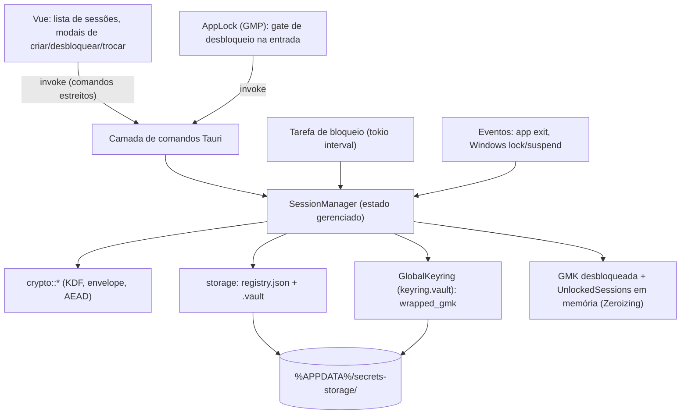

# Sessões de Segurança e Desbloqueio — Design

**Spec da feature:** [spec.md](./spec.md) — requisitos `SESSION-01…25`
**Spec-fonte (requisitos):** [secure-vault/spec.md](../secure-vault/spec.md) — histórias "Criar e desbloquear sessões" (VAULT-01…03), "Proteger a senha mestra" (VAULT-04) e "Senha mestra global e `auth_mode`" (VAULT-05 — GMP, keyring global, desbloqueio conjunto das sessões `global`)
**Formato criptográfico:** [crypto-format/design.md](../crypto-format/design.md) — **implementado** (`crypto::{aead,kdf,keys,keyring,envelope,codec}`)
**Modelo de ameaças:** [secure-vault/threat-model.md](../secure-vault/threat-model.md) — re-aprovado em 2026-07-21 (AD-022/GMP, D-05 fechado)
**Status:** Approved — 2026-07-21
**Fatia:** primeira vertical de M1 — ciclo de vida de sessões locais + senha mestra. **Sem** CRUD de segredos, sync, OAuth ou update.

---

## Escopo desta fatia

**Inclui:** gate de **senha mestra global (GMP)** (criar no 1º uso / desbloquear / trocar), `auth_mode` por sessão (**global** padrão / **própria** opt-out), criar/nomear/listar sessões, senha mestra (criar/verificar/trocar), bloquear/desbloquear, isolamento entre sessões, política de inatividade, bloqueio ao fechar o app, indicador de força, dica sob demanda, atraso progressivo, renomear (só desbloqueada), excluir (com senha), aviso de ausência de recuperação. Modelo canônico em [ui-screens/context.md](../ui-screens/context.md) (D-04).

**Fora (fatias futuras):** registros de segredo e clipboard (SECRET-*), sincronização (SYNC-*), atualização (UPDATE-*). O payload cifrado da sessão nasce vazio (`secrets: []`) e será preenchido pela fatia de segredos sem mudar o formato.

**Parcial / validação posterior:** reação a bloqueio/suspensão do Windows entra como best-effort aqui e será *validada a fundo* na feature "Prova de integração Windows e Tauri" (PT-05). A zeroização de memória é best-effort aqui e endurecida em PT-04.

---

## Arquitetura



Princípio C-10: a WebView é não confiável; **todo comando revalida** estado desbloqueado, existência da sessão, modo e limites no Rust. Nenhuma senha, chave ou material derivado cruza o IPC (só entra senha no create/unlock/change; nunca sai chave).

---

## Modelos de dados

### Persistido — registro (não secreto, legível bloqueado — VAULT-01 AC9 / AD-013)

`%APPDATA%/secrets-storage/registry.json`
```jsonc
{
  "version": 1,
  "sessions": [
    {
      "id": "uuid-v4",
      "name": "Trabalho",
      "name_normalized": "trabalho",     // p/ unicidade case-insensitive (VAULT-01 AC13)
      "auth_mode": "global",             // "global" (padrão) | "own"; também autenticado na AAD do .vault (D-04)
      "hint": "meu esquema de sempre",   // opcional; metadado não secreto (VAULT-04 AC3)
      "lock_policy": { "inactivity_secs": 900, "on_windows_lock": true, "on_windows_suspend": true },
      "created_at": "ISO-8601"
    }
  ]
}
```
> `name` também vai autenticado na AAD do `.vault`; no unlock o core verifica que batem (detecta adulteração do registro).

### Persistido — cofre por sessão

`%APPDATA%/secrets-storage/vaults/<uuid>.vault` — envelope CBOR do [crypto-format](../crypto-format/design.md). Payload = `{ content_format: 1, secrets: [] }` nesta fatia. O `auth_mode` da sessão vai autenticado na AAD do header (impede rebaixar `own`→`global` sem a chave correta — D-04).

### Persistido — keyring global (novo arquivo)

`%APPDATA%/secrets-storage/keyring.vault` — envelope autenticado (mesmo formato do [crypto-format](../crypto-format/design.md)) que guarda a **GMK** envolvida pela **gKEK** derivada da **GMP**:

```jsonc
{
  "format_version": 1,
  "salt_global": "…",                  // salt do Argon2id da GMP (KDF-01)
  "kdf_params": { /* m, t, p do Argon2id */ },
  "aead_id": "…",
  "wrapped_gmk": "AEAD(gKEK, GMK, aad = header)"   // GMK/gKEK nunca em claro (C-02)
}
```
> Sua existência sinaliza que a GMP já foi criada (1º uso vs. desbloqueio). GMK aleatória; `gKEK = Argon2id(GMP, salt_global)`. Separado do `registry.json` de propósito (ver Decisões técnicas).

### Em memória (core Rust, `tauri::State`)

```rust
struct SessionManager {
    registry: Mutex<Registry>,
    app_lock: Mutex<AppLock>,                       // gate global (GMP) — D-02
    unlocked: Mutex<HashMap<Uuid, UnlockedSession>>,
    attempts: Mutex<HashMap<Uuid, AttemptState>>,   // atraso progressivo (VAULT-04 AC2); chave global + por sessão
}
enum AppLock {
    Locked,                                         // GMP não informada (ou keyring ausente = 1º uso)
    Unlocked { gmk: Zeroizing<[u8; 32]> },          // GMK desbloqueada em memória
}
struct UnlockedSession {
    content_key: Zeroizing<[u8; 32]>,
    last_activity: Instant,          // inatividade por sessão (VAULT-01 AC5)
    lock_policy: LockPolicy,
}
struct AttemptState { failures: u32, next_allowed: Instant }
```
Bloquear sessão = remover de `unlocked` e zeroizar. **Desbloquear a GMP** popula `AppLock::Unlocked` e faz unwrap das `root_key` de **todas** as sessões `global` de uma vez (D-03); sessões `own` seguem bloqueadas até a senha própria. Fechar o app = `lock_app` (zeroiza GMK + todas as sessões — VAULT-01 AC7).

---

## Superfície de comandos (IPC)

| Comando | Entrada | Regras / autorização | Requisito |
| --- | --- | --- | --- |
| `app_status` | — | Funciona bloqueado; retorna `app_locked`, `keyring_exists` (1º uso vs. desbloqueio) | D-02 |
| `create_global_password` | password | Só quando keyring ausente (1º uso); gera `salt_global` + GMK, deriva gKEK, grava `keyring.vault`; força mínima | D-04 (T03) |
| `unlock_app` | password | Deriva gKEK ← GMP; unwrap da GMK; abre todas as sessões `global`; respeita atraso | D-02/D-03 (T04) |
| `lock_app` | — | Zeroiza GMK + **todas** as sessões (`unlocked`); também no exit | VAULT-01 AC7 |
| `change_global_password` | current, new | Unwrap da GMK com gKEK atual; re-wrap com gKEK' (mesma GMK); força mínima | D-04 (T16), ROT-01 |
| `set_session_auth_mode` | id, new_mode, secret | Reenvelope da `root_key`; `secret` = senha própria atual (se sai/entra em `own`) ou exige GMP desbloqueada (global); conteúdo não muda | D-04 (T12), ROT-01 |
| `list_sessions` | — | Funciona bloqueado; retorna id, nome, `auth_mode`, `locked`, policy, tem_dica | VAULT-01 AC9 |
| `create_session` | name, auth_mode, password?, hint?, policy | Valida unicidade normalizada; `global`: envolve root_key com a GMK (exige app desbloqueado, sem senha nova); `own`: exige senha própria + força mínima | VAULT-01/04, D-04 (T07) |
| `unlock_session` | id, password | **Apenas sessões `own`**; respeita atraso; unwrap AEAD; verifica nome; carrega content_key | VAULT-01 AC2, VAULT-04 AC2 |
| `lock_session` | id | Zeroiza e remove de `unlocked` | VAULT-01 AC3 |
| `lock_all` | — | Bloqueia todas (também no exit) | VAULT-01 AC7 |
| `change_master_password` | id, current, new | Exige senha atual (unwrap) + força mínima; reenvelope | VAULT-04 AC6, ROT-01 |
| `rename_session` | id, new_name | Exige sessão **desbloqueada** + unicidade | VAULT-01 AC13/14 |
| `delete_session` | id, password | Exige senha válida daquela sessão; apaga vault + entrada | VAULT-01 AC10 |
| `set_lock_policy` | id, policy | Confirma "nunca" no frontend; core aceita 60s…∞ | VAULT-01 AC4 |
| `touch_session` | id | Reset do timer só por interação intencional | VAULT-01 AC5 |
| `reveal_hint` | id | Retorna a dica (metadado não secreto) sob demanda | VAULT-04 AC4 |

Erros são enums tipados (`SessionError`) sem eco de segredo/senha (C-15). Senha errada e sessão inexistente retornam o mesmo tipo genérico onde couber (não vazar info — VAULT-01 AC2).

---

## Política de bloqueio

- **Lock global (GMP):** além do lock por sessão, o app tem um gate global. Enquanto `AppLock::Locked`, nenhuma sessão `global` abre (só `own` via senha própria). `lock_app` (e o fechamento do app) zeram a GMK **e** todas as sessões (`unlocked`), fail-closed.
- **Timer:** tarefa `tokio` a cada ~1 s percorre `unlocked`; se `now - last_activity ≥ inactivity_secs` (e ≠ "nunca"), bloqueia. `touch_session` atualiza `last_activity` (VAULT-01 AC5). Continua contando com app minimizado (é só relógio; independe de foco).
- **"Nunca":** `inactivity_secs = null`; confirmação exigida na UI (VAULT-01 AC4).
- **Eventos:** `on_windows_lock`/`on_windows_suspend` default true. Wiring best-effort nesta fatia; fechar o app sempre bloqueia (fail-closed). Validação profunda → PT-05.
- **Atraso progressivo (VAULT-04 AC2):** falhas incrementam `AttemptState`; `next_allowed` cresce (ex.: backoff exponencial com teto). Nunca apaga a sessão.

---

## Estratégia de erros

| Cenário | Tratamento | UX |
| --- | --- | --- |
| Senha errada | Falha de unwrap AEAD; incrementa atraso | "Senha incorreta" + espera, sem detalhe |
| GMP incorreta | Falha de unwrap da GMK; incrementa atraso global | "Senha global incorreta" + espera, sem detalhe |
| Keyring ausente/corrompido/versão futura | Fail-closed, preserva arquivo; ausente no 1º uso → fluxo de criação | "App bloqueado: keyring incompatível/corrompido" |
| CSPRNG falha | Aborta criação | Erro claro, sessão não criada |
| Nome duplicado (normalizado) | Rejeita antes de gravar | Mensagem de unicidade |
| Vault ausente/corrompido/versão futura | Fail-closed, preserva arquivo | "Cofre incompatível/corrompido" |
| Renomear sessão bloqueada | Rejeita | Pede para desbloquear antes |
| Params de KDF fora do limite | Recusa abrir, sem alocar | "Cofre incompatível" |

---

## Componentes de frontend (Vue 3 + TS + Tailwind)

Visual funcional/genérico (AD-017). Componentes:

| Componente | Local | Papel |
| --- | --- | --- |
| `CreateGlobalPasswordModal.vue` | `src/sessions/CreateGlobalPasswordModal.vue` | 1º uso: cria a GMP (senha + força); reusa `passwordStrength.ts` |
| `UnlockAppModal.vue` | `src/sessions/UnlockAppModal.vue` | Gate de entrada: desbloqueia a GMP (abre as globais), feedback de atraso |
| `SessionList.vue` | `src/sessions/SessionList.vue` | Lista sessões (bloqueada/desbloqueada), contagem, ações |
| `CreateSessionModal.vue` | `src/sessions/CreateSessionModal.vue` | Nome, controle de `auth_mode` (global padrão / própria opt-out), senha própria + força + dica + aviso (só `own`), política |
| `UnlockModal.vue` | `src/sessions/UnlockModal.vue` | Desbloqueio de sessão **`own`**: senha, "Mostrar dica", feedback de atraso |
| `ChangePasswordModal.vue` | `src/sessions/ChangePasswordModal.vue` | Senha atual + nova + força |
| `passwordStrength.ts` | `src/sessions/passwordStrength.ts` | Heurística de força (comprimento + variedade); zxcvbn fica como melhoria futura |
| `sessionsApi.ts` | `src/sessions/sessionsApi.ts` | Wrappers `invoke` tipados dos comandos |

O controle de `auth_mode` (global padrão / própria opt-out) aparece no create e nas configurações da sessão, acionando `set_session_auth_mode`. Avisos exigidos: dica visível sem senha (VAULT-04 AC5); ausência de recuperação no v1 (VAULT-04 AC7/AC8) exibido no create e periodicamente.

---

## Reuso e integração

| Existente | Como usar |
| --- | --- |
| `src-tauri/src/lib.rs` (builder Tauri) | Registrar `manage(SessionManager)`, `invoke_handler`, hook de exit → `lock_all` |
| `src/App.vue` (placeholder) | Substituir conteúdo pela `SessionList`; manter shell/estilo |
| `src/App.test.ts` (padrão Vitest + VTU) | Modelo para testes de componentes |
| Padrão `#[cfg(feature="updater")]` | Não tocar; independente desta fatia |

---

## Decisões técnicas (não óbvias)

| Decisão | Escolha | Racional |
| --- | --- | --- |
| Verificador de senha | Nenhum; unwrap AEAD | Evita verificador barato (KDF-02) |
| Integridade do nome | Nome na AAD + no registry | Detecta adulteração do registro sem cifrar o registro |
| Atraso progressivo | Em memória (não persistido) | Suficiente para a fatia; persistência anti-bypass é decisão futura |
| Força da senha | Heurística local nesta fatia | Evita dependência pesada agora; core só impõe mínimo |
| Payload vazio | `secrets: []` já cifrado | Exercita o formato completo; fatia de segredos só preenche |
| GMP como gate + wrap por `auth_mode` | Gate global desbloqueia as `global`; `own` mantém senha própria | Conveniência de senha única com opt-out de isolamento (context.md D-04) |
| Keyring global separado do registry | `keyring.vault` distinto do `registry.json` | Registry legível bloqueado (metadados); material da GMK isolado no envelope (C-02, D-04) |
| Raio de exposição da GMP | Aceito conscientemente | Comprometer a GMP expõe **todas** as globais; sessões `own` permanecem isoladas. Contradiz "sem desbloqueio transitivo" e reabriu o modelo de ameaças — **re-aprovado em 2026-07-21, D-05 fechado** (context.md D-04/D-05, AD-030) |

---

## Reuso concreto do `crypto::*` (já implementado)

O `SessionManager` **orquestra** primitivas existentes; não reimplementa criptografia. APIs disponíveis (verificadas em `src-tauri/src/crypto/`):

| Operação | API a reusar |
| --- | --- |
| Criar keyring da GMP (1º uso) | `crypto::keyring::create_keyring(...) -> KeyringEnvelope` |
| Desbloquear GMK | `crypto::keyring::unwrap_gmk(gmp, &env) -> Key32` |
| Trocar a GMP (re-wrap da mesma GMK) | `crypto::keyring::change_gmp(...)` |
| Derivar KEK de senha (própria) | `crypto::kdf::derive_kek(pwd, salt, params)` + `KdfParams::validate` |
| Gerar/derivar chaves de sessão | `crypto::keys::{generate_root_key, derive_content_key, derive_session_wrap_key}` |
| Criar/abrir/reenrolar cofre | `crypto::envelope::{create_vault, unlock, rewrap}` com `UnlockAuth`/`WrapAuth`, retornando `UnlockedVault` |
| Cofre e conteúdo | `crypto::envelope::{VaultEnvelope, Header, SessionContent, VaultNonces}` |
| Serialização CBOR | `crypto::codec::{to_cbor, from_cbor}` |
| Gravação atômica no disco | `storage::atomic_vault::AtomicVaultWriter` (já implementado em T06/T13 de secret-management) |

`Key32` (`crypto::secret`) já é `Zeroizing`-friendly; a `AppLock`/`UnlockedSession` guardam apenas `Key32`.

---

## Contrato de integração — o gate G1 de `secret-management`

O objetivo desta fatia é substituir o fake `SessionAccess` por uma implementação de produção. O trait **pertence ao consumidor** (`secret-management`), configurando uma inversão de dependência clássica (porta e adaptador):

- **Porta (já existe):** `crate::secrets::session_access::SessionAccess`, com `read_authorized`, `read_all_authorized`, `write_authorized`, `write_two_authorized`, operando sobre `SessionRead`/`SessionWrite` (que expõem `&SessionContent`, `epoch: u64`, `revision: u64`) e retornando `SessionAccessError` (`Locked`, `StaleAuthorization`, …).
- **Adaptador (esta fatia):** o `SessionManager` implementa `SessionAccess`. Diferente do fake (em memória), no `write_*` ele **persiste o envelope cifrado** via `crypto::envelope::rewrap` + `AtomicVaultWriter` **dentro da mesma linearização** em que avança `epoch`/`revision`, e revalida o estado desbloqueado + epoch antes de confirmar.
- **Ordem de lock:** duas sessões (`write_two_authorized`) travam por UUID crescente, igual ao contrato provado pelo fake.
- **Evidência de liberação do G1:** a suíte `cargo test --test secret_management` (serial) passa com o `SessionManager` real no lugar de `FakeSessionAccess`; deny de commit após lock/epoch preservado; canário ausente em logs/temporários.

> Nota de fronteira: o trait continua morando em `secrets::session_access` (o consumidor define a porta). O `SessionManager` vive em `sessions/` e depende de `secrets` apenas para o trait — nenhuma dependência reversa de `secrets` para `sessions`.

---

## Requirement Traceability (SESSION-*)

| Requisito | Componentes / comandos principais |
| --- | --- |
| SESSION-01 | `create_global_password`, `keyring.vault`, `crypto::keyring::create_keyring` |
| SESSION-02 | `unlock_app`, `crypto::keyring::unwrap_gmk`, abertura das sessões `global` (D-03) |
| SESSION-03 | erros genéricos de `unlock_app`/`unlock_session`, `AttemptState` |
| SESSION-04 | `change_global_password`, `crypto::keyring::change_gmp` |
| SESSION-05 | `create_session`, `crypto::envelope::create_vault`, payload `secrets: []` |
| SESSION-06 | `name_normalized` no `registry.json`, validação de unicidade |
| SESSION-07 | `list_sessions` (funciona bloqueado) |
| SESSION-08 | `rename_session` (exige desbloqueada) |
| SESSION-09 | `delete_session` (senha da sessão) |
| SESSION-10 | `unlock_session` (apenas `own`), `crypto::envelope::unlock` |
| SESSION-11 | `lock_session`, `lock_all`, zeroização de `UnlockedSession` |
| SESSION-12 | `set_session_auth_mode`, `crypto::envelope::rewrap` |
| SESSION-13 | `auth_mode` na AAD do header (`create_vault`/`unlock` autenticam) |
| SESSION-14 | `set_lock_policy`, `lock_app`, hook de exit, timer `tokio` |
| SESSION-15 | `touch_session`, `last_activity` por `UnlockedSession` |
| SESSION-16 | eventos Windows lock/suspend (best-effort) → `SessionManager` |
| SESSION-17 | `passwordStrength.ts` + mínimo imposto no core |
| SESSION-18 | `AttemptState` (backoff), aplicado à GMP e às sessões `own` |
| SESSION-19 | `reveal_hint`, `hint` no registry |
| SESSION-20 | avisos no frontend (create/edição da dica) |
| SESSION-21 | `change_master_password`, `change_global_password` |
| SESSION-22 | avisos de não-recuperação (create + periódico) |
| SESSION-23 | `impl SessionAccess for SessionManager` (read/write/two) |
| SESSION-24 | revalidação por comando no core (C-10) |
| SESSION-25 | redaction/allowlist de erros, sem canário em logs/temp (C-15) |
