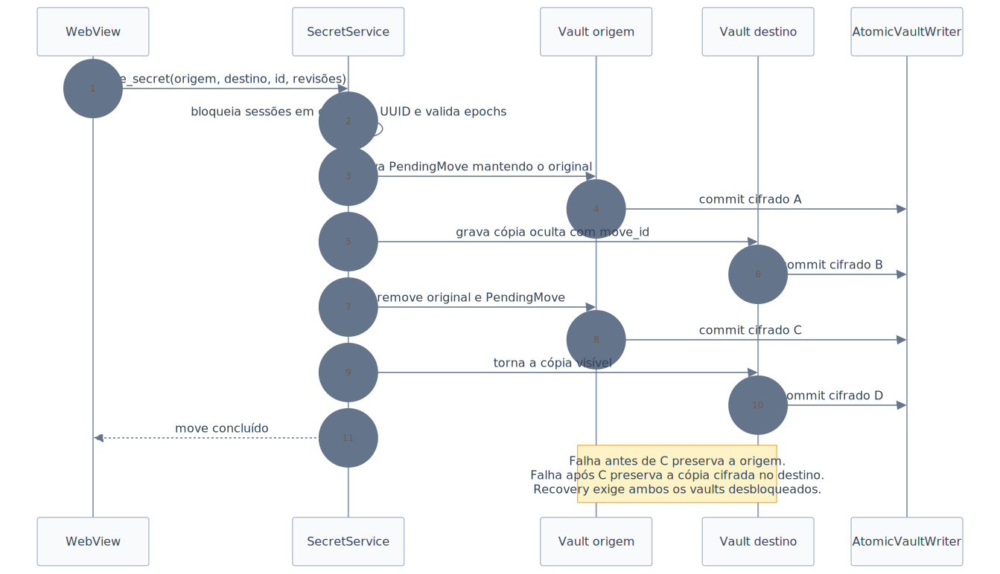

# Gerenciamento de segredos — Design

**Spec:** [spec.md](./spec.md)
**Status:** Approved — 2026-07-19
**Data:** 2026-07-19

## Resumo

O gerenciamento de segredos será implementado como uma camada tipada no core Rust, integrada ao futuro `SessionManager`. A WebView continua não confiável: listas recebem apenas summaries, detalhes recebem somente campos públicos e descritores de campos sensíveis, e um valor secreto cruza o IPC apenas em um `reveal` explícito. A cópia para o clipboard é feita diretamente pelo core e não devolve o valor à WebView.

O payload de cada sessão continua dentro do envelope AEAD existente. A camada nova converte `SessionContent.secrets: Vec<ciborium::Value>` para registros `SecretRecordV1` validados, sem acoplar o módulo criptográfico ao domínio de produto. Toda mutação passa por lock/epoch, revisão otimista e regravação atômica do vault cifrado.



Fonte: [secret-management-architecture-flowchart.mmd](./secret-management-architecture-flowchart.mmd)

## Pré-condições e bloqueios

1. `local-sessions/design.md` ainda é Draft e o `SessionManager`, registry e repository de vaults não existem. A implementação desta feature depende desses contratos concretos.
2. O modelo de ameaças permanece em revisão por AD-022. O design assume o raio de autoridade já documentado: GMP abre sessões `global`; sessões `own` permanecem isoladas.
3. `crypto-format` é candidato, não revisão independente concluída. Este design reutiliza seus envelopes sem promover parâmetros provisórios a garantia final.
4. O store `src/stores/vault.ts` é placeholder e não pode ser adaptado para persistir dados reais; ele será substituído por um store de apresentação sem segredos duráveis.

## Decisões das áreas cinzentas

| Área | Decisão do Design | Racional |
| --- | --- | --- |
| Busca | Busca por nome, tipo e metadados públicos permitidos; valores secretos, notas, tokens e chaves não entram no índice. | Reduz exposição e elimina índice persistente de plaintext. |
| Campos | Cinco schemas fixos no v1, sem campos personalizados. | Mantém validação exaustiva e evita formato arbitrário antes da revisão. |
| Clipboard | Opções 30 s, 1 min, 5 min (default), 10 min e 15 min; não há “nunca limpar”. | Limita a janela e mantém escolha previsível. |
| Reveal | Um campo por vez, no máximo 30 s; oculta em blur, navegação, troca de sessão, lock ou epoch inválida. | Reduz permanência no DOM sem impedir nova revelação consciente. |
| Exclusão | Confirmação explícita exibindo nome e tipo; senha não é repetida se a sessão continua autorizada. | Evita exclusão acidental sem criar falsa reautenticação local. |
| Chave SSH | O core valida estrutura e limites, mas não exige que a chave pública corresponda à privada nesta fatia. | Correspondência depende de parser/formato adicional; não deve ser inferida silenciosamente. |

## Arquitetura

### Fluxo de leitura

1. A rota contém `sessionId` e `secretId`; nenhum valor sensível entra na URL.
2. `SecretApi` chama um comando allowlisted.
3. O comando valida window label, DTO e limites e solicita um `AuthorizationGuard` da sessão.
4. `SecretService` lê o registro dentro do core e revalida epoch antes de responder.
5. List/detail retornam somente DTOs sanitizados. `reveal_secret_field` retorna um valor efêmero específico.
6. O frontend mantém o reveal em uma referência efêmera, sem Pinia/localStorage, e remove a referência nos eventos definidos.

### Fluxo de mutação

1. O core valida ID, revisão esperada, tipo e limites.
2. O serviço captura guard, revisão e snapshot da sessão e prepara uma cópia de trabalho zeroizável.
3. O conteúdo candidato é serializado, cifrado com nonce novo e gravado como arquivo temporário no mesmo diretório.
4. `commit_if_current` readquire o lock, revalida epoch e revisão e mantém o lock durante a substituição do arquivo e a atualização do estado em memória.
5. Se um lock ganhou a ordem antes do commit, a mutação é descartada; se o commit ganhou a ordem, ele termina e o lock ocorre imediatamente depois. Não existe estado em que o arquivo avança após a operação ser declarada stale.
6. Somente após a substituição e a atualização em memória a resposta de sucesso é emitida; temps de candidatos rejeitados são removidos.

### Authority Tauri

- `build.rs` declara somente os comandos de produção da feature no `AppManifest`.
- A capability da janela `main` referencia permissões próprias individuais; não concede filesystem nem clipboard diretamente à WebView.
- A Runtime Authority bloqueia origins/janelas sem permissão antes do handler.
- Cada handler ainda revalida label `main`, sessão, lock, epoch, revisão e limites. Capability não substitui autorização de domínio.
- Nenhum remote URL recebe acesso e nenhuma wildcard de janela é usada.

## Componentes

### `SecretRecordV1` e codec

- **Local:** `src-tauri/src/secrets/model.rs`, `src-tauri/src/secrets/codec.rs`
- **Propósito:** modelos fechados, validação defensiva e conversão entre registros tipados e `ciborium::Value`.
- **Interfaces:**
  - `decode_records(content: &SessionContent) -> Result<Vec<SecretRecordV1>, SecretError>`
  - `encode_records(records: &[SecretRecordV1]) -> Result<Vec<Value>, SecretError>`
  - `validate_new(input: CreateSecretInput) -> Result<NewSecret, SecretError>`
  - `apply_patch(record, expected_revision, patch) -> Result<(), SecretError>`
- **Reusa:** `crypto::codec`, `crypto::envelope::SessionContent`, `uuid`, `serde`.
- **Invariante:** `content_format = 1` continua válido; cada elemento de `secrets` precisa ser um record v1 fechado. Tipo/campo desconhecido falha fechado sem regravar o vault.

### `SecretService`

- **Local:** `src-tauri/src/secrets/service.rs`
- **Propósito:** CRUD, summaries, detalhe, reveal, busca e movimentação.
- **Interfaces:**
  - `list(session_id, cursor, limit) -> SecretPage`
  - `detail(session_id, secret_id) -> SecretDetail`
  - `reveal(session_id, secret_id, field, expected_revision) -> SensitiveValue`
  - `create(session_id, input) -> SecretMutationResult`
  - `update(session_id, secret_id, expected_revision, patch) -> SecretMutationResult`
  - `delete(session_id, secret_id, expected_revision) -> SecretMutationResult`
  - `search(query, cursor, limit) -> SecretSearchPage`
  - `move_secret(source, target, secret_id, expected_revisions) -> MoveResult`
- **Dependências:** `SessionAccess`, `SecretCodec`, `AtomicVaultWriter`, `Clock`, `RandomSource`.
- **Reusa:** `security::lock::AuthorizationGuard` e padrão `commit_if_current`.

### `SessionAccess`

- **Local:** contrato em `src-tauri/src/secrets/session_access.rs`; implementação no futuro módulo de sessões.
- **Propósito:** impedir que a feature conheça senhas, GMK ou paths.
- **Interfaces:**
  - `read_authorized(session_id, operation) -> Result<T, SessionAccessError>`
  - `write_authorized(session_id, operation) -> Result<T, SessionAccessError>`
  - `write_two_authorized(first, second, operation) -> Result<T, SessionAccessError>`
- **Invariantes:** locks de duas sessões são adquiridos por UUID crescente; nenhuma espera de I/O ocorre sem ownership explícito; epochs são revalidadas antes de cada commit.
- **Linearização:** o trecho que substitui o arquivo e avança o estado fica dentro do lock do coordinator. Eventos de lock concorrem pela mesma ordem e nunca invalidam retroativamente um commit já confirmado.

### `AtomicVaultWriter`

- **Local:** `src-tauri/src/storage/atomic_vault.rs`
- **Propósito:** gravar somente bytes já cifrados, sem janela de arquivo parcialmente sobrescrito.
- **Protocolo Windows:**
  1. criar temp aleatório no mesmo diretório com criação exclusiva;
  2. escrever envelope cifrado e executar `sync_all`/`FlushFileBuffers`;
  3. validar que o temp decodifica como envelope e autentica com a sessão corrente;
  4. para destino existente, usar `ReplaceFileW`; no primeiro commit, usar `MoveFileExW` no mesmo volume;
  5. preservar backup cifrado durante a substituição e removê-lo somente após validar o destino.
- **Recuperação:** na inicialização, aceitar somente o destino autenticado; se inválido, tentar o backup autenticado. Temps nunca são promovidos automaticamente e podem ser removidos após inventário.
- **Limite honesto:** `FlushFileBuffers` reduz a janela de perda, mas o design não promete resistência absoluta a falha de hardware/controlador.

### `ClipboardPort`

- **Local:** `src-tauri/src/platform/windows/clipboard.rs` e trait em `src-tauri/src/secrets/clipboard.rs`
- **Propósito:** copy/clear core-only com propriedade verificável.
- **Protocolo:** escrever `CF_UNICODETEXT`, capturar `GetClipboardSequenceNumber` após o commit e guardar apenas `{session_id, sequence, deadline}`. Timeout, lock e “Limpar agora” esvaziam somente se a sequência atual ainda coincide.
- **Retry:** `OpenClipboard` recebe poucas tentativas com backoff curto; falha vira resultado `inconclusive`, nunca sucesso presumido.
- **Limites:** o Windows e outros processos podem copiar/persistir o conteúdo. A UI comunica que a limpeza é best-effort.
- **Reusa:** crate `windows`; adiciona somente features Win32 necessárias, sem capability de clipboard para a WebView.
- **Features Win32:** acrescentar somente os namespaces exigidos pelas APIs de clipboard e substituição de arquivo, mantendo a lista target-specific em `Cargo.toml`.

### Comandos e DTOs

- **Local:** `src-tauri/src/secrets/commands.rs`, permissões geradas por `build.rs`.
- **Comandos:** `list_secrets`, `get_secret_detail`, `reveal_secret_field`, `create_secret`, `update_secret`, `delete_secret`, `search_secrets`, `move_secret`, `copy_secret_field`, `clear_owned_clipboard`.
- **DTOs:** enums fechados com `deny_unknown_fields`; IDs/revisões explícitos; erros serializam somente `code` allowlisted.
- **Limites:** o JSON do IPC pode realizar uma alocação inicial antes da validação serde. O core valida bytes antes de duplicar, normalizar, cifrar ou persistir; o Design não promete “zero alocação” no transporte.

### Frontend

- **Local:** `src/api/secrets.ts`, `src/stores/secrets.ts`, telas existentes em `src/screens/Secret*`.
- **Mudanças:**
  - rotas passam a `/sessions/:sessionId/secrets`, `/:secretId` e forms correspondentes;
  - `SecretsList` consome `SecretSummary[]`;
  - `SecretDetail` remove fixtures e solicita detalhe/reveal sob demanda;
  - `SecretForm` usa estado local, limpa campos sensíveis em unmount/cancel/success/lock;
  - store mantém summaries, cursores e loading/error; nunca persiste valores revelados;
  - listeners de lifecycle ocultam reveal em blur, route leave e lock.
- **Reusa:** `AppShell`, `UiInput`, `UiButton`, `UiIcon`, `PasswordStrength` quando aplicável e testes VTU co-localizados.

## Modelo persistido

```rust
#[serde(tag = "type", rename_all = "kebab-case", deny_unknown_fields)]
enum SecretDataV1 {
    Password {
        username: String,
        password: SecretText,
        url: Option<String>,
        notes: Option<SecretText>,
    },
    ApiKey {
        key: SecretText,
        environment: Option<String>,
        scopes: Vec<String>,
    },
    Token {
        value: SecretText,
        expires_at: Option<String>,
        notes: Option<SecretText>,
    },
    SecureNote {
        text: SecretText,
    },
    SshKey {
        public_key: Option<String>,
        private_key: SecretText,
        passphrase: Option<SecretText>,
    },
}

struct SecretRecordV1 {
    version: u16,
    id: Uuid,
    revision: u64,
    name: String,
    created_at_ms: i64,
    updated_at_ms: i64,
    move_state: Option<MoveState>,
    data: SecretDataV1,
}
```

`SecretText` encapsula `Zeroizing<String>`, não implementa `Debug`/`Display` e só serializa dentro do codec persistido ou do DTO explícito de reveal. Timestamps são UTC Unix milliseconds; apresentação localizada fica no frontend.

### Limites defensivos

| Campo/conjunto | Limite |
| --- | --- |
| Nome | 1–256 bytes UTF-8 |
| Metadado curto individual | 4 KiB |
| Valor sensível individual | 1 MiB |
| Registro completo serializado | 2 MiB |
| Escopos | 128 itens, 256 bytes cada |
| Página de listagem/busca | 1–100 itens |
| Query de busca | 1–512 bytes |
| Registros por sessão nesta versão | 10.000 |

Esses limites são de compatibilidade do formato v1. Inputs são medidos em bytes UTF-8 após rejeitar NUL; truncamento silencioso é proibido.

## DTOs de leitura

`SecretSummary` inclui `session_id`, `id`, `type`, `name`, `subtitle` derivado de metadado público, `revision` e timestamps. `SecretDetail` acrescenta campos públicos e uma lista de `SensitiveFieldDescriptor { field, present }`; não contém valor sensível. `SensitiveValue` contém um único `field`, `revision` e `value`, não implementa `Debug` no Rust e não pode ser salvo pelo store.

Ao revelar, o valor inevitavelmente vira uma string gerenciada pelo runtime JavaScript. A aplicação remove referências e nós do DOM imediatamente, mas não promete zeroização física da memória do WebView ou controle sobre o garbage collector. Para copiar, o core evita essa passagem e escreve diretamente no clipboard.

Busca normaliza query e campos permitidos em memória, sem índice persistido. Campos pesquisáveis:

- todos: `name` e `type`;
- senha: `username`, host da URL;
- API key: `environment`, `scopes`;
- token: expiração;
- SSH: comentário/fingerprint derivado da chave pública;
- nota segura: somente `name`.

## Movimentação crash-safe



Fonte: [secret-move-sequence.mmd](./secret-move-sequence.mmd)

O movimento usa `move_id` aleatório e quatro commits cifrados:

1. origem grava `PendingMove`, mantendo o registro original;
2. destino grava uma cópia `Staged`, invisível para list/search;
3. origem remove original e marker;
4. destino troca `Staged` por `Committed`.

Se o processo falha antes do passo 3, a origem permanece autoritativa. Se falha após o passo 3, o destino contém a cópia completa cifrada, embora ainda oculta. Na próxima vez em que ambas as sessões estiverem desbloqueadas, o recovery compara `move_id`, revisões e presença do original e completa ou reverte. O serviço não reporta sucesso antes do passo 4.

## Concorrência e paginação

- Cada record possui revisão monotônica; update/delete exigem `expected_revision`.
- Operações em uma sessão são serializadas pelo `SessionManager`.
- Operações em duas sessões adquirem locks em ordem lexicográfica de UUID.
- Cursores contêm versão, último `(normalized_name, id)` e epochs das sessões consultadas; mudança relevante retorna `stale_cursor`, não uma página silenciosamente inconsistente.
- Search captura guards por sessão, produz summaries e revalida todas as epochs antes da resposta.
- Cada summary carrega a epoch observada. Se um lock ocorrer depois da linearização da resposta, o evento de lock faz o frontend descartar resultados e reveals daquela sessão; não se promete cancelar bytes IPC já enviados.

## Estratégia de erros

| Cenário | Código estável | UX |
| --- | --- | --- |
| Sessão bloqueada | `session_locked` | Voltar ao unlock sem preservar input sensível. |
| Epoch mudou | `stale_authorization` | Recarregar estado; não repetir mutação automaticamente. |
| Revisão obsoleta | `revision_conflict` | Mostrar que o item mudou e pedir recarga. |
| Tipo/campo/limite inválido | `invalid_secret_input` | Marcar campo sem ecoar valor. |
| Vault incompatível/corrompido | `vault_unavailable` | Falhar fechado e preservar arquivos. |
| Falha de commit | `storage_commit_failed` | Manter última versão confirmada. |
| Move pendente | `move_pending` | Explicar que ambas as sessões devem ser desbloqueadas para recuperar. |
| Clipboard ocupado | `clipboard_unavailable` | Informar que nada foi copiado/limpo. |
| Clipboard alterado | `clipboard_not_owned` | Não limpar conteúdo posterior. |
| Comando/capability negado | `authority_denied` | Encerrar ação sem mudança de estado. |

Nenhum erro inclui path, usuário, nome de segredo, valor, query ou erro bruto do sistema.

## Reuso do código existente

| Componente | Reuso |
| --- | --- |
| `crypto::envelope::SessionContent` | Container cifrado; `secrets` recebe records CBOR tipados. |
| `crypto::{aead,codec,keys}` | Serialização e envelope autenticado; sem nova criptografia. |
| `crypto::Key32` / `zeroize` | Chaves e wrappers sensíveis. |
| `security::lock::LockCoordinator` | Guards de epoch e commit revalidado. |
| `security::memory::SensitiveRegion` | Apenas buffers Windows de alto risco quando não introduzir cópias extras; não substitui `SecretText`. |
| `proof::commands` | Padrão de DTO limitado, erro allowlisted e verificação de window label. |
| `src/screens/Secret*` | Estrutura visual; dados estáticos e fixtures são removidos. |
| `src/components/*` | Controles visuais e acessibilidade existentes. |

## Test strategy

- **Unit Rust:** schemas, limites, codec, revisão, filtros de busca, cursores e state machine de move.
- **Integration Rust serial:** repository temporário, lock/epoch, falhas injetadas em cada commit e recovery de move.
- **Windows serial:** atomic writer e clipboard com sequência/ownership.
- **IPC serial:** allow/deny por capability/label, DTO malformado/oversize e ausência de valores em erros.
- **Frontend unit:** CRUD, masking/reveal cleanup, paginação, clipboard status e ausência de fixtures/storage.
- **E2E Windows serial:** criar → reiniciar → revelar/copiar → editar → pesquisar → mover → bloquear → negar.
- **Gates:** `pnpm check:rust`, `pnpm check:frontend`, `pnpm check`, smoke normal `pnpm build --no-bundle`.

Nenhum teste persiste canários em snapshots ou relatórios; diretórios temporários são exclusivos por execução.

## Requirement traceability

| Requirement | Design coverage |
| --- | --- |
| SECMGMT-01 | `SecretRecordV1`, `SecretDataV1`, limites |
| SECMGMT-02 | `SecretService::create`, codec, writer |
| SECMGMT-03 | detail/update, DTOs e revisão |
| SECMGMT-04 | delete confirmado e commit atômico |
| SECMGMT-05 | revisão, locks e cursores |
| SECMGMT-06 | `AtomicVaultWriter` e recovery |
| SECMGMT-07 | `SecretSummary`/`SecretDetail` sanitizados |
| SECMGMT-08 | `reveal_secret_field` e estado efêmero |
| SECMGMT-09 | `SecretText`, erros e lifecycle frontend |
| SECMGMT-10 | search sem índice, guards por sessão |
| SECMGMT-11 | query efêmera e campos allowlisted |
| SECMGMT-12 | lock duplo determinístico |
| SECMGMT-13 | protocolo `PendingMove`/`Staged` |
| SECMGMT-14 | `ClipboardPort`, timeout e lock |
| SECMGMT-15 | sequência do clipboard e UX honesta |

**Coverage:** 15/15 requisitos cobertos pelo Design; 0 mapeados para tarefas.

## Fontes técnicas verificadas

- Microsoft Learn: [`ReplaceFileW`](https://learn.microsoft.com/en-us/windows/win32/api/winbase/nf-winbase-replacefilew), [`MoveFileExW`](https://learn.microsoft.com/en-us/windows/win32/api/winbase/nf-winbase-movefileexw), [`FlushFileBuffers`](https://learn.microsoft.com/en-us/windows/win32/api/fileapi/nf-fileapi-flushfilebuffers), [`OpenClipboard`](https://learn.microsoft.com/en-us/windows/win32/api/winuser/nf-winuser-openclipboard) e [`GetClipboardSequenceNumber`](https://learn.microsoft.com/en-us/windows/win32/api/winuser/nf-winuser-getclipboardsequencenumber).
- Tauri 2: [permissions](https://v2.tauri.app/security/permissions/), [capabilities](https://v2.tauri.app/security/capabilities/) e [Runtime Authority](https://v2.tauri.app/security/runtime-authority/).

As fontes sustentam as APIs e seus limites; as garantias de domínio, recovery e redaction são decisões deste Design e ainda precisam de implementação e testes.
