# Gerenciamento de segredos — Tasks

**Spec:** [spec.md](./spec.md)  
**Design:** [design.md](./design.md)  
**Status:** Approved — 2026-07-19  
**Escopo:** `SECMGMT-01…15`

## Gate externo

### G1 — Sessões locais persistentes disponíveis

Esta feature não implementa sessões. Antes de T14/T15/T23, `local-sessions` precisa fornecer um `SessionManager` real com registry, paths de vault, estado desbloqueado, guards de lock/epoch, acesso a `SessionContent` e commit cifrado revalidado. Até G1, o core é desenvolvido contra `SessionAccess` e um fake determinístico.

**Evidência para liberar:** design de `local-sessions` aprovado, contratos concretos implementados e gates Rust dessa feature verdes.

## Política de execução

- Todo código de comportamento usa `test-driven-development`: RED observado, GREEN mínimo e refactor somente com a suíte verde.
- Decisões de segurança, Rust core, Win32, authority, integração e verificação final ficam com o agente principal.
- Tarefas frontend e documentação estreitamente delimitadas podem usar `delegate-small-tasks` com Terra; Luna fica restrita a inventários/revisões read-only e só será usada se estiver disponível. O agente principal inspeciona mudanças e executa o gate final.
- Cada tarefa concluída recebe exatamente um Conventional Commit em português.
- `[P]` significa que a tarefa pode usar subagente em paralelo depois de todas as dependências concluírem e somente quando seus testes não compartilham estado externo.

## Contrato de testes que T01 deve registrar

| Camada | Tipo | Local | Comando | Paralelismo |
| --- | --- | --- | --- | --- |
| Domínio Rust puro | unitário | `src-tauri/src/secrets/**/*.rs` | `pnpm test:rust` | Seguro |
| Repository/serviço com vault temporário | integração Rust | `src-tauri/tests/secret_management.rs` | `cargo test --manifest-path src-tauri/Cargo.toml --test secret_management -- --test-threads=1` | Serial |
| Writer/clipboard Windows | integração Windows | `src-tauri/tests/windows_secret_platform.rs` | `cargo test --manifest-path src-tauri/Cargo.toml --test windows_secret_platform -- --test-threads=1` | Serial |
| Comandos e authority | integração IPC | `src-tauri/tests/secret_management_commands.rs` | `cargo test --manifest-path src-tauri/Cargo.toml --test secret_management_commands -- --test-threads=1` | Serial |
| Componentes/API/store Vue | unitário frontend | `src/**/*.test.ts` | `pnpm test:frontend` | Seguro |
| Jornada de segredos | E2E Tauri WebDriver | `e2e/secret-management/**/*.e2e.ts` | `pnpm test:e2e:secret-management` | Serial |
| Configuração/build | smoke | manifests, `build.rs`, capabilities | `cargo check --manifest-path src-tauri/Cargo.toml` e `pnpm build --no-bundle` | Serial |

## Plano de execução

Fonte: [tasks-core-flowchart.mmd](./tasks-core-flowchart.mmd)

Fonte: [tasks-ui-flowchart.mmd](./tasks-ui-flowchart.mmd)

1. **Contrato e fundação:** T01 → T02.
2. **Domínio paralelo:** T03 `[P]` e T05 `[P]`; depois T04 `[P]`, T10 `[P]` e T12 `[P]`. T06 executa serialmente.
3. **Serviço e plataforma:** T07 → T08 → T09; T10 + T07 → T11; T12 → T13.
4. **Gate e IPC:** após G1, T14; então T13 + T14 + G1 → T15.
5. **Frontend:** T16 → T17; T18/T19/T20/T21 `[P]`; depois T22.
6. **Aceitação:** T23 → T24.

## Task breakdown

### T01 — Registrar o contrato de testes da feature

**Status:** Done — 2026-07-19
**What:** adicionar à matriz de testes os seis layers e comandos contratuais desta feature.  
**Where:** `.specs/codebase/TESTING.md`  
**Depends on:** nenhum  
**Reuses:** organização, gates e regras de paralelismo existentes  
**Requirements:** SECMGMT-01…15  
**Owner/Tools:** Terra; `delegate-small-tasks`; sem MCP

**Done when:**

- [x] Matriz inclui Rust puro, integração de vault, plataforma Windows, IPC, frontend e E2E.
- [x] Suítes Windows/Tauri/E2E estão marcadas como seriais.
- [x] Comandos futuros estão identificados como indisponíveis até suas tarefas introdutoras.
- [x] `git diff --check` passa; contagem de testes: N/A, nenhuma suíte alterada.

**Tests/Gate:** documentação; `git diff --check`  
**Verify:** `rg -n "secret_management|windows_secret_platform|test:e2e:secret-management" .specs/codebase/TESTING.md`  
**Commit:** `docs(testes): definir matriz do gerenciamento de segredos`

### T02 — Declarar os módulos da feature

**Status:** Done — 2026-07-19
**What:** criar os módulos vazios e exports que delimitam `secrets`, `storage` e clipboard Windows, sem comportamento.  
**Where:** `src-tauri/src/{lib.rs,secrets/mod.rs,storage/mod.rs,platform/windows/mod.rs,platform/windows/clipboard.rs}`
**Depends on:** T01  
**Reuses:** layout de `crypto`, `security` e `platform`  
**Requirements:** SECMGMT-01, SECMGMT-06, SECMGMT-14  
**Owner/Tools:** agente principal; sem skill de implementação por ser somente wiring

**Done when:**

- [x] Os módulos compilam nos targets condicionais atuais.
- [x] Nenhuma API de segredo fica exposta à WebView.
- [x] Smoke passa; contagem: 75 testes Rust preservados.

**Tests/Gate:** smoke de build; `cargo check --manifest-path src-tauri/Cargo.toml`  
**Verify:** `pnpm check:rust`  
**Commit:** `chore(segredos): declarar módulos da feature`

### T03 — Implementar o modelo tipado e validação [P]

**Status:** Done — 2026-07-19
**What:** implementar `SecretRecordV1`, `SecretDataV1`, `SecretText`, inputs fechados, revisões e limites v1.  
**Where:** `src-tauri/src/secrets/model.rs`  
**Depends on:** T02  
**Reuses:** `Zeroizing`, `Uuid`, serde e timestamps do design  
**Requirements:** SECMGMT-01, SECMGMT-03, SECMGMT-05, SECMGMT-09  
**Owner/Tools:** agente principal; `test-driven-development`

**Done when:**

- [x] RED cobre os cinco schemas, unknown fields, NUL, limites, datas e revisão obsoleta.
- [x] `SecretText` não implementa `Debug`/`Display` e usa `Zeroizing<String>` para limpar seu buffer no drop.
- [x] GREEN valida em bytes UTF-8 antes de persistência e não trunca.
- [x] Gate passa; contagem: 93 testes Rust, incluindo 18 novos unit tests.

**Tests/Gate:** unitário Rust; `pnpm test:rust`  
**Verify:** `pnpm check:rust`  
**Commit:** `feat(segredos): adicionar modelo tipado e limites`

### T04 — Implementar o codec CBOR fechado [P]

**Status:** Done — 2026-07-19
**What:** converter records v1 validados de/para `SessionContent.secrets` sem aceitar versões, tipos ou campos desconhecidos.  
**Where:** `src-tauri/src/secrets/codec.rs`  
**Depends on:** T03  
**Reuses:** `crypto::codec`, `crypto::envelope::SessionContent`, `ciborium::Value`  
**Requirements:** SECMGMT-01, SECMGMT-02, SECMGMT-06  
**Owner/Tools:** agente principal; `test-driven-development`

**Done when:**

- [x] RED cobre round-trip dos cinco tipos e falha fechada para payload futuro/malformado.
- [x] Decode inválido não altera o `SessionContent` original.
- [x] Registro serializado acima de 2 MiB é rejeitado.
- [x] Gate passa; contagem: 106 testes Rust, incluindo 13 novos unit tests.

**Tests/Gate:** unitário Rust; `pnpm test:rust`  
**Verify:** `pnpm check:rust`  
**Commit:** `feat(segredos): implementar codec cbor fechado`

### T05 — Definir `SessionAccess` e fake determinístico [P]

**Status:** Done — 2026-07-19
**What:** definir o contrato de autorização de uma/duas sessões e um fake apenas de teste para lock, epoch, revisão e falhas.  
**Where:** `src-tauri/src/secrets/session_access.rs`  
**Depends on:** T02  
**Reuses:** `security::lock::AuthorizationGuard` e ordem por UUID  
**Requirements:** SECMGMT-02, SECMGMT-05, SECMGMT-10, SECMGMT-12  
**Owner/Tools:** agente principal; `test-driven-development`

**Done when:**

- [x] RED demonstra negação após lock/epoch e ordem determinística de duas sessões.
- [x] O contrato não expõe senha, GMK, key material ou path.
- [x] Fake injeta falha antes do commit e revalida epoch.
- [x] Gate passa; contagem: 115 testes Rust, incluindo 9 novos unit tests.

**Tests/Gate:** unitário Rust; `pnpm test:rust`  
**Verify:** `pnpm check:rust`  
**Commit:** `feat(segredos): definir acesso autorizado a sessões`

### T06 — Implementar `AtomicVaultWriter`

**Status:** Done — 2026-07-19
**What:** gravar, substituir e recuperar somente envelopes cifrados usando o protocolo Windows do design.  
**Where:** `src-tauri/src/storage/atomic_vault.rs`, `src-tauri/tests/windows_secret_platform.rs`, `src-tauri/Cargo.toml`  
**Depends on:** T02  
**Reuses:** envelope autenticado e crate `windows` target-specific  
**Requirements:** SECMGMT-02, SECMGMT-04, SECMGMT-06, SECMGMT-13  
**Owner/Tools:** agente principal; `test-driven-development`

**Done when:**

- [x] RED serial cobre primeiro commit, replace, backup válido, destino corrompido e temp órfão.
- [x] Temp usa criação exclusiva no mesmo diretório e flush antes do replace.
- [x] Recovery promove somente destino/backup autenticado e nunca temp.
- [x] Gate serial passa; contagem: 8 integration tests Windows e 138 unit tests Rust.

**Tests/Gate:** integração Windows serial; `cargo test --manifest-path src-tauri/Cargo.toml --test windows_secret_platform -- --test-threads=1`  
**Verify:** comando acima + `pnpm check:rust`  
**Commit:** `feat(storage): gravar vault de forma atômica no windows`

### T07 — Implementar CRUD no `SecretService`

**What:** implementar create/detail-for-update/update/delete com revisão otimista e commit autorizado.  
**Where:** `src-tauri/src/secrets/service.rs`, `src-tauri/tests/secret_management.rs`  
**Depends on:** T04, T05, T06  
**Reuses:** codec, fake `SessionAccess`, writer e padrão `commit_if_current`  
**Requirements:** SECMGMT-02…06  
**Owner/Tools:** agente principal; `test-driven-development`

**Done when:**

- [ ] RED cobre CRUD dos cinco tipos, revisão obsoleta, lock/epoch e falha antes do commit.
- [ ] Sucesso só é retornado após arquivo e memória avançarem na mesma linearização.
- [ ] Falha preserva a última versão confirmada.
- [ ] Gate serial passa; contagem: no mínimo 20 integration tests da suíte.

**Tests/Gate:** integração Rust serial; `cargo test --manifest-path src-tauri/Cargo.toml --test secret_management -- --test-threads=1`  
**Verify:** comando acima + `pnpm check:rust`  
**Commit:** `feat(segredos): implementar crud autorizado`

### T08 — Implementar summaries, detalhe sanitizado e reveal

**What:** adicionar projeções de leitura sem valores e reveal de um único campo com revisão/epoch.  
**Where:** `src-tauri/src/secrets/service.rs`  
**Depends on:** T07  
**Reuses:** `SecretSummary`, `SecretDetail`, `SensitiveFieldDescriptor`, `SecretText`  
**Requirements:** SECMGMT-03, SECMGMT-07…09  
**Owner/Tools:** agente principal; `test-driven-development`

**Done when:**

- [ ] RED usa canários e prova ausência em summary, detail, `Debug` e erros.
- [ ] Reveal rejeita campo público, ausente, revisão obsoleta e epoch inválida.
- [ ] Somente o campo solicitado cruza a fronteira do retorno explícito.
- [ ] Gate passa; contagem: baseline + no mínimo 10 unit tests.

**Tests/Gate:** unitário Rust; `pnpm test:rust`  
**Verify:** `pnpm check:rust`  
**Commit:** `feat(segredos): sanitizar leituras e revelar por campo`

### T09 — Implementar busca e cursores estáveis

**What:** pesquisar somente metadados allowlisted de sessões desbloqueadas e paginar com cursor versionado por epochs.  
**Where:** `src-tauri/src/secrets/service.rs`  
**Depends on:** T08  
**Reuses:** normalização do modelo, summaries e guards de `SessionAccess`  
**Requirements:** SECMGMT-05, SECMGMT-07, SECMGMT-10, SECMGMT-11  
**Owner/Tools:** agente principal; `test-driven-development`

**Done when:**

- [ ] RED cobre campos pesquisáveis, query vazia, sessão bloqueada durante busca e `stale_cursor`.
- [ ] Valores, notas, tokens e chaves nunca participam da comparação.
- [ ] Todas as epochs são revalidadas antes da resposta.
- [ ] Gate passa; contagem: baseline + no mínimo 12 unit tests.

**Tests/Gate:** unitário Rust; `pnpm test:rust`  
**Verify:** `pnpm check:rust`  
**Commit:** `feat(segredos): pesquisar metadados autorizados`

### T10 — Implementar a máquina de estados de movimentação [P]

**Status:** Done — 2026-07-19
**What:** modelar `PendingMove`, `Staged`, `Committed` e decisões determinísticas de completar/reverter.  
**Where:** `src-tauri/src/secrets/{move_state.rs,model.rs,codec.rs,mod.rs}`
**Depends on:** T03, T05  
**Reuses:** IDs/revisões do modelo e ordem de lock de `SessionAccess`  
**Requirements:** SECMGMT-12, SECMGMT-13  
**Owner/Tools:** agente principal; `test-driven-development`

**Done when:**

- [x] RED cobre cada fronteira dos quatro commits e origem=destino.
- [x] Estado visível nunca contém `Staged`.
- [x] Recovery preserva “origem intacta ou cópia completa no destino”.
- [x] Gate passa; contagem: 10 testes da máquina + 2 roundtrips de persistência.

**Tests/Gate:** unitário Rust; `pnpm test:rust`  
**Verify:** `pnpm check:rust`  
**Commit:** `feat(segredos): modelar movimentação crash-safe`

### T11 — Integrar move e recovery ao serviço

**What:** executar os quatro commits cifrados e recuperar movimentos quando ambas as sessões estiverem autorizadas.  
**Where:** `src-tauri/src/secrets/service.rs`, `src-tauri/tests/secret_management.rs`  
**Depends on:** T07, T10  
**Reuses:** writer, codec, `write_two_authorized` e state machine  
**Requirements:** SECMGMT-06, SECMGMT-12, SECMGMT-13  
**Owner/Tools:** agente principal; `test-driven-development`

**Done when:**

- [ ] RED injeta falha antes/depois de cada commit e reinicia o serviço.
- [ ] Locks seguem UUID crescente e sucesso só ocorre após `Committed`.
- [ ] Recovery é idempotente e não duplica registro visível.
- [ ] Gate serial passa; contagem da suíte: anterior + no mínimo 12 integration tests.

**Tests/Gate:** integração Rust serial; `cargo test --manifest-path src-tauri/Cargo.toml --test secret_management -- --test-threads=1`  
**Verify:** comando acima + `pnpm check:rust`  
**Commit:** `feat(segredos): integrar move e recovery crash-safe`

### T12 — Implementar o domínio do clipboard [P]

**Status:** Done — 2026-07-19
**What:** definir `ClipboardPort`, presets, ownership por sequence/deadline e coordenação de timeout/lock/clear-now.  
**Where:** `src-tauri/src/secrets/clipboard.rs`  
**Depends on:** T03  
**Reuses:** clock injetável, session ID e `SecretText`  
**Requirements:** SECMGMT-09, SECMGMT-14, SECMGMT-15  
**Owner/Tools:** agente principal; `test-driven-development`

**Done when:**

- [x] RED cobre default 5 min, todos os presets, timeout, lock, clear-now e conteúdo posterior.
- [x] Estado de ownership guarda somente sessão, sequence e deadline.
- [x] Resultados distinguem cleared, not-owned e inconclusive.
- [x] Gate passa; contagem: 11 novos unit tests, 138 no total.

**Tests/Gate:** unitário Rust; `pnpm test:rust`  
**Verify:** `pnpm check:rust`  
**Commit:** `feat(segredos): coordenar ownership do clipboard`

### T13 — Implementar o adaptador Win32 do clipboard

**What:** escrever `CF_UNICODETEXT`, capturar sequence e limpar condicionalmente com retries curtos.  
**Where:** `src-tauri/src/platform/windows/clipboard.rs`, `src-tauri/tests/windows_secret_platform.rs`, `src-tauri/Cargo.toml`  
**Depends on:** T02, T12  
**Reuses:** crate `windows` e trait `ClipboardPort`  
**Requirements:** SECMGMT-14, SECMGMT-15  
**Owner/Tools:** agente principal; `test-driven-development`

**Done when:**

- [ ] RED serial cobre copy, sequence, conteúdo substituído, clipboard ocupado e clear.
- [ ] Somente features Win32 estritamente necessárias são adicionadas.
- [ ] Falha de confirmação nunca é reportada como limpeza garantida.
- [ ] Gate serial passa; contagem da suíte Windows: anterior + no mínimo 6 testes.

**Tests/Gate:** integração Windows serial; `cargo test --manifest-path src-tauri/Cargo.toml --test windows_secret_platform -- --test-threads=1`  
**Verify:** comando acima + `pnpm check:rust`  
**Commit:** `feat(windows): adaptar clipboard seguro`

### T14 — Implementar comandos e DTOs Tauri

**What:** criar os dez handlers, DTOs fechados e erros allowlisted sobre o `SecretService`.  
**Where:** `src-tauri/src/secrets/commands.rs`, `src-tauri/tests/secret_management_commands.rs`  
**Depends on:** G1, T08, T09, T11, T12  
**Reuses:** padrão `proof::commands` e `SessionManager` entregue por G1  
**Requirements:** SECMGMT-02…15  
**Owner/Tools:** agente principal; `test-driven-development`

**Done when:**

- [ ] RED serial cobre label allow/deny, DTO desconhecido/oversize, lock/epoch/revisão e erros sanitizados.
- [ ] Copy não devolve valor à WebView; reveal devolve um único campo.
- [ ] Nenhum erro serializado contém canário, query, nome, path ou erro Win32 bruto.
- [ ] Gate serial passa; contagem: no mínimo 20 integration tests IPC.

**Tests/Gate:** integração IPC serial; `cargo test --manifest-path src-tauri/Cargo.toml --test secret_management_commands -- --test-threads=1`  
**Verify:** comando acima + `pnpm check:rust`  
**Commit:** `feat(segredos): expor comandos tauri estreitos`

### T15 — Integrar authority, capabilities e estado de produção

**What:** registrar handlers/state, gerar permissões individuais e concedê-las somente à janela `main`.  
**Where:** `src-tauri/{build.rs,capabilities/default.json,src/lib.rs}`  
**Depends on:** G1, T13, T14  
**Reuses:** `AppManifest`, capability atual e wiring do app  
**Requirements:** SECMGMT-02, SECMGMT-05, SECMGMT-09, SECMGMT-14  
**Owner/Tools:** agente principal; `test-driven-development`

**Done when:**

- [ ] RED IPC prova deny para label/origin/capability não permitidos.
- [ ] WebView não recebe filesystem nem clipboard direto.
- [ ] Builds normal e security-proof continuam separados e compilam.
- [ ] Gate passa; contagem IPC preservada + no mínimo 6 casos de authority.

**Tests/Gate:** integração IPC + smoke serial; suíte IPC, `cargo check` normal/proof e `pnpm build --no-bundle`  
**Verify:** `pnpm check`  
**Commit:** `feat(tauri): integrar authority do gerenciamento de segredos`

### T16 — Criar a API frontend tipada

**What:** encapsular todos os invokes, DTOs e códigos de erro sem armazenamento.  
**Where:** `src/api/secrets.ts`, `src/api/secrets.test.ts`  
**Depends on:** T15  
**Reuses:** `@tauri-apps/api/core` e contrato de T14  
**Requirements:** SECMGMT-02…15  
**Owner/Tools:** Terra; `delegate-small-tasks`, `test-driven-development`

**Done when:**

- [ ] RED verifica nomes/args dos dez comandos e mapeamento de erro.
- [ ] API não loga args nem persiste resultados.
- [ ] Tipos distinguem summary, detail e reveal.
- [ ] Gate passa; contagem: baseline frontend + no mínimo 12 unit tests.

**Tests/Gate:** unitário frontend; `pnpm test:frontend`  
**Verify:** `pnpm check:frontend`  
**Commit:** `feat(frontend): adicionar api tipada de segredos`

### T17 — Criar o store de apresentação

**What:** manter summaries, paginação, loading/error e invalidação por sessão sem guardar valores revelados.  
**Where:** `src/stores/secrets.ts`, `src/stores/secrets.test.ts`  
**Depends on:** T16  
**Reuses:** Vue reactivity e API de T16  
**Requirements:** SECMGMT-07, SECMGMT-09…11  
**Owner/Tools:** Terra; `delegate-small-tasks`, `test-driven-development`

**Done when:**

- [ ] RED cobre list/search, cursor stale, lock e troca de sessão.
- [ ] Nenhum campo do store aceita `SensitiveValue`.
- [ ] Query é limpa após uso e nunca vai a URL/localStorage.
- [ ] Gate passa; contagem: baseline + no mínimo 10 unit tests.

**Tests/Gate:** unitário frontend; `pnpm test:frontend`  
**Verify:** `pnpm check:frontend`  
**Commit:** `feat(frontend): criar store efêmero de segredos`

### T18 — Conectar lista, busca e paginação [P]

**What:** substituir fixtures de `SecretsList` por summaries do store com busca e cursor.  
**Where:** `src/screens/SecretsList/{SecretsList.vue,SecretsList.test.ts}`  
**Depends on:** T17  
**Reuses:** `AppShell`, `UiInput`, `UiButton`, `UiIcon`  
**Requirements:** SECMGMT-07, SECMGMT-10, SECMGMT-11  
**Owner/Tools:** Terra; `delegate-small-tasks`, `test-driven-development`

**Done when:**

- [ ] RED cobre loading, vazio, erro, duas sessões, paginação e lock durante busca.
- [ ] DOM não contém canários de campos sensíveis.
- [ ] Query não aparece na URL.
- [ ] Gate passa; contagem do componente: no mínimo 8 unit tests.

**Tests/Gate:** unitário frontend; `pnpm test:frontend`  
**Verify:** `pnpm check:frontend`  
**Commit:** `feat(frontend): conectar lista e busca de segredos`

### T19 — Conectar formulário create/edit [P]

**What:** tornar `SecretForm` tipado para os cinco schemas e enviar create/update com revisão.  
**Where:** `src/screens/SecretForm/{SecretForm.vue,SecretForm.test.ts}`  
**Depends on:** T17  
**Reuses:** `UiInput`, `UiButton` e inputs da API  
**Requirements:** SECMGMT-01…05, SECMGMT-09  
**Owner/Tools:** Terra; `delegate-small-tasks`, `test-driven-development`

**Done when:**

- [ ] RED cobre os cinco tipos, validação, create, edit e conflito de revisão.
- [ ] Campos sensíveis são limpos em cancel, success, unmount e lock.
- [ ] Erros não ecoam valores.
- [ ] Gate passa; contagem do componente: no mínimo 14 unit tests.

**Tests/Gate:** unitário frontend; `pnpm test:frontend`  
**Verify:** `pnpm check:frontend`  
**Commit:** `feat(frontend): conectar formulário de segredos`

### T20 — Conectar detalhe, reveal, copy e delete [P]

**What:** exibir detalhe sanitizado e controlar reveal de 30 s, clipboard e exclusão confirmada.  
**Where:** `src/screens/SecretDetail/{SecretDetail.vue,SecretDetail.test.ts}`  
**Depends on:** T17  
**Reuses:** API, `UiButton`, `UiBadge`, lifecycle Vue/router  
**Requirements:** SECMGMT-03, SECMGMT-04, SECMGMT-07…09, SECMGMT-14, SECMGMT-15  
**Owner/Tools:** Terra com revisão do agente principal; `delegate-small-tasks`, `test-driven-development`

**Done when:**

- [ ] RED cobre masking, reveal granular, 30 s, blur, route leave, lock e epoch.
- [ ] Copy mostra deadline/limite honesto e “Limpar agora” sem receber valor.
- [ ] Delete exige confirmação com nome/tipo e trata revisão obsoleta.
- [ ] Gate passa; contagem do componente: no mínimo 16 unit tests.

**Tests/Gate:** unitário frontend; `pnpm test:frontend`  
**Verify:** `pnpm check:frontend`  
**Commit:** `feat(frontend): controlar exposição no detalhe`

### T21 — Criar o diálogo de movimentação [P]

**What:** adicionar um diálogo que lista destinos desbloqueados e executa move com feedback de recovery.  
**Where:** `src/components/SecretMoveDialog/{SecretMoveDialog.vue,SecretMoveDialog.test.ts}`  
**Depends on:** T17  
**Reuses:** sessões visíveis do store existente, API e controles UI  
**Requirements:** SECMGMT-12, SECMGMT-13  
**Owner/Tools:** Terra; `delegate-small-tasks`, `test-driven-development`

**Done when:**

- [ ] RED exclui origem e destinos bloqueados, cobre sucesso, lock, conflito e `move_pending`.
- [ ] Nenhum record/value é duplicado no estado frontend.
- [ ] Sucesso navega somente depois da confirmação do core.
- [ ] Gate passa; contagem do componente: no mínimo 7 unit tests.

**Tests/Gate:** unitário frontend; `pnpm test:frontend`  
**Verify:** `pnpm check:frontend`  
**Commit:** `feat(frontend): adicionar movimentação entre sessões`

### T22 — Integrar rotas e remover fontes placeholder

**What:** ligar as telas às rotas com `sessionId`/`secretId` e remover fixtures/store placeholder dos fluxos de produção.  
**Where:** `src/router/index.ts`, `src/App.vue`, `src/stores/vault.ts`, testes co-localizados e imports consumidores  
**Depends on:** T18, T19, T20, T21  
**Reuses:** guards atuais e telas `Secret*`  
**Requirements:** SECMGMT-02, SECMGMT-07, SECMGMT-09, SECMGMT-11  
**Owner/Tools:** agente principal; Luna opcional para inventário read-only, Terra low como fallback; `test-driven-development`

**Done when:**

- [ ] RED prova rotas autorizadas, limpeza ao sair e ausência de fixture/localStorage como fonte.
- [ ] URLs contêm somente IDs, nunca query ou valor sensível.
- [ ] `rg` não encontra imports de fixtures nos fluxos funcionais de segredos.
- [ ] Gate passa; contagem: baseline + no mínimo 8 unit tests de integração frontend.

**Tests/Gate:** unitário frontend; `pnpm check:frontend`  
**Verify:** `rg -n "fixtures|localStorage" src/screens/Secret* src/stores src/router` com apenas usos explicitamente não funcionais, seguido de `pnpm check`  
**Commit:** `feat(frontend): integrar rotas reais de segredos`

### T23 — Validar a jornada E2E Windows

**What:** criar a jornada serial create → restart → reveal/copy → edit → search → move → lock → deny.  
**Where:** `e2e/secret-management/secret-management.e2e.ts`, configuração dedicada e `package.json`  
**Depends on:** G1, T22  
**Reuses:** harness WebDriver já existente da prova sem compartilhar artefatos  
**Requirements:** SECMGMT-02…15  
**Owner/Tools:** agente principal; `test-driven-development`

**Done when:**

- [ ] RED falha antes do wiring da jornada e GREEN passa no binário normal.
- [ ] Canários não aparecem em URL, console, localStorage, screenshots ou relatórios.
- [ ] Clipboard posterior do usuário não é apagado e operações pós-lock são negadas.
- [ ] Gate serial passa; contagem: no mínimo 1 jornada completa e 3 cenários de falha.

**Tests/Gate:** E2E Tauri WebDriver serial; `pnpm test:e2e:secret-management`  
**Verify:** comando acima + `pnpm check` + `pnpm build --no-bundle`  
**Commit:** `test(segredos): validar jornada e2e no windows`

### T24 — Fechar rastreabilidade e documentação

**What:** registrar evidências, contagens finais, cobertura 15/15 e remover o blocker G1 somente se comprovado.  
**Where:** `tasks.md`, `spec.md`, `design.md`, parent spec, `ROADMAP.md`, `STATE.md`  
**Depends on:** T23  
**Reuses:** IDs `SECMGMT-*`, commits e resultados dos gates  
**Requirements:** SECMGMT-01…15  
**Owner/Tools:** Terra; Luna opcional para auditoria read-only; `delegate-small-tasks`

**Done when:**

- [ ] Todas as tarefas estão Done com commit e evidência.
- [ ] Cada requisito possui teste e implementação rastreáveis.
- [ ] Spec/design/roadmap/state concordam e nenhum gate é alegado sem log.
- [ ] `git diff --check` e `pnpm check` passam; contagem final registrada sem redução.

**Tests/Gate:** documentação + gate completo; `pnpm check`  
**Verify:** `rg -n "SECMGMT-(0[1-9]|1[0-5])" .specs/features/secret-management/{spec.md,design.md,tasks.md}`  
**Commit:** `docs(segredos): concluir rastreabilidade da feature`

## Task Granularity Check

| Task | Entrega dominante | Status |
| --- | --- | --- |
| T01 | 1 contrato de testes | ✅ Granular |
| T02 | 1 boundary de módulos | ✅ Granular |
| T03 | 1 modelo de domínio | ✅ Granular |
| T04 | 1 codec | ✅ Granular |
| T05 | 1 contrato de acesso | ✅ Granular |
| T06 | 1 writer atômico | ✅ Granular |
| T07 | 1 serviço CRUD | ✅ Coeso |
| T08 | 1 projeção de leitura | ✅ Coeso |
| T09 | 1 mecanismo de busca | ✅ Granular |
| T10 | 1 máquina de estados | ✅ Granular |
| T11 | 1 operação de move/recovery | ✅ Coeso |
| T12 | 1 coordenador de clipboard | ✅ Granular |
| T13 | 1 adaptador de plataforma | ✅ Granular |
| T14 | 1 superfície IPC | ✅ Coeso |
| T15 | 1 wiring de authority | ✅ Coeso |
| T16 | 1 API frontend | ✅ Granular |
| T17 | 1 store | ✅ Granular |
| T18 | 1 screen | ✅ Granular |
| T19 | 1 screen | ✅ Granular |
| T20 | 1 screen | ✅ Granular |
| T21 | 1 component | ✅ Granular |
| T22 | 1 integração de navegação | ✅ Coeso |
| T23 | 1 jornada E2E | ✅ Granular |
| T24 | 1 fechamento documental | ✅ Coeso |

## Diagram-Definition Cross-Check

| Task/Gate | Depends on no corpo | Arestas nos diagramas | Status |
| --- | --- | --- | --- |
| G1 | nenhum | origem para T14/T15/T23 | ✅ |
| T01 | nenhum | origem para T02 | ✅ |
| T02 | T01 | T01→T02 | ✅ |
| T03 | T02 | T02→T03 | ✅ |
| T04 | T03 | T03→T04 | ✅ |
| T05 | T02 | T02→T05 | ✅ |
| T06 | T02 | T02→T06 | ✅ |
| T07 | T04,T05,T06 | T04/T05/T06→T07 | ✅ |
| T08 | T07 | T07→T08 | ✅ |
| T09 | T08 | T08→T09 | ✅ |
| T10 | T03,T05 | T03/T05→T10 | ✅ |
| T11 | T07,T10 | T07/T10→T11 | ✅ |
| T12 | T03 | T03→T12 | ✅ |
| T13 | T02,T12 | T02/T12→T13 | ✅ |
| T14 | G1,T08,T09,T11,T12 | G1/T08/T09/T11/T12→T14 | ✅ |
| T15 | G1,T13,T14 | G1/T13/T14→T15 | ✅ |
| T16 | T15 | T15→T16 | ✅ |
| T17 | T16 | T16→T17 | ✅ |
| T18 | T17 | T17→T18 | ✅ |
| T19 | T17 | T17→T19 | ✅ |
| T20 | T17 | T17→T20 | ✅ |
| T21 | T17 | T17→T21 | ✅ |
| T22 | T18,T19,T20,T21 | T18/T19/T20/T21→T22 | ✅ |
| T23 | G1,T22 | G1/T22→T23 | ✅ |
| T24 | T23 | T23→T24 | ✅ |

## Test Co-location Validation

| Task | Camada | Matriz exige | Task inclui | Status |
| --- | --- | --- | --- | --- |
| T01 | docs | documentação | diff check | ✅ |
| T02 | configuração/build | smoke | cargo check + Rust gate | ✅ |
| T03 | domínio Rust | unitário | co-localizado | ✅ |
| T04 | domínio Rust | unitário | co-localizado | ✅ |
| T05 | domínio Rust | unitário | co-localizado | ✅ |
| T06 | plataforma/storage Windows | integração serial | `windows_secret_platform` | ✅ |
| T07 | repository/service | integração serial | `secret_management` | ✅ |
| T08 | domínio Rust | unitário | co-localizado | ✅ |
| T09 | domínio Rust | unitário | co-localizado | ✅ |
| T10 | domínio Rust | unitário | co-localizado | ✅ |
| T11 | repository/service | integração serial | `secret_management` | ✅ |
| T12 | domínio Rust | unitário | co-localizado | ✅ |
| T13 | plataforma Windows | integração serial | `windows_secret_platform` | ✅ |
| T14 | comandos Tauri | IPC serial | `secret_management_commands` | ✅ |
| T15 | authority/config | IPC + smoke serial | IPC + builds | ✅ |
| T16 | API frontend | unitário frontend | co-localizado | ✅ |
| T17 | store frontend | unitário frontend | co-localizado | ✅ |
| T18 | componente Vue | unitário frontend | co-localizado | ✅ |
| T19 | componente Vue | unitário frontend | co-localizado | ✅ |
| T20 | componente Vue | unitário frontend | co-localizado | ✅ |
| T21 | componente Vue | unitário frontend | co-localizado | ✅ |
| T22 | router/App/store | unitário frontend | co-localizado | ✅ |
| T23 | jornada Tauri | E2E serial | suíte dedicada | ✅ |
| T24 | docs + regressão | gate completo | `pnpm check` | ✅ |

## Requirement Traceability

| Requirement | Tasks |
| --- | --- |
| SECMGMT-01 | T03, T04, T19 |
| SECMGMT-02 | T04, T06, T07, T14, T16, T22, T23 |
| SECMGMT-03 | T03, T07, T08, T14, T19, T20, T23 |
| SECMGMT-04 | T06, T07, T14, T20, T23 |
| SECMGMT-05 | T03, T05, T07, T09, T14, T23 |
| SECMGMT-06 | T04, T06, T07, T11, T23 |
| SECMGMT-07 | T08, T09, T14, T17, T18, T20, T23 |
| SECMGMT-08 | T08, T14, T20, T23 |
| SECMGMT-09 | T03, T08, T12, T14, T17, T19, T20, T22, T23 |
| SECMGMT-10 | T05, T09, T14, T17, T18, T23 |
| SECMGMT-11 | T09, T14, T16, T17, T18, T22, T23 |
| SECMGMT-12 | T05, T10, T11, T14, T21, T23 |
| SECMGMT-13 | T06, T10, T11, T14, T21, T23 |
| SECMGMT-14 | T02, T12, T13, T14, T20, T23 |
| SECMGMT-15 | T12, T13, T14, T20, T23 |

**Coverage:** 15/15 requisitos mapeados; 24 tarefas; 1 gate externo explícito.
