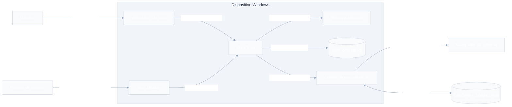

# Modelo de Ameaças — Secrets Storage v1

**Status:** Aprovado como base — inclui o modelo de senha mestra global (GMP). Ver [context.md](../ui-screens/context.md) (D-04/D-05).

**Data:** 2026-07-13

**Aprovação:** 2026-07-14 — riscos residuais, limites e protótipos bloqueadores aceitos para orientar o design; a aprovação não declara os controles como implementados. **Reaberta em revisão** (AD-022) e **re-aprovada em 2026-07-21 por Enzo:** a introdução da senha mestra global (GMP), conforme [context.md](../ui-screens/context.md) (D-04/D-05), altera pontos antes aprovados (isolamento entre sessões, objetivos, ativos, C-01/C-13/C-21 e o raio de exposição de T-AUTH-*). A re-aprovação aceita explicitamente os riscos Críticos residuais **T-AUTH-06** (comprometer a GMP expõe todas as sessões `global` simultaneamente — quebra do não desbloqueio transitivo) e o **default `auth_mode = global`** (isolamento forte `own` é opt-out). Gate **D-05 fechado**. A aprovação não declara os controles como implementados nem dispensa a auditoria independente pré-release.

**Escopo:** Windows, Tauri 2, core Rust, frontend Vite/Tailwind, múltiplas sessões locais e sincronização por OneDrive ou Google Drive

**Documentos relacionados:** [Especificação](./spec.md) · [Contexto](./context.md) · [Roadmap](../../project/ROADMAP.md)

---

## 1. Resumo executivo

O Secrets Storage v1 deve proteger cada sessão como uma fronteira criptográfica independente. Uma cópia do disco, do arquivo do cofre ou do armazenamento em nuvem não deve revelar senhas mestras, chaves de dados ou segredos sem um ataque offline caro contra a senha daquela sessão. Desbloquear uma sessão com senha própria não pode desbloquear outra. Essa garantia de não desbloqueio transitivo vale integralmente para sessões com senha própria (`auth_mode = own`); sessões globais (`auth_mode = global`) compartilham deliberadamente o domínio de confiança da senha mestra global (GMP) e são abertas em conjunto quando a GMP é informada.

O provedor de nuvem é tratado como armazenamento hostil: pode ler, apagar, atrasar, repetir, substituir ou apresentar versões antigas dos blobs. Confidencialidade e integridade não dependem do provedor. Disponibilidade, preservação absoluta do histórico e detecção universal de rollback em uma instalação sem estado anterior não são garantidas.

Dados em memória recebem proteção de melhor esforço e vida curta. Se malware executando como o usuário, um administrador local ou código no kernel controlar o computador enquanto uma sessão estiver desbloqueada, ele poderá observar entrada, tela, clipboard, IPC ou memória do processo. O produto reduz a janela e a quantidade de dados expostos, mas não promete confidencialidade absoluta nesse cenário.

BitLocker, TPM, inicialização segura e TPM+PIN são camadas recomendadas para dispositivos de maior risco, não substitutos da criptografia própria do cofre. A escolha final de KDF, AEAD, parâmetros e apoio de hardware fica bloqueada até os protótipos e benchmarks deste documento.

## 2. Método e vocabulário

Este documento combina uma análise centrada em dados, inspirada no NIST SP 800-154, com categorias STRIDE e avaliação qualitativa de risco baseada no NIST SP 800-30 Rev. 1.

### Níveis de risco

| Nível | Interpretação |
| --- | --- |
| Crítico | Pode expor muitas credenciais ou comprometer a cadeia de confiança; bloqueia o release. |
| Alto | Pode expor uma sessão, causar perda relevante ou permitir execução privilegiada; exige controle antes do release. |
| Médio | Exposição limitada, degradação de defesa ou ataque que exige condições adicionais. |
| Baixo | Impacto pequeno, observável e recuperável sem exposição relevante. |

### Estados de tratamento

| Estado | Significado |
| --- | --- |
| Mitigado | Há controle obrigatório e evidência de verificação planejada. |
| Parcial | O controle reduz, mas não elimina, o risco. |
| Aceito | O risco residual é compreendido e será comunicado. |
| Fora do modelo | Não existe promessa de proteção nesse cenário. |
| Pendente de design | A decisão depende de protótipo, benchmark ou revisão. |

## 3. Objetivos de segurança

1. Manter confidencialidade e integridade dos segredos persistidos por sessão.
2. Isolar senhas, chaves e estados de bloqueio entre sessões, distinguindo dois regimes: isolamento total para sessões com senha própria (`auth_mode = own`) e domínio de confiança compartilhado da GMP para sessões globais (`auth_mode = global`), que compartilham deliberadamente estado de desbloqueio.
3. Nunca persistir a senha mestra e nunca usar um verificador barato que facilite ataque offline.
4. Detectar alteração de conteúdo e metadados protegidos antes de usar os dados.
5. Evitar perda silenciosa durante gravação, sincronização ou resolução de conflitos.
6. Minimizar plaintext em memória, UI, clipboard, logs, dumps e arquivos temporários.
7. Autorizar toda operação privilegiada no core Rust, independentemente do estado da interface.
8. Autenticar atualizações e rejeitar downgrade conforme uma política monotônica.
9. Explicar ao usuário as proteções, dependências e limitações sem garantias enganosas.
10. Proteger a senha mestra global (GMP) e a global master key (GMK) como raiz do domínio de confiança global, já que seu comprometimento expõe todas as sessões globais de uma vez.

## 4. Ativos

| ID | Ativo | Sensibilidade |
| --- | --- | --- |
| A-01 | Senha mestra global (GMP) e senhas próprias de sessões opt-out | Crítica; nunca persistidas. A GMP é raiz do domínio global; comprometê-la expõe todas as sessões globais. |
| A-02 | Chave raiz, KEKs, DEKs e subchaves de uma sessão | Crítica; acesso equivale ao conteúdo protegido. |
| A-11 | Global master key (GMK), gKEK e keyring global | Crítica; a GMK envolve as root_keys de todas as sessões globais e nunca é persistida em claro. Acesso equivale ao conteúdo de todas as sessões globais. |
| A-03 | Segredos em plaintext | Crítica. |
| A-04 | Cofre local, blobs remotos e metadados autenticados | Alta; ciphertext ainda permite ataque offline e análise de volume. |
| A-05 | Plaintext transitório em memória, UI e clipboard | Crítica e efêmera. |
| A-06 | Tokens OAuth, verificadores PKCE e URLs pré-autenticadas | Alta; podem permitir acesso ao armazenamento do aplicativo. |
| A-07 | Histórico, conflitos, tombstones, heads e checkpoints | Alta para integridade e disponibilidade. |
| A-08 | Chave de assinatura e pipeline de release | Crítica para todos os usuários. |
| A-09 | Nomes, quantidade de sessões e dicas de senha | Metadado deliberadamente visível; pode revelar contexto. |
| A-10 | Políticas de bloqueio, modo somente leitura e configuração | Alta para integridade da postura de segurança. |

## 5. Adversários considerados

| ID | Adversário | Capacidades consideradas |
| --- | --- | --- |
| ADV-01 | Pessoa com acesso casual | Usa tela, teclado, clipboard e arquivos acessíveis na conta. |
| ADV-02 | Ladrão com dispositivo desligado | Copia disco, cofre e dados de hibernação; realiza ataque offline. Com a GMP, passa a ter um alvo de maior valor: quebrá-la offline expõe todas as sessões globais de uma vez. |
| ADV-03 | Atacante físico tecnicamente capacitado | Manipula boot, periféricos, DMA ou hardware e pode obter imagens de memória. |
| ADV-04 | Provedor de nuvem comprometido ou malicioso | Lê, apaga, substitui, reordena e repete blobs e metadados remotos. |
| ADV-05 | Malware no contexto do usuário | Captura teclado/clipboard/tela e tenta ler memória ou invocar IPC. Capturar a GMP (ex.: keylogger) passa a ser alvo de maior valor: expõe todas as sessões globais simultaneamente. |
| ADV-06 | Administrador local, kernel ou firmware comprometido | Depura processos, lê memória e altera o sistema operacional. |
| ADV-07 | Atacante de rede | Intercepta OAuth, downloads e tráfego quando controles de transporte falham. |
| ADV-08 | Atacante da cadeia de software | Compromete dependência, pipeline, conta ou chave de assinatura. |
| ADV-09 | Usuário legítimo sujeito a erro | Usa senha fraca, perde senha, desativa bloqueios ou resolve conflito incorretamente. |

## 6. Premissas e limites de confiança

O formato do cofre não pressupõe BitLocker, TPM ou honestidade da nuvem. Pressupõe que primitivas criptográficas revisadas, o gerador aleatório do sistema e o binário legítimo funcionem conforme especificado. Proteções locais adicionais podem depender de Windows suportado, WebView2 atualizado, integridade do boot e configuração segura do dispositivo.

O produto **não** pressupõe que a UI seja uma autoridade. A WebView é conteúdo não confiável em relação ao core: cada comando deve ser pequeno, validado e autorizado novamente no Rust.

O produto **não garante**:

- confidencialidade contra host, kernel ou firmware comprometido durante uso legítimo;
- proteção contra câmera, captura de tela privilegiada ou keylogger enquanto o segredo é exibido ou digitado;
- disponibilidade quando todas as cópias locais e remotas são apagadas;
- recuperação sem a senha mestra no v1;
- apagamento físico verificável de SSDs, backups ou versões mantidas pelo provedor;
- detecção de uma versão antiga autêntica numa instalação nova que não possui checkpoint confiável mais recente.

## 7. Fronteiras de confiança e fluxo de dados

O código-fonte separado do diagrama está em [trust-boundaries-flowchart.mmd](./trust-boundaries-flowchart.mmd).

## 8. Matriz de ameaças

### 8.1 Autenticação e isolamento entre sessões

| ID | STRIDE | Cenário e impacto | Risco inicial | Controles | Tratamento / residual |
| --- | --- | --- | --- | --- | --- |
| T-AUTH-01 | Elevação | Atacante copia o cofre e testa senhas sem sofrer o atraso da UI. | Crítico | C-01, C-02, C-03, C-17 | Parcial: senha fraca continua vulnerável; parâmetros pendentes de benchmark. |
| T-AUTH-02 | Divulgação | Dica contém parte da senha ou contexto sensível. | Alto | C-04 | Parcial: metadado é deliberadamente visível e sincronizado. |
| T-AUTH-03 | Elevação | Tentativas interativas repetidas contra uma sessão. | Alto | C-02, C-04 | Mitigado localmente; atraso não impede ataque offline. |
| T-AUTH-04 | Elevação | Desbloqueio, busca ou comando de uma sessão atravessa a fronteira de outra. | Crítico | C-01, C-10, C-11 | Entre sessões globais o acesso conjunto é por design (D-03) e não é violação; cruzar para uma sessão com senha própria sem a senha dela continua sendo ameaça a mitigar, verificada por testes de autorização por sessão. |
| T-AUTH-05 | Alteração | Atacante desativa bloqueio, muda modo somente leitura ou exclui sessão. | Alto | C-10, C-13 | Parcial: host comprometido pode alterar o aplicativo; mudanças sensíveis exigem senha. |
| T-AUTH-06 | Elevação | Comprometer ou adivinhar a GMP expõe todas as sessões globais simultaneamente. | Crítico | C-01 (revisado), C-02, C-04, C-21 | Parcial/Aceito: por design a GMP abre todas as sessões globais; orientar GMP forte e uso de senha própria para sessões sensíveis. O raio de exposição é maior que no modelo por-sessão. |
| T-AUTH-07 | Elevação | Rebaixar `auth_mode` (own→global) para abrir uma sessão própria com a GMK. | Crítico | C-01 (revisado), C-05, C-21 | Mitigado: `auth_mode` é autenticado na AAD do header; alterá-lo sem a chave correta quebra a autenticação e impede o rebaixamento. |

### 8.2 Memória, UI, clipboard e eventos do Windows

| ID | STRIDE | Cenário e impacto | Risco inicial | Controles | Tratamento / residual |
| --- | --- | --- | --- | --- | --- |
| T-MEM-01 | Divulgação | Malware, administrador ou depurador lê plaintext/chaves de sessão desbloqueada. | Crítico | C-12, C-15 | Fora do modelo para controle ativo do host; exposição é minimizada, não eliminada. |
| T-MEM-02 | Divulgação | Chaves chegam ao pagefile, hibernação ou imagem de memória. | Alto | C-12, C-19 | Parcial: `VirtualLock` pode falhar e suspensão mantém RAM. |
| T-MEM-03 | Divulgação | Crash dump, WER, panic ou telemetria captura segredo. | Alto | C-15 | Mitigado se dumps sensíveis forem desativados/redigidos e testados. |
| T-MEM-04 | Divulgação | Outro processo lê o clipboard antes/depois da limpeza. | Alto | C-14 | Parcial: padrão de 5 min amplia a janela; limpeza não pode ser prometida universalmente. |
| T-MEM-05 | Divulgação | DOM, histórico da WebView, log de IPC ou cache mantém plaintext. | Alto | C-10, C-11, C-12, C-15 | Parcial até protótipo comprovar o ciclo de vida real. |
| T-MEM-06 | Elevação | Evento de bloqueio/suspensão é perdido ou demora a bloquear. | Alto | C-13 | Parcial: evento crítico pode não chegar; fechar sempre bloqueia. Desativação individual é risco aceito pelo usuário. |

### 8.3 Persistência local

| ID | STRIDE | Cenário e impacto | Risco inicial | Controles | Tratamento / residual |
| --- | --- | --- | --- | --- | --- |
| T-STOR-01 | Divulgação | Disco, backup ou cofre é copiado e analisado offline. | Crítico | C-01, C-02, C-03, C-05, C-19 | Parcial: resistência depende da senha e dos parâmetros; BitLocker é defesa adicional. |
| T-STOR-02 | Alteração | Ciphertext, cabeçalho, sessão ou metadado é substituído/truncado. | Alto | C-05, C-17 | Mitigado se todos os campos relevantes forem autenticados antes do uso. |
| T-STOR-03 | Negação | Queda de energia/espaço insuficiente deixa gravação parcial. | Alto | C-07 | Mitigado após testes de falha e recuperação. |
| T-STOR-04 | Divulgação | Exclusão deixa versões em histórico, SSD, backup ou nuvem. | Alto | C-18 | Aceito e comunicado; não prometer destruição física fora do controle do aplicativo. |
| T-STOR-05 | Negação | Duas instâncias gravam simultaneamente e corrompem o estado. | Alto | C-07, C-17 | Pendente de design de locking/journal. |

### 8.4 Sincronização e conflitos

| ID | STRIDE | Cenário e impacto | Risco inicial | Controles | Tratamento / residual |
| --- | --- | --- | --- | --- | --- |
| T-SYNC-01 | Divulgação | Provedor lê conteúdo ou aprende padrões de uso. | Crítico | C-05, C-08 | Conteúdo mitigado; tamanho, horário e volume permanecem parcialmente visíveis. |
| T-SYNC-02 | Alteração | Provedor injeta, troca ou corrompe blob. | Alto | C-05, C-06, C-17 | Mitigado para integridade criptográfica; blob inválido nunca substitui cópia válida. |
| T-SYNC-03 | Alteração | Provedor repete ou volta a uma revisão antiga autêntica. | Crítico | C-06 | Parcial: detectável com checkpoint conhecido; impossível provar frescor universal numa instalação nova sem âncora externa confiável. |
| T-SYNC-04 | Alteração | Escritas concorrentes sobrescrevem campos ou histórico silenciosamente. | Alto | C-06, C-20 | Mitigado por revisões imutáveis, ancestralidade e preservação de todas as versões. |
| T-SYNC-05 | Negação | Blob malformado causa consumo ilimitado de CPU, RAM ou disco. | Alto | C-17 | Mitigado após limites, parsing defensivo e fuzzing. |
| T-SYNC-06 | Divulgação | Nomes, dicas, IDs ou estrutura remota revelam contexto. | Médio | C-05, C-08 | Parcial: nome/dica são deliberadamente não secretos; minimizar o restante. |
| T-SYNC-07 | Negação | Provedor apaga dados, revoga token, excede quota ou fica indisponível. | Alto | C-06, C-08, C-20 | Aceito parcialmente: operação local continua; não há disponibilidade absoluta. |

### 8.5 OAuth, Tauri e atualizações

| ID | STRIDE | Cenário e impacto | Risco inicial | Controles | Tratamento / residual |
| --- | --- | --- | --- | --- | --- |
| T-OAUTH-01 | Falsificação | Código OAuth é interceptado, resposta é forjada ou login é confundido entre provedores. | Alto | C-09 | Mitigado com navegador externo, Authorization Code + PKCE S256 e `state` de uso único. |
| T-OAUTH-02 | Divulgação | Token, verifier ou URL pré-autenticada chega à UI, log ou dump. | Alto | C-09, C-10, C-15 | Parcial até validar armazenamento local e fluxo real dos dois provedores. |
| T-OAUTH-03 | Elevação | Escopo excessivo permite acessar arquivos fora da área do aplicativo. | Alto | C-08, C-09 | Mitigado com App Folder/appDataFolder e consentimento mínimo. |
| T-IPC-01 | Elevação | XSS ou frontend comprometido invoca comando Rust privilegiado. | Crítico | C-10, C-11 | Mitigado se autorização ocorrer no backend e comandos não aceitarem capacidades genéricas. |
| T-IPC-02 | Elevação | Conteúdo remoto, capability ou plugin amplo expande a autoridade da WebView. | Crítico | C-10, C-11 | Mitigado por conteúdo local, CSP estrita e allowlist mínima, sujeito a auditoria. |
| T-UPD-01 | Falsificação | Manifesto ou instalador adulterado é aceito. | Crítico | C-16 | Mitigado com assinatura obrigatória e HTTPS. |
| T-UPD-02 | Alteração | Pacote antigo, porém assinado, causa downgrade vulnerável. | Alto | C-16 | Mitigado com versão monotônica e aceitação apenas de versão superior. |
| T-UPD-03 | Elevação | Chave ou pipeline de release é comprometido e assina malware. | Crítico | C-16 | Parcial: assinatura não protege contra o signatário comprometido; requer isolamento, rotação e resposta. |

### 8.6 Acesso físico e operação

| ID | STRIDE | Cenário e impacto | Risco inicial | Controles | Tratamento / residual |
| --- | --- | --- | --- | --- | --- |
| T-PHYS-01 | Divulgação | Cold boot, DMA, periférico ou firmware captura RAM de sessão aberta. | Crítico | C-12, C-13, C-19 | Parcial/fora do modelo conforme o nível de controle; recomendar hibernação protegida e TPM+PIN para alto risco. |
| T-USER-01 | Negação | Usuário esquece a senha e perde acesso definitivo. | Alto | C-04 | Aceito no v1; avisos periódicos, sem backdoor ou recuperação implícita. |
| T-USER-02 | Divulgação | Usuário escolhe “nunca” ou desativa bloqueio no Windows. | Alto | C-13 | Aceito mediante confirmação e aviso claro; novas sessões usam opções seguras por padrão. |
| T-LOG-01 | Divulgação | Diagnóstico, nome de arquivo, mensagem de erro ou analytics revela segredo/token. | Alto | C-15 | Mitigado por redaction, dados estruturados permitidos e testes de canário. |

## 9. Catálogo de controles obrigatórios

| ID | Controle e requisito mínimo |
| --- | --- |
| C-01 | Uma chave raiz aleatória e independente por sessão. Sessões com senha própria (`auth_mode = own`) mantêm isolamento total: nenhum desbloqueio ou cache de uma delas concede acesso a outra. Sessões globais (`auth_mode = global`) compartilham deliberadamente o domínio de confiança da GMP e são abertas em conjunto no desbloqueio do app (D-03). O `auth_mode` autenticado na AAD impede rebaixar uma sessão própria para o modo global. |
| C-02 | KDF memory-hard com salt aleatório por sessão, parâmetros e versão no envelope, limites defensivos e benchmark em hardware suportado. Argon2id é candidato, não decisão final. |
| C-03 | Envelope de chaves: a KDF produz uma KEK que envolve a chave raiz aleatória; subchaves separadas por propósito, sessão, versão e época. Não armazenar verificador barato. |
| C-04 | Comprimento mínimo, indicador de força, atraso progressivo local, dica sob demanda com aviso de exposição, senha atual para troca e lembrete de ausência de recuperação. |
| C-05 | AEAD sobre conteúdo e metadados associados, incluindo versão, UUID de sessão, tipo/ID do objeto, época, revisão e ancestralidade. Estratégia de nonce é decisão bloqueada. |
| C-06 | Revisões imutáveis, IDs autenticados, compromisso com pais/DAG, identificador e sequência por dispositivo e checkpoints locais conhecidos. Relógio não prova frescor. |
| C-07 | Gravação em arquivo temporário no mesmo volume, validação, flush e substituição atômica; journal ou manifestos em dois slots; testes de falha em cada etapa. |
| C-08 | Nuvem como blob store hostil, nomes opacos, metadados mínimos, OneDrive App Folder ou Google `appDataFolder`, upload condicional quando disponível. |
| C-09 | OAuth de cliente público nativo no navegador do sistema, Authorization Code + PKCE S256, `state` único e curto, redirect local restrito e troca de código apenas no Rust. Sem client secret embutido. |
| C-10 | Senhas, chaves, tokens e operações criptográficas permanecem no core Rust; comandos de alto nível revalidam estado desbloqueado, sessão, modo somente leitura, IDs e limites. |
| C-11 | Bundle Vite/Tailwind inteiramente local na WebView, CSP estrita sem CDN/`unsafe-eval`, capabilities e plugins mínimos, DevTools desligado em release e nenhum evento global com plaintext. |
| C-12 | Buffers sensíveis de vida curta, sem cópias desnecessárias, zeroização verificável, tentativa explícita de impedir paginação e descarte completo ao bloquear/fechar. Falhas de `VirtualLock` são tratadas. |
| C-13 | Bloqueio do app inteiro pela GMP (tela de desbloqueio global; sem a GMP nada é acessível) somado ao bloqueio por sessão. Cronômetro independente por sessão; padrão de 15 min; somente interação intencional nela reinicia. Bloqueio/suspensão do Windows ativos por padrão e configuráveis individualmente; fechar bloqueia todas e trava o app. Bloquear o app descarta a GMK e fecha todas as sessões globais; sessões com senha própria seguem seu próprio estado. “Nunca” exige confirmação. |
| C-14 | Clipboard com prazo configurável, padrão de 5 min, “Limpar agora”, limpeza apenas se o conteúdo ainda for o copiado pelo app e mensagem honesta quando não houver confirmação. |
| C-15 | Proibição de segredos, senhas, chaves, tokens e URLs pré-autenticadas em logs, panic, telemetria, temporários e dumps; redaction por allowlist e testes com canários. |
| C-16 | Updater Tauri com assinatura obrigatória, HTTPS, versão estritamente superior, chave privada fora do repositório/artefatos, pipeline protegido e plano de rotação/revogação. |
| C-17 | Limites de tamanho, profundidade, contagem, custo KDF e armazenamento; parsing antes de alocação grande, autenticação antes de interpretação e fuzzing de formatos/IPC. |
| C-18 | Contrato de exclusão distingue tombstone, histórico, expiração, purge do provedor e sanitização de mídia; nunca promete apagar backups fora do controle do app. |
| C-19 | Recomendar BitLocker; para ameaça física direcionada, recomendar TPM+PIN e hibernação/desligamento em vez de sleep. TPM/DPAPI podem proteger material do dispositivo, nunca ser a única chave do cofre. |
| C-20 | Conflitos preservam todas as versões, resolução campo a campo, materialização permanente após 30 dias, aviso nos 7 dias finais e desfazer por 7 dias. |
| C-21 | Keyring global e proteção da GMP/GMK: KDF memory-hard da gKEK a partir da GMP com salt próprio; `wrapped_gmk = AEAD(gKEK, GMK, aad = header)` com `format_version`, `salt_global`, params de KDF e `aead_id` autenticados; wrap da `root_key` de sessões globais por `HKDF(GMK, session_uuid)` e `auth_mode` autenticado na AAD. Nunca persistir gKEK/GMK em claro; orientar GMP forte e oferecer senha própria para sessões sensíveis. Parâmetros do keyring pendentes de benchmark (PT-01). |

## 10. Postura contra acesso físico e hardware

### Dispositivo desligado

A criptografia do cofre deve permanecer a proteção primária. BitLocker reduz a exposição do volume inteiro, incluindo temporários e hibernação, mas não elimina ataque offline contra uma cópia independente do blob. Para alvos de maior valor, TPM+PIN eleva o custo de ataques que dependem apenas do TPM e da cadeia automática de boot.

### Dispositivo em sleep, bloqueado ou suspenso

Sleep pode manter chaves em RAM. O aplicativo tenta bloquear sessões configuradas ao receber o evento, mas eventos críticos podem não conceder tempo suficiente ou não chegar. Para ameaça física avançada, a orientação é hibernar ou desligar com criptografia de disco habilitada. Se o usuário desativar o bloqueio de uma sessão em lock/suspend, o risco residual deve ser mostrado como alto.

### Dispositivo ligado e sessão desbloqueada

O plaintext necessariamente existe durante uso. Zeroização, buffers protegidos e separação do core diminuem exposição acidental; não impedem um administrador, driver, firmware ou malware suficientemente privilegiado de capturá-lo. O produto deve dizer isso de forma direta.

### TPM e DPAPI

TPM pode manter uma chave de dispositivo não exportável e DPAPI pode proteger tokens OAuth ou uma camada opcional de vinculação ao dispositivo. Nenhum deles deve substituir a senha mestra ou tornar o formato irrecuperável em outro computador. Malware executando como o usuário ainda pode solicitar operações autorizadas ao sistema; portanto, apoio de hardware é defesa em profundidade.

## 11. Protótipos e testes que bloqueiam o design final

| ID | Experimento | Evidência necessária |
| --- | --- | --- |
| PT-01 | Benchmark de KDF | Latência e memória em hardware mínimo, típico e rápido; parâmetros resistentes a DoS; impacto de unlock simultâneo. |
| PT-02 | Formato e AEAD | Vetores de teste, alteração de cada campo/byte rejeitada, nonce único ou estratégia misuse-resistant revisada. |
| PT-03 | Hierarquia e isolamento | Desbloquear, bloquear, trocar senha e excluir uma sessão sem acesso ou resíduo nas demais. No modelo GMP: desbloqueio global abre somente as sessões globais e as sessões com senha própria permanecem fechadas; trocar a GMP re-envolve a mesma GMK sem afetar conteúdos; rebaixar `auth_mode` (own→global) falha por autenticação da AAD; bloquear o app descarta a GMK. |
| PT-04 | Memória otimizada | Confirmar zeroização em release, tratar falha de lock de páginas e inspecionar cópias em Rust/WebView/IPC. |
| PT-05 | Eventos Windows | Lock, unlock, sleep, hibernação, shutdown e suspensão crítica; comportamento fail-closed quando possível. |
| PT-06 | Pagefile/hibernação | Buscar canários após uso, bloqueio, hibernação e crash com e sem BitLocker. |
| PT-07 | Dumps e logs | Forçar panic, WER, minidump e erros OAuth/sync; nenhum canário ou token pode aparecer. |
| PT-08 | Clipboard | Substituição concorrente, múltiplos formatos, atraso, “Limpar agora”, falha de acesso e reinício do Explorer. |
| PT-09 | Tauri/IPC | XSS controlado não acessa comando privilegiado; capabilities, CSP, plugins e DevTools auditados no bundle final. |
| PT-10 | OAuth real | PKCE/state/redirect, cancelamento e token lifecycle em Microsoft e Google; nenhum token entra na WebView/log. |
| PT-11 | Sync hostil | Corrupção, truncamento, replay, rollback, reordenação, quota, duplicação e concorrência entre dispositivos. |
| PT-12 | Gravação atômica | Cortar processo/energia simulada em cada etapa e recuperar sempre o último estado autenticado. |
| PT-13 | TPM/DPAPI opcional | Portabilidade, recuperação em novo dispositivo, perfil de usuário, TPM indisponível e malware no mesmo usuário. |
| PT-14 | Updater | Pacote/manifesto adulterado, downgrade, chave rotacionada, endpoint indisponível e falha antes/depois da troca. |
| PT-15 | Parsing e fuzzing | Corpus de blobs/IPC malformados sem panic, consumo ilimitado ou aceitação de estado não autenticado. |

Um controle só muda para “Mitigado” quando existir implementação e evidência reproduzível. Até lá, esta matriz descreve requisitos, não certifica o produto.

## 12. Decisões ainda abertas

1. KDF e parâmetros finais, incluindo compatibilidade ou não com requisitos FIPS.
2. AEAD, tamanho de nonce e estratégia de geração/uso indevido.
3. Estrutura exata da hierarquia de chaves, épocas e rotação.
4. Representação binária versionada e limites máximos de cada campo.
5. Mecanismo de checkpoint/âncora e promessa exata contra rollback em dispositivo novo.
6. Estrutura de memória sensível e fronteira prática entre Rust, WebView e clipboard.
7. Papel opcional de DPAPI/TPM, experiência de migração e recuperação do dispositivo.
8. Armazenamento e rotação de tokens OAuth nos dois provedores.
9. Rotação/revogação da chave de assinatura do updater.
10. Política exata de retenção/purge de históricos e tombstones após os prazos funcionais.
11. Domínio de confiança da GMP e parâmetros do keyring global: KDF/params da gKEK, formato e versionamento do keyring, e critérios para orientar quando uma sessão deve usar senha própria em vez do modo global.

## 13. Gates de release e manutenção

- Nenhuma ameaça Crítica ou Alta pode permanecer “Pendente de design” no release correspondente.
- Risco Crítico/Alto “Parcial”, “Aceito” ou “Fora do modelo” exige texto visível na documentação e aprovação explícita.
- Toda ameaça declarada mitigada precisa mapear para controle, teste e resultado versionado.
- Mudanças em formato criptográfico, Tauri/IPC, OAuth, sincronização, updater, armazenamento de chaves ou política de bloqueio exigem revisão deste documento.
- Dependências criptográficas e de segurança devem usar versões suportadas, advisories monitorados e atualização controlada.
- A introdução da senha mestra global (GMP) é uma mudança do modelo de autenticação (AD-022) e exigiu re-aprovação humana antes de voltar a ser base estável de design (ver [context.md](../ui-screens/context.md) D-05). **Re-aprovada em 2026-07-21 por Enzo, com D-05 fechado;** os pontos afetados (isolamento, C-01/C-13/C-21 e T-AUTH-*) voltam a contar como aprovados. A auditoria de segurança independente pré-release (§283) permanece obrigatória e não é substituída por esta re-aprovação.
- Auditoria independente é obrigatória antes da versão estável; este documento não substitui auditoria.

## 14. Referências primárias

### Método e criptografia

- [NIST SP 800-154 — Data-Centric System Threat Modeling](https://csrc.nist.gov/pubs/sp/800/154/ipd)
- [NIST SP 800-30 Rev. 1 — Guide for Conducting Risk Assessments](https://csrc.nist.gov/pubs/sp/800/30/r1/final)
- [Microsoft — STRIDE threat categories](https://learn.microsoft.com/en-us/azure/security/develop/threat-modeling-tool-threats)
- [NIST SP 800-132 — Password-Based Key Derivation](https://csrc.nist.gov/pubs/sp/800/132/final)
- [RFC 9106 — Argon2](https://www.rfc-editor.org/rfc/rfc9106.html)
- [RFC 5116 — Authenticated Encryption](https://www.rfc-editor.org/rfc/rfc5116.html)
- [NIST SP 800-38D — GCM and GMAC](https://csrc.nist.gov/pubs/sp/800/38/d/final)
- [RFC 5869 — HKDF](https://www.rfc-editor.org/rfc/rfc5869.html)

### Windows e hardware

- [Microsoft — BitLocker overview](https://learn.microsoft.com/en-us/windows-hardware/manufacture/desktop/bitlocker-drive-encryption)
- [Microsoft — BitLocker countermeasures](https://learn.microsoft.com/en-us/windows/security/operating-system-security/data-protection/bitlocker/countermeasures)
- [Microsoft — How Windows uses the TPM](https://learn.microsoft.com/en-us/windows/security/hardware-security/tpm/how-windows-uses-the-tpm)
- [Microsoft — `VirtualLock`](https://learn.microsoft.com/en-us/windows/win32/api/memoryapi/nf-memoryapi-virtuallock)
- [Microsoft — DPAPI `CryptProtectData`](https://learn.microsoft.com/en-us/windows/win32/api/dpapi/nf-dpapi-cryptprotectdata)
- [Microsoft — System power management events](https://learn.microsoft.com/en-us/windows/win32/power/system-power-management-events)
- [Microsoft — Windows Error Reporting dumps](https://learn.microsoft.com/en-us/windows/win32/wer/collecting-user-mode-dumps)
- [NIST SP 800-88 Rev. 2 — Media Sanitization](https://csrc.nist.gov/pubs/sp/800/88/r2/final)

### Aplicação, OAuth, nuvem e updates

- [Tauri 2 — Process Model](https://v2.tauri.app/concept/process-model/)
- [Tauri 2 — Runtime Authority](https://v2.tauri.app/security/runtime-authority/)
- [Tauri 2 — Content Security Policy](https://v2.tauri.app/security/csp/)
- [Tauri 2 — Updater](https://v2.tauri.app/plugin/updater/)
- [RFC 8252 — OAuth 2.0 for Native Apps](https://www.rfc-editor.org/rfc/rfc8252.html)
- [RFC 7636 — PKCE](https://www.rfc-editor.org/rfc/rfc7636.html)
- [Microsoft Graph — OneDrive App Folder](https://learn.microsoft.com/en-us/graph/onedrive-sharepoint-appfolder)
- [Google Drive — Application data folder](https://developers.google.com/workspace/drive/api/guides/appdata)
- [Microsoft — `FlushFileBuffers`](https://learn.microsoft.com/en-us/windows/win32/api/fileapi/nf-fileapi-flushfilebuffers)
- [Microsoft — `ReplaceFileW`](https://learn.microsoft.com/en-us/windows/win32/api/winbase/nf-winbase-replacefilew)
