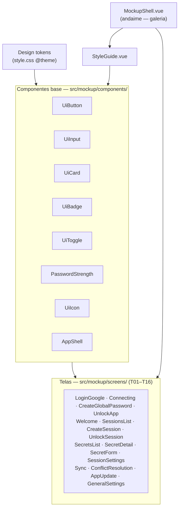

# Mockup Visual das Telas — Design

**Spec:** [spec.md](./spec.md) (T01–T16) + prompt de identidade visual
**Status:** Implemented
**Escopo:** protótipo visual navegável das 16 telas do fluxo. **100% estático — nada funcional.** Sem criptografia, backend, IPC Tauri, validação, roteamento de produto ou persistência.

---

## Princípio orientador

Cada tela é um **componente Vue de apresentação puro**: só `<template>` + (no máximo) `const` locais com dados fictícios. **Proibido** neste mockup: `ref`/estado reativo de produto, `props`, `emits`, `watch`, `invoke` do Tauri, chamadas de rede, `v-model` ligado a lógica. Interações (hover/focus/disabled) só via CSS/Tailwind.

**Exceção consciente:** o `MockupShell.vue` é **andaime de visualização** (uma galeria para trocar qual tela aparece). Não é funcionalidade do produto e não vai para o app real — vive isolado em `src/mockup/`.

---

## Architecture Overview

Camada de mockup isolada em `src/mockup/`, sem tocar em `src/App.vue` de produção até aprovação. Três anéis: **tokens** (CSS) → **componentes base** (UI) → **telas** (composição). O shell só compõe telas para exibição.



**Fluxo de navegação (mockup):** o `MockupShell` mostra uma lista T01–T16 na lateral; clicar troca a tela renderizada. As telas com sidebar de produto usam o `AppShell` (sidebar visual de sessões, sem lógica). Nenhuma tela navega para outra sozinha — quem troca é o shell.

**Modelo de autenticação (D-01…D-03, ver [context.md](./context.md)):** senha mestra **global** trava o app (T04); desbloqueá-la abre todas as sessões globais de uma vez; sessões podem optar por **senha própria** (T07 toggle) e aí ficam isoladas (T08). Isso é decisão de mockup — diverge da garantia "sem desbloqueio transitivo" da `secure-vault/spec.md`.

---

## Code Reuse Analysis

### Existing Components to Leverage

| Component | Location | How to Use |
| --- | --- | --- |
| Setup Tailwind 4 `@theme` | `src/style.css` | Estender: adicionar tokens de cor/fonte/raio como custom properties → viram utilitários |
| Padrão de card/aviso âmbar | `src/App.vue` (atual) | Referência de estilo (aside âmbar, bordas suaves); **não** editar App.vue ainda |
| `<script setup lang="ts">` + Vue 3 | `src/App.vue` | Mesma convenção de SFC |
| Vitest + Vue Test Utils | `src/App.test.ts` | Padrão para smoke test de montagem de cada tela |

### Integration Points

| System | Integration Method |
| --- | --- |
| App de produção (`src/App.vue`) | **Nenhuma nesta fatia.** Mockup vive em `src/mockup/` e não é montado por `main.ts` até decisão futura |
| Tauri IPC / core Rust | **Nenhuma.** Mockup não chama `invoke` |
| Fontes (Inter / JetBrains Mono) | Self-hosted local (CSP proíbe CDN). Fallback Windows: `Segoe UI` (sans) e `Cascadia Code`/`Consolas` (mono) |

---

## Design Tokens (fonte única da verdade)

Definidos em `src/style.css` via `@theme`, expostos como utilitários Tailwind (ex.: `bg-app`, `text-secondary`, `border-divider`, `text-accent`, `font-mono`). Tema escuro é o padrão em `:root`; tema claro sob a classe `.theme-light` no elemento raiz.

```css
@theme {
  /* Fontes */
  --font-sans: "Inter", "Segoe UI", system-ui, sans-serif;
  --font-mono: "JetBrains Mono", "Cascadia Code", "Consolas", monospace;

  /* Cores — TEMA ESCURO (padrão) */
  --color-app: #0B0E14;
  --color-surface: #141925;
  --color-elevated: #1C2333;
  --color-divider: #2A3242;
  --color-primary: #E6EAF2;      /* texto primário */
  --color-secondary: #9AA4B8;    /* texto secundário */
  --color-muted: #5A6273;        /* texto desabilitado */
  --color-accent: #6D5EF5;
  --color-accent-hover: #5B4CE0;
  --color-success: #2DD4A7;
  --color-warning: #F5B84B;
  --color-danger: #F0616D;

  /* Raios */
  --radius-control: 8px;
  --radius-card: 12px;
  --radius-modal: 16px;
  --radius-pill: 999px;
}

/* Acento suave para chips/realces (alpha) */
:root { --color-accent-soft: rgba(109,94,245,.10); }

/* TEMA CLARO — override por classe no root */
.theme-light {
  --color-app: #F5F6FA;   --color-surface: #FFFFFF;  --color-elevated: #FFFFFF;
  --color-divider: #E2E5EC; --color-primary: #171B24; --color-secondary: #5A6273;
  --color-muted: #A8AEBC; --color-accent: #5B4CE0; --color-success: #12B588;
  --color-warning: #D9911F; --color-danger: #E0455A; --color-accent-soft: rgba(91,76,224,.08);
}
```

**Escala tipográfica** (aplicada por classe utilitária/composição, não novos tokens):
Display 28/700/34 · H1 20/600/28 · H2 16/600/24 · Corpo 14/400/20 · Label 14/500/20 · Aux 12/400/16 · Micro 11/500/14 (ls .02em) · Mono 13/400/20.
**Espaçamento:** múltiplos de 4 (padrão Tailwind já atende). **Sombras** só no tema claro (tokens `shadow-card/modal/popover` via `@theme` ou classes utilitárias).

---

## Components

### Base — `src/mockup/components/`

#### UiButton.vue
- **Purpose:** botão em 4 variantes visuais.
- **Location:** `src/mockup/components/UiButton.vue`
- **Variantes (por classe, não prop reativa):** `primary` (bg accent, texto branco, h-10), `secondary` (transparente, borda divider), `danger` (bg/texto danger), `ghost` (só ícone, 36–40px).
- **Estados:** hover, focus-ring (accent 2px + offset), disabled (muted).
- **Reuses:** tokens de cor/raio.

#### UiInput.vue
- **Purpose:** campo de formulário com label e texto de ajuda.
- **Location:** `src/mockup/components/UiInput.vue`
- **Estrutura:** label (14/500) acima · input h-10 borda divider radius-control · ajuda (12 secondary) abaixo · slot opcional de ícone-olho (revelar senha, apenas visual).
- **Variações:** texto, password (com olho), erro (borda danger + mensagem coral).

#### UiCard.vue
- **Purpose:** container de superfície.
- **Location:** `src/mockup/components/UiCard.vue`
- **Estrutura:** bg surface, radius-card, padding 20; borda 1px divider (escuro) / sombra (claro). Slot default + slots opcionais header/footer.

#### UiBadge.vue
- **Purpose:** pill de estado (11px micro).
- **Location:** `src/mockup/components/UiBadge.vue`
- **Tons:** neutro (Bloqueada), accent-soft (Desbloqueada), success (Sincronizado), warning (Offline / Somente leitura), danger (Conflito).

#### UiToggle.vue
- **Purpose:** switch on/off (visual).
- **Location:** `src/mockup/components/UiToggle.vue`
- **Estrutura:** trilho 40x22, botão branco; ligado = bg accent. Estados ligado/desligado renderizados por classe.

#### PasswordStrength.vue
- **Purpose:** indicador de força — 4 segmentos + rótulo.
- **Location:** `src/mockup/components/PasswordStrength.vue`
- **Níveis (visuais):** Fraca (danger) · Média (warning) · Boa (accent) · Forte (success).

#### UiIcon.vue
- **Purpose:** ícones em linha (stroke ~1.75px, 20px). Inclui cadeado, olho, copiar, Google, Google Drive, tipos de segredo (senha/api/token/nota/ssh), engrenagem, sync, aviso.
- **Location:** `src/mockup/components/UiIcon.vue`
- **Implementação:** inline SVG por `name` (sem libs externas — CSP/offline). Cor via `currentColor`.

#### AppShell.vue
- **Purpose:** layout de produto = sidebar 240px (lista de sessões + rodapé de ícones) + área principal com slot.
- **Location:** `src/mockup/components/AppShell.vue`
- **Uso:** telas T05, T07, T10, T11, T14. Sidebar com sessões fictícias fixas; item ativo destacado. Sem navegação real.

### StyleGuide — `src/mockup/StyleGuide.vue`
- **Purpose:** vitrine viva: paleta (escuro/claro), tipografia, e cada componente base em todos os estados. Serve de referência e de teste visual.

### Telas — `src/mockup/screens/` (T01–T16)
Cada uma compõe os base + `AppShell` quando aplicável, com o conteúdo fictício e as **variações de estado** definidos na spec. Layout centralizado (sem sidebar): T01, T02, T03, T04, T05, T08. Com `AppShell`: T06, T09, T10, T11, T12, T13, T14, T15, T16 (modais/painéis sobre o shell quando fizer sentido).

| Arquivo | Tela (spec) | Variações a incluir |
| --- | --- | --- |
| `T01_LoginGoogle.vue` | Login Google | padrão (+ hover opcional) |
| `T02_Connecting.vue` | Conectando | carregando + erro (cancelado) |
| `T03_CreateGlobalPassword.vue` | Criar senha global (1º uso) | preenchido + aviso "sem recuperação" |
| `T04_UnlockApp.vue` | Desbloquear app (senha global) | padrão + dica revelada + atraso pós-erro |
| `T05_Welcome.vue` | Boas-vindas / vazio | única |
| `T06_SessionsList.vue` | Lista de sessões | globais desbloqueadas + próprias bloqueadas |
| `T07_CreateSession.vue` | Criar sessão | senha própria desligada + ligada |
| `T08_UnlockSession.vue` | Desbloquear sessão (senha própria) | padrão + dica revelada + atraso pós-erro |
| `T09_SecretsList.vue` | Lista de segredos | com itens + cofre vazio |
| `T10_SecretDetail.vue` | Detalhe do segredo | um por tipo + toast de cópia |
| `T11_SecretForm.vue` | Criar/editar segredo | tipo Senha (+ opcional Chave SSH) |
| `T12_SessionSettings.vue` | Config. da sessão | única (autenticação + zona de perigo) |
| `T13_Sync.vue` | Sincronização | sincronizado + enviando + offline |
| `T14_ConflictResolution.vue` | Conflitos | 1 conflito, 2 campos + banner |
| `T15_AppUpdate.vue` | Atualização | disponível + verificando + erro |
| `T16_GeneralSettings.vue` | Config. gerais / Sobre | senha global + tema escuro (+ claro opcional) |

### MockupShell — `src/mockup/MockupShell.vue`
- **Purpose (andaime):** galeria navegável. Lista T01–T16 + StyleGuide numa coluna; renderiza a seleção. Toggle de tema claro/escuro (aplica `.theme-light` no root) para inspecionar ambos.
- **Nota:** único arquivo do mockup com um `ref` local — e só para escolher qual tela exibir. Não representa lógica de produto.

---

## Data Models

Não aplicável (mockup estático). Dados fictícios ficam inline em cada tela. Para reduzir divergência visual, um módulo opcional `src/mockup/fixtures.ts` pode centralizar os mocks (sessões, segredos de exemplo) como constantes tipadas — sem lógica.

```typescript
// src/mockup/fixtures.ts (opcional, apenas constantes)
// auth: "global" (abre com a senha global) | "own" (senha própria, isolada)
export const SESSIONS = [
  { name: "Trabalho", initial: "T", auth: "global", state: "unlocked", count: 12 },
  { name: "Pessoal", initial: "P", auth: "global", state: "unlocked", count: 5 },
  { name: "Financeiro", initial: "F", auth: "own", state: "locked" },
  { name: "Projeto X", initial: "X", auth: "own", state: "locked", readOnly: true },
] as const
```

---

## Error Handling Strategy

Não há erros de runtime a tratar (estático). "Estados de erro" são **telas/variações visuais** (T02 cancelado, T06 senha incorreta, T13 assinatura inválida), renderizados por composição, não por lógica.

---

## Tech Decisions (não óbvias)

| Decisão | Escolha | Racional |
| --- | --- | --- |
| Como navegar entre telas sem quebrar "nada funcional" | `MockupShell` como galeria (andaime), telas 100% estáticas | Permite revisar sem introduzir roteamento/estado de produto |
| Onde vivem os arquivos | `src/mockup/` isolado, não montado por `main.ts` | Não contamina o app de produção nem os gates de segurança |
| Tokens de cor | Tailwind 4 `@theme` custom properties → utilitários | Fonte única; troca de tema por classe no root |
| Tema claro/escuro | escuro em `:root`, claro em `.theme-light` | Sem JS de produto; só o shell alterna a classe |
| Ícones | inline SVG em `UiIcon` | CSP/offline proíbem CDN e libs de ícone remotas |
| Fontes | self-hosted, fallback Segoe UI / Cascadia Code | CSP proíbe CDN; fallback já existe no Windows |
| Reatividade nas telas | proibida (só `const` de mock) | Garante "nada funcional" e simplifica revisão |
| Modelo de autenticação | senha global (gate do app) + opt-out por sessão | Decisão do usuário D-01…D-03; global abre todas as sessões globais de uma vez |

---

## Concerns / Riscos

- **Não impersonar o Google:** T02 representa só "redirecionando"; **não** desenhar a página de consentimento real do Google.
- **OAuth ≠ login de identidade:** manter a nota de arquitetura da spec visível na documentação para o mockup não virar expectativa de produto.
- **Fontes e CSP:** se Inter/JetBrains Mono não forem empacotadas, o mockup cai no fallback — aceitável, mas registrar.
- **Isolamento:** `src/mockup/` não deve ser importado pelo bundle de produção sem decisão explícita.
- **Desbloqueio transitivo (D-03):** a senha global abrindo todas as sessões globais **remove** o isolamento entre elas — o oposto da garantia atual da `secure-vault/spec.md`. Consciente e restrito ao mockup; propagar ao produto exige revisão de segurança (ver [context.md](./context.md)).
