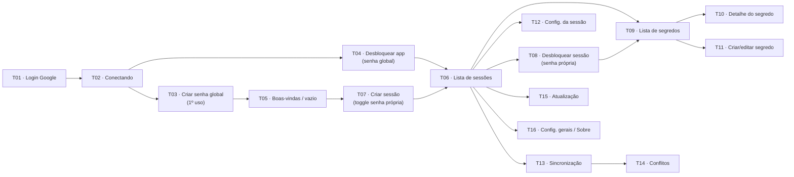

# Fluxo de Telas (Mockup) — Especificação de Design

**Status:** Implemented — mockup visual validado
**Escopo:** especificação das telas que compõem **um único fluxo linear de demonstração** do produto, do login à navegação principal. Serve de guia para gerar os componentes `.vue` no Claude Design.
**Natureza:** 100% visual. **Nada funciona.** Botões, campos e toggles são apenas aparência; "avançar" no fluxo significa exibir o próximo mockup estático, sem lógica, backend, criptografia, validação ou persistência.
**Identidade visual:** ver o *prompt de design* / futuro `StyleGuide.vue` (base grafite escura, acento índigo `#6D5EF5`, tipografia Inter + JetBrains Mono, escala base 4px).
**Decisões de modelo:** ver [context.md](./context.md) (D-01…D-03 — senha mestra global + senha por sessão opt-out).

---

## Modelo de autenticação (mockup)

- **Senha mestra global** protege o app. Após o login com Google, uma **tela de desbloqueio global** trava tudo (D-02).
- Desbloquear a senha global **abre de uma vez** todas as sessões que a usam (D-03).
- Uma sessão pode marcar **"usar senha própria"** — fica isolada e exige a própria senha mesmo com o app aberto (D-01).

## Nota de arquitetura (mockup ≠ produto)

No produto real ([PROJECT.md](../../project/PROJECT.md)) o app é **local-first e zero-knowledge**, e o **OAuth 2.0 com Google** serve **apenas para autorizar a sincronização** do cofre cifrado no Google Drive — **não** é login de identidade. Este mockup, a pedido, começa por uma **tela de login com Google**; trate como apresentação do protótipo, não como a autenticação de produto. A tela de consentimento do Google é **externa e real** — este mockup **não a reproduz** (representa só o estado "redirecionando"). O modelo global + opt-out (D-03) diverge da garantia atual "sem desbloqueio transitivo" da `secure-vault/spec.md`; ver [context.md](./context.md).

---

## Mapa do fluxo

**Cabeçalho de navegação recorrente (após desbloqueio global):** janela com **sidebar esquerda de 240px** listando sessões + ícones de rodapé (Sincronização, Configurações, Sobre) e um botão **"Bloquear app"** (trava tudo, volta a T04). Telas de login/conectar/senha global/onboarding usam **layout centralizado sem sidebar**.

---

## T01 — Login OAuth2 com Google

**Objetivo:** ponto de entrada; "Continuar com Google".
**Layout:** centralizado, sem sidebar. Coluna ~380px sobre o fundo `#0B0E14`.
**Conteúdo (mock):** marca (cadeado em círculo accent-soft + "Secrets Storage" Display 28/700) · subtítulo "Cofre local-first e zero-knowledge…" · **botão largo** ícone Google + "Continuar com Google" · aux 12px "Usamos sua conta apenas para sincronizar o cofre já cifrado…" · rodapé micro "v0.1.7 · Open source · Telemetria desativada".
**Estados:** padrão (+ hover opcional).

---

## T02 — Conectando ao Google (transitório)

**Objetivo:** representar o redirecionamento externo sem reproduzir a página do Google.
**Layout:** centralizado.
**Conteúdo (mock):** spinner accent · "Abrindo o Google…" · "Conclua a autorização na janela do navegador…" · botão "Cancelar".
**Estados:** carregando + variação **erro** (âmbar "Autorização não concluída" + "Tentar novamente").

---

## T03 — Criar senha mestra global (primeiro uso)

**Objetivo:** definir a senha que trava o app inteiro (D-02).
**Layout:** centralizado.
**Conteúdo (mock):** título "Crie sua senha mestra" · texto "Ela protege todo o app e desbloqueia suas sessões de uma vez." · **input senha** (olho) + **indicador de força** (3/4, "Boa") · **confirmar senha** · **dica opcional** com aviso âmbar "a dica é visível sem a senha" · card âmbar destacado **"Não há recuperação. Se você esquecer esta senha, o app fica inacessível."** · botão primário "Criar senha e continuar".
**Estados:** preenchido.

---

## T04 — Desbloquear app (senha mestra global)

**Objetivo:** gate de entrada nas execuções seguintes (D-02).
**Layout:** centralizado.
**Conteúdo (mock):** cadeado grande · "Desbloquear Secrets Storage" · **input senha global** (olho) · ação **"Mostrar dica"** · nota micro "Desbloqueia todas as sessões que usam a senha global." · botão primário "Desbloquear".
**Estados (3 variações):** padrão · **dica revelada** (card discreto) · **atraso pós-erro** (coral "Senha incorreta" + âmbar "Aguarde 8s…" + botão desabilitado).

---

## T05 — Boas-vindas / cofre vazio

**Objetivo:** senha global já criada, mas nenhuma sessão ainda.
**Layout:** centralizado (sidebar pode aparecer vazia com placeholder).
**Conteúdo (mock):** ícone de cofre · Display "Crie sua primeira sessão de segurança" · corpo "Cada sessão é um cofre. Por padrão usa sua senha mestra global; você pode dar a ela uma senha própria." · botão "Criar sessão".
**Estados:** único.

---

## T06 — Lista de sessões (tela principal)

**Objetivo:** hub de navegação; sessões e seus estados **sem revelar segredos**.
**Layout:** `AppShell` (sidebar 240px + área principal com grade de cards). Botão "Bloquear app" no topo/sidebar.
**Conteúdo (mock):** cards:
- **Trabalho** — avatar "T" · badge **Global** (accent-soft) + **Desbloqueada** · "12 segredos".
- **Pessoal** — avatar "P" · badge **Global** + **Desbloqueada** · "5 segredos". *(Global ⇒ aberta junto com o app.)*
- **Financeiro** — avatar "F" · badge **Senha própria** (índigo) + **Bloqueada** (cadeado) · "— segredos ocultos".
- **Projeto X** — avatar "X" · badge **Senha própria** + **Bloqueada** + **Somente leitura** (âmbar).
Botão "Nova sessão" + busca de sessões (visual).
**Estados:** misto (globais desbloqueadas + próprias bloqueadas).

---

## T07 — Criar sessão

**Objetivo:** criação com escolha de autenticação (D-01).
**Layout:** modal centralizado (radius 16).
**Conteúdo (mock):** título "Nova sessão" · **input Nome** ("Financeiro", ajuda "nome único, sem diferenciar maiúsculas/minúsculas") · **Toggle "Usar senha própria para esta sessão"** (padrão **desligado**).
- **Desligado (padrão):** nota accent-soft "Esta sessão usará a senha mestra global e abrirá junto com o app." (sem campos de senha).
- **Ligado (variação):** revela **senha da sessão** + **força** + **confirmar** + **dica** (com aviso).
Política de inatividade (1 min→"Nunca", mock "15 min", "Nunca" como escolha consciente) · toggles "Bloquear ao bloquear o Windows" / "ao suspender" · rodapé "Cancelar" + "Criar sessão".
**Estados (2 variações):** senha própria **desligada** e **ligada**.

---

## T08 — Desbloquear sessão (senha própria)

**Objetivo:** abrir uma sessão que optou por senha própria (as globais já abrem com o app).
**Layout:** modal centralizado, com o nome da sessão.
**Conteúdo (mock):** cadeado + "Desbloquear **Financeiro**" · nota micro "Sessão com senha própria." · **input senha da sessão** (olho) · **"Mostrar dica"** · "Cancelar" + "Desbloquear".
**Estados (3 variações):** padrão · **dica revelada** ("Dica: apelido do banco + ano") · **atraso pós-erro** (coral + âmbar + botão desabilitado).

---

## T09 — Sessão desbloqueada — lista de segredos

**Objetivo:** navegar pelos segredos de uma sessão aberta.
**Layout:** `AppShell` + busca no topo + lista.
**Conteúdo (mock):** cabeçalho nome "Trabalho" + badge estado · botões "Adicionar" e "Bloquear sessão" · busca "Buscar segredos…" · lista por **tipo**:
- 🔑 **Senha** — "GitHub" — usuario@exemplo.com
- 🗝️ **API key** — "Stripe (produção)"
- 🎫 **Token** — "Token CI/CD"
- 📝 **Nota secreta** — "Recuperação da conta bancária"
- 💻 **Chave SSH** — "Servidor de deploy"
Cada linha: nome, subtítulo secundário, "editado há 3 dias", ícone copiar.
**Estados (2 variações):** com segredos · **cofre vazio** ("Nenhum segredo ainda" + "Adicionar primeiro segredo").

---

## T10 — Detalhe do segredo

**Objetivo:** ver campos, ocultar/revelar, copiar com aviso de clipboard.
**Layout:** painel de detalhe (título = nome + badge de tipo).
**Conteúdo (mock):** pares label/valor; valores sensíveis em **mono**, exibidos `••••••••` com olho + copiar. Ao copiar (variação): callout "Copiado. O clipboard será limpo em **05:00**." + "**Limpar agora**". Metadados "Criado em 02/03/2026", "editado há 3 dias". Botões "Editar" e "Excluir" (coral).
**Variações — um por tipo (mono nos valores):** Senha (usuário/senha/URL/notas) · API key (chave/ambiente/escopos) · Token (valor/expira) · Nota secreta (texto multilinha) · Chave SSH (pública visível / privada oculta / passphrase).

---

## T11 — Criar / editar segredo

**Objetivo:** formulário com campos por tipo.
**Layout:** modal ou painel.
**Conteúdo (mock):** **seletor de tipo** (Senha·API key·Token·Nota·SSH, mock "Senha") · campos do tipo (Nome, Usuário, Senha com força, URL, Notas) · "Cancelar" + "Salvar".
**Estados:** tipo "Senha" preenchido (+ opcional "Chave SSH").

---

## T12 — Configurações da sessão

**Objetivo:** ajustes por sessão + ações sensíveis + alternar modelo de senha.
**Layout:** `AppShell`, seções em cards.
**Conteúdo (mock):**
- **Geral:** renomear ("Trabalho") · política de inatividade ("15 min") · limpeza do clipboard ("5 min").
- **Autenticação:** estado atual "Usa a senha mestra global" com botão **"Definir senha própria"** (ou, se já própria: "Voltar a usar a senha global") — nota de que alterar exige a senha atual apropriada.
- **Acesso:** toggle "Modo somente leitura" (desligado).
- **Zona de perigo** (borda coral): "Excluir sessão" + nota "exige confirmação e senha".
**Estados:** único.

---

## T13 — Sincronização

**Objetivo:** status e controle do provedor.
**Layout:** `AppShell`.
**Conteúdo (mock):** card do provedor (logo Google Drive + "enzo.wu@exemplo.com" + badge **Sincronizado** + "há 2 min") + "Desconectar / revogar" · lista por sessão ("Trabalho — Sincronizado", "Pessoal — Enviando…", "Projeto X — Somente leitura") · indicador de rede.
**Estados (3 badges):** Sincronizado · Enviando (spinner) · **Offline** (âmbar + "Alterações locais serão enviadas quando a conexão voltar").

---

## T14 — Resolução de conflitos (campo a campo)

**Objetivo:** resolver edições concorrentes sem perda silenciosa.
**Layout:** modal/tela dedicada + banner.
**Conteúdo (mock):** **banner âmbar** "Conflito pendente em **GitHub (Trabalho)**. Expira em **6 dias**…" · por campo, colunas **Local** vs. **Remoto** (mono quando aplicável) com "Manter local" / "Manter remoto" / "Manter ambos". Ex.: *Senha* — Local (editado há 1h) vs. Remoto ("Notebook", há 3h). Rodapé "Resolver depois" + "Aplicar resolução".
**Estados:** 1 conflito com 2 campos.

---

## T15 — Atualização do app

**Objetivo:** auto-update autenticado.
**Layout:** modal pequeno ou card.
**Conteúdo (mock) — 3 variações:** **Disponível** ("v0.2.0" + notas + "Depois"/"Instalar e reiniciar") · **Verificando** (spinner) · **Erro** (coral "Atualização rejeitada: assinatura inválida. Sua versão atual continua funcionando." + "Fechar").
**Estados:** as 3 lado a lado.

---

## T16 — Configurações gerais / Sobre

**Objetivo:** preferências globais + transparência + senha global.
**Layout:** `AppShell`, seções.
**Conteúdo (mock):**
- **Segurança:** botão **"Trocar senha mestra global"** (nota "exige a senha atual") · **"Bloquear app agora"** · aviso persistente âmbar **"O v1 não possui recuperação de acesso."**
- **Aparência:** toggle tema Claro/Escuro (único controle que *parece* interativo, mas é estático).
- **Privacidade:** "Telemetria: Desativada" (fixo).
- **Sobre:** "Secrets Storage v0.1.7 · Open source · Tauri + Vue" + links visuais (repositório, licença).
**Estados:** tema escuro (+ claro opcional).

---

## Checklist de entrega (Claude Design)

- [x] `StyleGuide.vue` (paleta claro/escuro, tipografia, componentes base) primeiro.
- [x] Um `.vue` por tela T01–T16: `LoginGoogle`, `Connecting`, `CreateGlobalPassword`, `UnlockApp`, `Welcome`, `SessionsList`, `CreateSession`, `UnlockSession`, `SecretsList`, `SecretDetail`, `SecretForm`, `SessionSettings`, `Sync`, `ConflictResolution`, `AppUpdate`, `GeneralSettings`.
- [x] Todas as variações de estado citadas (lado a lado, sem JS de troca).
- [x] 100% estático e visual. **Nada funcional.**
