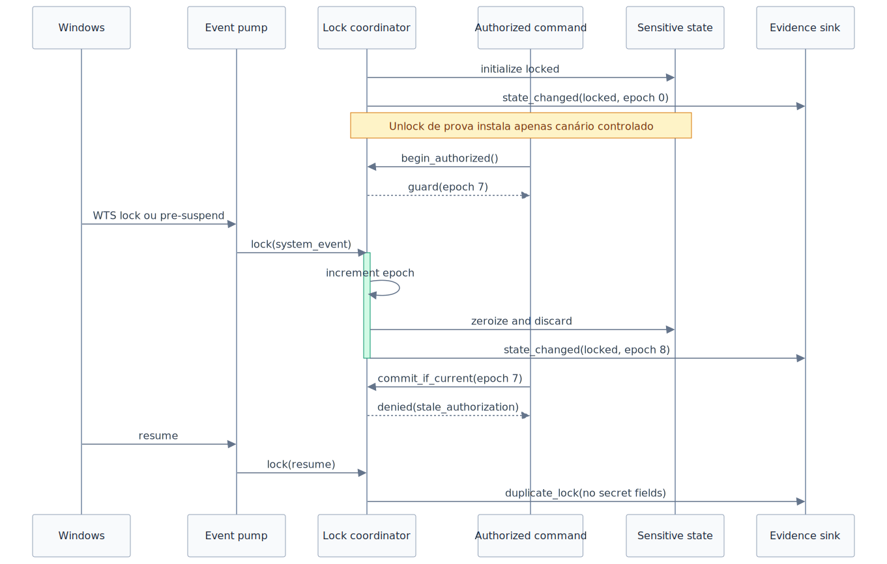

# Prova de Integração Windows e Tauri — Design

**Milestone:** M0 — Fundação de segurança
**Status:** Implementação pausada em 2026-07-19 após T14
**Spec:** [spec.md](./spec.md)

## Resumo

A prova será um harness isolado da aplicação de produção. Ele exercita a fronteira Tauri, o ciclo de vida de um canário em memória, eventos nativos do Windows e scanners de diagnóstico/bundle sem conectar o cofre funcional nem expor comandos de teste no artefato normal.

O core começa bloqueado. Toda autorização captura uma `epoch`; qualquer lock incrementa essa `epoch`, zera e descarta o estado sensível e invalida operações concorrentes antes que elas produzam uma resposta. Eventos WTS e de energia chegam por uma thread Win32 dedicada e convergem no mesmo coordenador usado pelo lock manual.

As evidências usam `pass`, `fail`, `inconclusive` ou `skipped`. Ausência de canário em dump, pagefile ou hiberfil não será tratada como prova de erradicação.

## Decisões de arquitetura

### D-WINT-01 — Harness fora do bundle normal

- O código de prova fica atrás da feature Cargo `security-proof`.
- O build normal e o workflow de release não habilitam essa feature.
- `tauri.conf.json` lista explicitamente somente capabilities de produção.
- `tauri.security-proof.conf.json` é um overlay versionado que adiciona a janela `security-proof` e sua capability.
- O scanner falha se comandos, assets, capability ou marcadores do harness aparecerem no bundle normal.

Isso evita manter uma API de diagnóstico privilegiada dormente em produção.

O build candidato do harness será invocado por um script versionado equivalente a:

```powershell
pnpm tauri build --config src-tauri/tauri.security-proof.conf.json --features security-proof
```

O script não dependerá de configuração implícita: verificará a composição com o config base, a lista final `app.security.capabilities`, labels das janelas e features Cargo. A configuração efetiva normalizada e os hashes dos manifests ACL gerados serão preservados junto à evidência. O build normal terá uma asserção simétrica de que `security-proof` está ausente.

### D-WINT-02 — Autoridade Tauri explícita

Comandos customizados não dependerão do comportamento permissivo padrão do `invoke_handler`. `build.rs` declarará cada comando no `tauri_build::AppManifest`, permitindo que a Runtime Authority aplique permissões por capability.

O baseline de produção terá:

- conteúdo local apenas e nenhuma URL remota em capabilities;
- capabilities limitadas por label de janela;
- permissões individuais, sem `core:default`;
- CSP explícita, sem CDN ou `unsafe-eval`;
- `dangerousDisableAssetCspModification` ausente ou `false`;
- `freezePrototype: true` e `devtools: false`;
- inventário explícito de plugins e features Cargo.

A janela principal não recebe comandos de prova. A janela `security-proof` existe somente no build de prova e recebe apenas permissões específicas.

### D-WINT-03 — Core independente de Tauri e Windows

As regras ficam em Rust puro. Adaptadores apenas traduzem entradas:

```text
WebView -> Runtime Authority -> comando estreito -> AuthorizationGuard
Windows -> EventPump -> SecuritySignal -> LockCoordinator
```

Nenhum adaptador acessa diretamente chaves nem decide se uma operação está autorizada.

### D-WINT-04 — Lock vence corridas

`LockCoordinator` mantém estado `Locked | Unlocked`, uma `epoch: u64` monotônica durante a vida do processo, um proprietário exclusivo do `SensitiveState` e o motivo não sensível do último lock.

`begin_authorized()` só cria `AuthorizationGuard { epoch }` se o estado estiver aberto. Imediatamente antes da ação e da produção do DTO allowlisted, `commit_if_current(guard)` revalida estado e epoch sob o mesmo lock lógico. Um lock que adquira o coordenador antes desse commit incrementa a epoch, zeroiza e invalida a guarda antiga com `stale_authorization`.

Essa garantia não é revogação ponta a ponta: uma resposta já entregue à WebView não pode ser recolhida se um lock chegar depois. Por isso, comandos de prova e produção não devolvem material protegido, e os testes distinguem “lock adquirido antes do commit” de “lock recebido após resposta concluída”.

Eventos duplicados ou fora de ordem são idempotentes. Startup, resume e encerramento sempre convergem para `Locked`.

### D-WINT-05 — Listener Windows dedicado

`WindowsEventPump` roda em uma thread nativa e possui uma janela Win32 top-level oculta com message loop. Ela não será uma message-only window, pois esse tipo não recebe todos os broadcasts do sistema.

| Origem | Mensagem | Sinal interno | Política |
| --- | --- | --- | --- |
| WTS | `WM_WTSSESSION_CHANGE / WTS_SESSION_LOCK` | `SessionLocked` | Lock imediato |
| Energia | `WM_POWERBROADCAST / PBT_APMSUSPEND` | `Suspending` | Lock imediato |
| Energia | `PBT_APMRESUMEAUTOMATIC`, `PBT_APMRESUMESUSPEND`, `PBT_APMRESUMECRITICAL` | `Resumed` | Reaplica lock |
| Shutdown | `WM_QUERYENDSESSION`, `WM_ENDSESSION` | `ShuttingDown` | Limpeza mínima best-effort |
| Tauri | `RunEvent::ExitRequested` | `Exiting` | Lock síncrono antes de permitir saída |
| Tauri | `RunEvent::Exit` | `Exiting` | Fallback idempotente final |

`WTSRegisterSessionNotification` pode falhar com `RPC_S_INVALID_BINDING` durante a inicialização. O pump fará retry limitado com backoff e emitirá somente código/estado não sensível. O registro será desfeito no shutdown normal.

Callbacks de shutdown não são garantia de limpeza: kill, crash, perda de energia e limites de tempo permanecem riscos residuais.

O app será construído e executado por `App::run`, cujo callback trata `ExitRequested` como ponto primário. `Exit` reaplica o lock como fallback, sem alegar que esse último evento sempre oferece tempo útil. `WindowEvent::CloseRequested` só entra no caminho quando a configuração da janela realmente implica encerramento do app; ele não substitui os eventos globais. Mensagens de energia desconhecidas nunca desbloqueiam.

## Visão dos limites



Fonte: [security-boundary-flowchart.mmd](./security-boundary-flowchart.mmd)

## Componentes

### `security::lock`

Responsável por estado, epoch, invalidação e descarte. API candidata:

```rust
pub struct AuthorizationGuard {
    epoch: u64,
}

impl LockCoordinator {
    pub fn begin_authorized(&self) -> Result<AuthorizationGuard, SecurityError>;
    pub fn commit_if_current<T>(
        &self,
        guard: AuthorizationGuard,
        action: impl FnOnce(&mut SensitiveState) -> Result<T, SecurityError>,
    ) -> Result<T, SecurityError>;
    pub fn lock(&self, reason: LockReason) -> LockOutcome;
}
```

`LockReason`, `LockOutcome` e erros usam enums/códigos estáveis, sem material sensível.

### `security::memory`

O PoC usa alocação dedicada no Windows:

1. `VirtualAlloc` reserva e confirma páginas exclusivas.
2. O canário é copiado para a região.
3. `VirtualLock` é tentado e seu resultado vira `PageLockStatus`.
4. No descarte, toda a capacidade é sobrescrita; `VirtualUnlock` e `VirtualFree` concluem a liberação.

Uma página dedicada evita bloquear uma página do allocator compartilhada com outros objetos. A implementação encapsula `unsafe`, não implementa `Clone`, `Debug`, `Display` ou serialização e expõe apenas operações controladas.

Falha de `VirtualLock` resulta em `Degraded`, não sucesso silencioso nem crash. A prova continua, registra somente o código da plataforma e marca a garantia de não paginação como indisponível. Uma política mais rígida poderá ser escolhida pela feature funcional após os resultados.

O wrapper é experimental e não substitui `Key32` nesta feature.

### `platform::windows_events`

Compilado apenas em Windows, com dependência `windows` target-specific e lista mínima de features Win32. O módulo:

- cria e possui a janela oculta;
- registra notificações WTS;
- converte mensagens em `SecuritySignal`;
- envia sinais por canal para o core;
- mantém o callback livre de criptografia e trabalho bloqueante;
- encerra o message loop e desfaz registros de forma idempotente.

### `proof::commands`

Disponível somente com `security-proof`:

| Comando | Entrada | Saída allowlisted |
| --- | --- | --- |
| `proof_install_canary` | bytes limitados + nonce do cenário | `{ state, epoch, page_lock_status }` |
| `proof_authorized_probe` | identificador limitado | `{ authorized, epoch }` |
| `proof_lock` | enum fechado | `{ state, epoch, changed }` |
| `proof_status` | nenhuma | `{ state, epoch, listener_status }` |

Nenhuma saída contém senha, canário, chave, plaintext, endereço de memória ou mensagem bruta do sistema. Limites são validados antes de copiar/alocar. Campos desconhecidos, enums inválidos, profundidade excessiva e comandos sem capability são negados.

### `security::diagnostics`

Somente eventos estruturados definidos por enum chegam ao sink:

```text
state_changed { state, epoch, reason }
windows_listener { component, status, platform_code? }
page_lock { status, platform_code? }
proof_result { proof_id, result }
```

O sink não aceita mapas ou strings arbitrárias. Erros externos são convertidos em código estável na fronteira. Panic hooks do harness imprimem apenas identificador de cenário e localização de código quando disponível.

O hook fechado será instalado antes de qualquer canário. Testes de panic executam um processo filho e coletam stdout, stderr, código de saída e artefatos externos, inclusive saídas que não passaram pelo sink. Isso cobre o hook padrão e mensagens de dependências em vez de assumir que toda saída usa `security::diagnostics`.

### Scanner e orquestrador

`scripts/security/scan-release.ps1`:

- audita sources, configuração efetiva normalizada, manifests ACL gerados, Cargo features e plugins;
- procura padrões proibidos em artefatos e arquivos empacotados;
- extrai NSIS com 7-Zip no CI antes de varrer seu conteúdo;
- falha se não conseguir inspecionar um formato obrigatório;
- aceita exceções apenas por rule id, caminho exato e justificativa versionada.

Padrões mínimos: PEM/private key, secrets conhecidos de CI, canários, `.env`, source maps não autorizados, DevTools, assets/comandos/capability de prova e configuração remota inesperada.

Capabilities podem ser insumo compilado e não texto recuperável do NSIS. Sua ausência será provada pela configuração efetiva e por teste comportamental do binário normal; a busca textual no instalador é apenas uma camada adicional.

`scripts/security/run-windows-proof.ps1` executa somente ações não administrativas por padrão e grava em `.artifacts/security-proof/<run-id>/`. Experimentos com WER, hibernação, BitLocker ou leitura offline exigem modo explícito e confirmação humana.

## Fluxo de lock concorrente



Fonte: [lock-lifecycle-sequence.mmd](./lock-lifecycle-sequence.mmd)

## Contrato de evidência

Cada cenário gera:

```json
{
  "schema_version": 1,
  "proof_id": "WINT-07-session-lock",
  "requirement_ids": ["WINT-07", "WINT-08"],
  "result": "pass",
  "environment": {
    "windows_build": "number",
    "architecture": "x86_64",
    "app_version": "semver",
    "commit": "git-sha",
    "build_profile": "release",
    "bitlocker": "on|off|unknown"
  },
  "observations": [{ "code": "STATE_LOCKED", "count": 1 }],
  "artifact_hashes": [],
  "limitations": []
}
```

Regras:

- `result` ∈ `pass | fail | inconclusive | skipped`;
- canário e input sensível nunca são persistidos;
- dumps brutos não são versionados;
- `pass` exige observação positiva definida pelo cenário;
- mídia opaca ou cobertura não demonstrável produz `inconclusive`;
- paths locais e nome de usuário são normalizados ou omitidos.

## Design dos testes

### Camada 1 — Unitários Rust

- startup bloqueado, lock idempotente e epoch monotônica;
- evento duplicado/fora de ordem;
- corrida determinística entre guarda e lock;
- zeroização observável no buffer controlado;
- `PageLockStatus` em sucesso e falha injetada;
- diagnóstico sem campos livres/sensíveis;
- ausência de serialização para tipos sensíveis.

### Camada 2 — Integração Windows

- criação e encerramento do event pump;
- retry de WTS e tradução de mensagens sintéticas;
- `VirtualAlloc`/`VirtualLock`/zeroização/descarte;
- resume sem evento prévio mantém lock;
- crash/panic controlado e busca de canário nas saídas.

Mensagens sintéticas verificam a lógica; a matriz manual verifica a entrega real do Windows.

### Camada 3 — Tauri E2E

Build release-like com `security-proof`, WebDriver e janela dedicada:

- capability permite apenas comandos declarados;
- janela principal recebe negação;
- comando desconhecido, payload inválido e oversize não causam efeito;
- XSS local controlado não amplia authority;
- input sensível sai do DOM/estado após concluir, cancelar e lock;
- lock concorrente impede resposta protegida.

### Camada 4 — Bundle normal

- auditoria de config, ACL, CSP, plugins e DevTools;
- extração e scan do NSIS;
- ausência do harness e padrões proibidos;
- chave pública/endpoints do updater comparados à allowlist;
- falha fechada quando um artefato não é inspecionável.

### Camada 5 — Laboratório manual

Uma runbook separada cobrirá lock, sleep, hibernação, shutdown, WER LocalDumps, pagefile/hiberfil quando acessíveis, BitLocker, DPAPI e limites de TPM. O laboratório não altera registro, energia ou BitLocker sem consentimento explícito. Falta de acesso administrativo vira `skipped` ou `inconclusive`.

## DPAPI, TPM e armazenamento do sistema

DPAPI será testado apenas com canário e blob local descartáveis, imutáveis para o teste, usando `CRYPTPROTECT_UI_FORBIDDEN`. Falhas de perfil, máquina ou disponibilidade devem preservar o blob byte a byte. O PoC não protege GMK nem altera envelopes do cofre, portanto não prova ainda ausência de corrupção na integração funcional. `CRYPTPROTECT_LOCAL_MACHINE` não será usado para afirmar isolamento entre usuários.

TPM permanece exploratório: nenhuma API ou formato entra no caminho crítico até que se prove portabilidade, recuperação e comportamento de falha. O backup portátil continuará dependente da senha mestra.

BitLocker reduz exposição offline de volume, pagefile e hiberfil, mas não protege RAM de uma sessão em execução. Resultados serão vinculados ao estado observado.

## Estrutura candidata

```text
src-tauri/
├── build.rs
├── capabilities/{default.json,security-proof.json}
├── src/security/{diagnostics.rs,lock.rs,memory.rs}
├── src/platform/windows/events.rs
├── src/proof/{commands.rs,mod.rs}
└── tests/windows_security_proof.rs
e2e/security-proof/
scripts/security/{run-windows-proof.ps1,scan-release.ps1,scanner-allowlist.json}
.artifacts/security-proof/       # ignorado
```

O source pode conter a capability e o harness, mas o config normal os exclui explicitamente e o scanner confirma a ausência no bundle.

## Falhas e limites

| Risco | Tratamento |
| --- | --- |
| `VirtualLock` indisponível | `Degraded`; zeroização continua |
| Evento pré-suspend perdido | Qualquer resume reaplica lock |
| Shutdown sem tempo | Não prometer limpeza |
| Lock concorrente | Epoch revalidada no commit |
| WTS indisponível no startup | Retry; estado continua bloqueado |
| Dump/pagefile não inspecionável | `inconclusive`, nunca `pass` |
| Scanner não extrai instalador | Falha do gate |
| Harness no bundle normal | Falha do scanner/CI |
| Mesmo usuário comprometido | DPAPI não é fronteira suficiente |

## Rastreabilidade

| Requirement | Componentes/testes | Estado |
| --- | --- | --- |
| WINT-01 | AppManifest, capabilities, E2E ACL/XSS | Coberto |
| WINT-02 | `AuthorizationGuard`, validação backend | Coberto |
| WINT-03 | DTOs limitados, inválidos/oversize | Coberto |
| WINT-04 | respostas allowlisted, scan de saída | Coberto |
| WINT-05 | `SensitiveState`, zeroização, coordinator | Coberto |
| WINT-06 | `PageLockStatus`, falha injetada/lab | Coberto |
| WINT-07 | `WindowsEventPump`, matriz real/sintética | Coberto |
| WINT-08 | epoch, startup/resume/exit locked | Coberto |
| WINT-09 | diagnóstico fechado, canários | Coberto |
| WINT-10 | panic hook, WER/dump runbook | Coberto |
| WINT-11 | auditoria, extração e scan NSIS | Coberto |
| WINT-12 | BitLocker/pagefile/hiberfil | Coberto, experimental |
| WINT-13 | DPAPI/blob descartável; integração do cofre e TPM adiadas | Coberto parcialmente, experimental |

**Cobertura:** 13/13 requisitos mapeados; 0/13 implementados.

## Sequência recomendada

1. Estado/epoch e testes de corrida.
2. Diagnóstico allowlisted e contrato de evidência.
3. Região de memória Windows e política de degradação.
4. Event pump Win32.
5. AppManifest, configs e comandos do harness.
6. E2E de authority/XSS.
7. Scanner de source/bundle/NSIS.
8. Orquestrador, runbook e matriz manual.
9. PoC DPAPI; decisão separada sobre TPM.

As etapas serão decompostas em tarefas atômicas após aprovação deste design.

## Questões para os protótipos

- Qual canal reduz mais o caminho crítico entre a thread Win32 e o coordenador sem deadlock?
- O CI permite teste WTS real ou somente mensagens sintéticas?
- Quais seções do NSIS o 7-Zip do runner extrai de forma verificável?
- A feature funcional aceitará `VirtualLock` degradado ou oferecerá modo estrito?
- Quais artefatos WER podem ser coletados sem alteração permanente da máquina?

Essas respostas refinam o grau de evidência, sem mudar a fronteira ou a política fail-closed.

## Fontes primárias

- [Tauri Runtime Authority](https://v2.tauri.app/security/runtime-authority/)
- [Tauri Capabilities](https://v2.tauri.app/security/capabilities/)
- [Tauri Permissions](https://v2.tauri.app/security/permissions/)
- [Tauri Configuration Reference](https://v2.tauri.app/reference/config/)
- [Tauri Testing](https://v2.tauri.app/develop/tests/)
- [Tauri WebDriver](https://v2.tauri.app/develop/tests/webdriver/)
- [WTSRegisterSessionNotification](https://learn.microsoft.com/windows/win32/api/wtsapi32/nf-wtsapi32-wtsregistersessionnotification)
- [WM_POWERBROADCAST](https://learn.microsoft.com/windows/win32/power/wm-powerbroadcast)
- [VirtualLock](https://learn.microsoft.com/windows/win32/api/memoryapi/nf-memoryapi-virtuallock)
- [CryptProtectData](https://learn.microsoft.com/windows/win32/api/dpapi/nf-dpapi-cryptprotectdata)
- [WER LocalDumps](https://learn.microsoft.com/windows/win32/wer/collecting-user-mode-dumps)
- [BitLocker FAQ](https://learn.microsoft.com/windows/security/operating-system-security/data-protection/bitlocker/faq)
