# Prova de Integração Windows e Tauri — Tarefas

**Design:** [design.md](./design.md)
**Status:** Paused — encerrada por decisão do usuário em 2026-07-19
**Execution:** T01–T14 concluídas; T15–T22 permanecem pendentes para eventual retomada
**Baseline conhecido:** 53 testes Rust e 88 testes frontend (STATE, 2026-07-16)
**Regra de execução:** uma tarefa por commit; testes co-localizados; nenhuma redução silenciosa do baseline.

## Plano de execução

### Fase 0 — Contrato e fundação

`T01 → T02`

### Fase 1 — Núcleo e adaptadores

Após T02, `T03`, `T04`, `T09` e `T10` podem avançar em paralelo. `T05`, `T06` e toda tarefa com teste Windows/integração permanecem serializadas.



Fonte: [tasks-foundation-flowchart.mmd](./tasks-foundation-flowchart.mmd)

### Fase 2 — Authority e harness



Fonte: [tasks-authority-flowchart.mmd](./tasks-authority-flowchart.mmd)

### Fase 3 — Evidência, distribuição e laboratório



Fonte: [tasks-evidence-flowchart.mmd](./tasks-evidence-flowchart.mmd)

## Tarefas

### T01 — Fechar o contrato de testes da prova

**Status:** ✅ Complete — 2026-07-17

**What:** Atualizar a matriz de testes com comandos, isolamento e paralelismo para Rust Windows, IPC, WebDriver, scripts PowerShell e laboratório manual.
**Where:** `.specs/codebase/TESTING.md`
**Depends on:** None
**Reuses:** comandos `pnpm check:*` e padrões atuais de testes co-localizados.
**Requirements:** WINT-01–13
**Agent:** Terra
**Tools:** skill `delegate-small-tasks`; sem MCP.

**Done when:**

- [x] Cada nova camada possui tipo, caminho, comando e política de paralelismo.
- [x] Os comandos serializados usam `--test-threads=1` quando acessam estado do Windows/Tauri.
- [x] Compile smokes são `cargo check --manifest-path src-tauri/Cargo.toml` e a variante com `--features security-proof`.
- [x] A matriz inclui os comandos e paths de IPC, WebDriver e PowerShell que ainda estão “a definir”.
- [x] O baseline foi registrado como não revalidado porque `pnpm --version` excedeu 10 segundos; nenhuma instalação/download foi tentada.
- [x] `git diff --check` passa.

**Tests:** none — documentação da infraestrutura.
**Gate:** `git diff --check`
**Commit:** `docs(testes): definir matriz da prova windows`

### T02 — Declarar a fundação Cargo da prova

**Status:** ✅ Complete — 2026-07-17

**What:** Adicionar a feature `security-proof`, dependências Win32 target-specific mínimas e módulos vazios compiláveis.
**Where:** `src-tauri/Cargo.toml`, `src-tauri/src/lib.rs`, `src-tauri/src/{security,platform,proof}/mod.rs`
**Depends on:** T01
**Reuses:** feature `updater` e organização atual de `crypto`.
**Requirements:** WINT-05, WINT-07, WINT-13
**Agent:** Main
**Tools:** skill `test-driven-development`; documentação oficial da crate `windows`.

**Done when:**

- [x] Build normal não habilita `security-proof`.
- [x] Features Win32 são mínimas e documentadas.
- [x] Builds com e sem `security-proof` compilam em Windows.
- [x] `pnpm check:rust` passa com 53 testes Rust, sem redução do baseline.

**Tests:** none — configuração/build.
**Gate:** `pnpm check:rust`; `cargo check --manifest-path src-tauri/Cargo.toml`; repetir com `--features security-proof`.
**Commit:** `build(seguranca): preparar feature security-proof`

### T03 — Implementar diagnóstico e modelo de evidência [P]

**Status:** ✅ Complete — 2026-07-17

**What:** Criar enums allowlisted de diagnóstico e `ProofResult` versionado, sem campos arbitrários ou sensíveis.
**Where:** `src-tauri/src/security/diagnostics.rs`
**Depends on:** T02
**Reuses:** `serde`, `thiserror` e padrões de erro do módulo `crypto`.
**Requirements:** WINT-09, WINT-10, WINT-12, WINT-13
**Agent:** Main
**Tools:** skill `test-driven-development`.

**Done when:**

- [x] Resultados aceitam somente `pass|fail|inconclusive|skipped`.
- [x] Ambiente, observações e limitações seguem o contrato do design.
- [x] Paths/usuário/canário não entram no schema.
- [x] 11 testes unitários nomeados cobrem serialização, allowlist e rejeições.
- [x] `pnpm check:rust` passa com 64 testes Rust.

**Tests:** unit
**Gate:** `pnpm check:rust`
**Commit:** `feat(seguranca): modelar diagnosticos e evidencias`

### T04 — Implementar o coordenador de lock por epoch [P]

**Status:** ✅ Complete — 2026-07-17

**What:** Criar `LockCoordinator`, `AuthorizationGuard` e commit revalidado, com lock idempotente.
**Where:** `src-tauri/src/security/lock.rs`
**Depends on:** T02
**Reuses:** tipos sensíveis e zeroização já usados em `crypto::secret`.
**Requirements:** WINT-02, WINT-05, WINT-08
**Agent:** Main
**Tools:** skill `test-driven-development`.

**Done when:**

- [x] Startup começa bloqueado e epoch é monotônica.
- [x] Lock incrementa epoch antes de descartar estado.
- [x] Guarda antiga falha com código estável.
- [x] Ordens lock antes/depois do commit e panic fail-closed são testadas deterministicamente.
- [x] 10 testes unitários passam.
- [x] `pnpm check:rust` passa com 74 testes Rust.

**Tests:** unit
**Gate:** `pnpm check:rust`
**Commit:** `feat(seguranca): implementar lock por epoch`

### T05 — Implementar região sensível dedicada no Windows

**Status:** ✅ Complete — 2026-07-17

**What:** Encapsular `VirtualAlloc`, `VirtualLock`, zeroização, `VirtualUnlock` e `VirtualFree` em um tipo sem cópias ou formatação reveladora.
**Where:** `src-tauri/src/security/memory.rs`, `src-tauri/tests/windows_sensitive_memory.rs`
**Depends on:** T02
**Reuses:** `zeroize` e `Key32` apenas como referência de invariantes.
**Requirements:** WINT-05, WINT-06
**Agent:** Main
**Tools:** skill `test-driven-development`; documentação Microsoft.

**Done when:**

- [x] `unsafe` fica restrito ao módulo e possui invariantes documentadas.
- [x] Falha de page lock vira `Degraded` com código não sensível.
- [x] Drop sobrescreve a capacidade antes da liberação.
- [x] Tipo não implementa `Clone`, `Debug`, `Display` ou serialização.
- [x] 7 testes Windows serializados cobrem alocação, sucesso/degradação, zeroização e descarte.

**Tests:** integration Windows, serial
**Gate:** comando Windows definido em T01 e `pnpm check:rust`
**Commit:** `feat(seguranca): proteger regiao sensivel no windows`

### T06 — Mapear mensagens Windows para sinais de segurança

**Status:** ✅ Complete — 2026-07-17

**What:** Criar tradução pura e exaustiva de WTS, energia e shutdown para `SecuritySignal`.
**Where:** `src-tauri/src/platform/windows/events.rs`
**Depends on:** T02, T04
**Reuses:** enum `LockReason` de T04, sem depender do pump nativo.
**Requirements:** WINT-07, WINT-08
**Agent:** Terra
**Tools:** skill `test-driven-development`; documentação Microsoft.

**Done when:**

- [x] Lock, pre-suspend, três resumes e shutdown possuem mapeamento explícito.
- [x] Mensagem desconhecida nunca desbloqueia.
- [x] Tabela com 10 casos unitários passa.
- [x] `pnpm check:rust` passa com 75 testes Rust.

**Tests:** unit
**Gate:** `pnpm check:rust`
**Commit:** `feat(windows): mapear eventos de seguranca`

### T07 — Implementar o event pump Win32

**Status:** ✅ Complete — 2026-07-18

**What:** Criar thread com janela top-level oculta, message loop, registro WTS, retry limitado e canal para o coordenador.
**Where:** `src-tauri/src/platform/windows/events.rs`, `src-tauri/tests/windows_security_proof.rs`
**Depends on:** T04, T06
**Reuses:** tradução pura de T06 e coordinator de T04.
**Requirements:** WINT-07, WINT-08
**Agent:** Main
**Tools:** skill `test-driven-development`; documentação Microsoft.

**Done when:**

- [x] Não usa message-only window.
- [x] Callback só traduz/envia sinais e não executa criptografia.
- [x] `RPC_S_INVALID_BINDING` recebe retry limitado.
- [x] Registro e thread encerram idempotentemente.
- [x] 9 testes Windows serializados passam.

**Tests:** integration Windows, serial
**Gate:** comando Windows definido em T01 e `pnpm check:rust`
**Commit:** `feat(windows): implementar event pump de seguranca`

### T08 — Integrar lock ao ciclo de saída Tauri

**Status:** ✅ Complete — 2026-07-18

**What:** Tratar `RunEvent::ExitRequested` como lock primário e `RunEvent::Exit` como fallback idempotente.
**Where:** `src-tauri/src/lib.rs`, `src-tauri/tests/windows_security_proof.rs`
**Depends on:** T04, T07
**Reuses:** inicialização atual do updater e `LockCoordinator`.
**Requirements:** WINT-07, WINT-08
**Agent:** Main
**Tools:** skill `test-driven-development`; documentação Tauri.

**Done when:**

- [x] Lock síncrono ocorre antes de permitir saída normal.
- [x] `Exit` não promete tempo útil e apenas reaplica a operação idempotente.
- [x] `CloseRequested` não substitui eventos globais.
- [x] 6 cenários de lifecycle/ownership passam na suíte serial (15 testes no total).

**Tests:** integration, serial
**Gate:** comando Windows definido em T01 e `pnpm check:rust`
**Commit:** `feat(tauri): bloquear estado na saida`

### T09 — Registrar comandos próprios no AppManifest [P]

**Status:** ✅ Complete — 2026-07-17

**What:** Fazer `build.rs` declarar somente os comandos de prova quando `security-proof` estiver ativa.
**Where:** `src-tauri/build.rs`
**Depends on:** T02
**Reuses:** `tauri_build::Attributes` e `AppManifest`.
**Requirements:** WINT-01
**Agent:** Main
**Tools:** skill `test-driven-development`; documentação Tauri build.

**Done when:**

- [x] Build normal gera zero permissões de comandos de prova.
- [x] Build de prova gera somente as 8 permissões allow/deny esperadas.
- [x] Manifest gerado foi inspecionado nos dois modos.
- [x] Compile smoke passa nos dois modos.

**Tests:** none — configuração/build.
**Gate:** `cargo check --manifest-path src-tauri/Cargo.toml`; repetir com `--features security-proof`.
**Commit:** `build(tauri): declarar comandos no app manifest`

### T10 — Endurecer a configuração Tauri de produção [P]

**Status:** ✅ Complete — 2026-07-17

**What:** Tornar capabilities, CSP, prototype freeze, DevTools, janelas e plugins explicitamente mínimos no config normal.
**Where:** `src-tauri/tauri.conf.json`, `src-tauri/capabilities/default.json`
**Depends on:** T02
**Reuses:** CSP e capability mínima existentes.
**Requirements:** WINT-01, WINT-11
**Agent:** Main
**Tools:** documentação oficial Tauri.

**Done when:**

- [x] `app.security.capabilities` lista somente produção.
- [x] `devtools: false`, `freezePrototype: true` e asset CSP segura estão explícitos.
- [x] Não há remote URLs nem `core:default`.
- [x] `pnpm check` e `pnpm build --no-bundle` passam.

**Tests:** none — configuração/build.
**Gate:** `pnpm check` e `pnpm build --no-bundle`
**Commit:** `chore(tauri): restringir configuracao de producao`

### T11 — Criar overlay e capability do build de prova

**Status:** ✅ Complete — 2026-07-18

**What:** Criar overlay, capability, comando de build e verificador da configuração efetiva normal/prova.
**Where:** `src-tauri/tauri.security-proof.conf.json`, `src-tauri/capabilities/security-proof.json`, `scripts/security/assert-effective-config.ps1`, `scripts/security/tests/assert-effective-config.tests.ps1`
**Depends on:** T09, T10
**Reuses:** labels e permissions geradas por T09.
**Requirements:** WINT-01, WINT-11
**Agent:** Main
**Tools:** skill `test-driven-development`; Tauri CLI.

**Done when:**

- [x] Overlay cria somente a janela `security-proof`.
- [x] Capability de prova não está ativa no config normal.
- [x] Verificador compara config efetivo, labels, features e ACL gerada.
- [x] Build normal falha se `security-proof` vazar; build de prova falha se capability faltar.
- [x] Self-test passa com 8 cenários no Windows PowerShell; `pwsh` não está disponível no host.
- [x] Dois modos passam nos comandos Cargo exatos de T01.

**Tests:** integration de build/config, serial
**Gate:** self-test PowerShell; `cargo check --manifest-path src-tauri/Cargo.toml`; repetir com `--features security-proof`
**Commit:** `test(tauri): criar build isolado de prova`

### T12 — Implementar comandos estreitos do harness

**Status:** ✅ Complete — 2026-07-18

**What:** Implementar quatro comandos de prova com DTOs limitados e testes IPC permitidos/negados.
**Where:** `src-tauri/src/proof/commands.rs`, `src-tauri/tests/security_proof_commands.rs`
**Depends on:** T03, T04, T05, T09, T11
**Reuses:** coordinator, memória e diagnóstico.
**Requirements:** WINT-01, WINT-02, WINT-03, WINT-04, WINT-05
**Agent:** Main
**Tools:** skill `test-driven-development`; Tauri mock runtime.

**Done when:**

- [x] `install_canary`, `authorized_probe`, `lock` e `status` validam inputs antes de alocar.
- [x] Respostas não incluem segredo, endereço ou erro bruto; o input sensível é zeroizado no Drop.
- [x] Janela principal/comando desconhecido/oversize/enum inválido são negados.
- [x] Lock concorrente anterior ao commit impede a ação.
- [x] 16 testes IPC serializados passam.

**Tests:** integration, serial
**Gate:** comando IPC definido em T01 e `pnpm check:rust`
**Commit:** `test(tauri): implementar comandos do harness`

### T13 — Criar a UI local do harness

**Status:** ✅ Complete — 2026-07-18

**What:** Criar UI de prova separada que limita o input e o remove de DOM/estado ao concluir, cancelar ou bloquear.
**Where:** `src/security-proof/`, `e2e/security-proof/vite.config.ts`
**Depends on:** T11
**Reuses:** Vue 3, Vitest e componentes/form patterns existentes.
**Requirements:** WINT-03, WINT-04, WINT-05
**Agent:** Terra
**Tools:** skill `test-driven-development`.

**Done when:**

- [x] Asset existe apenas no build de prova.
- [x] Nenhum input sensível vai para storage, query string ou log.
- [x] Sete testes unitários cobrem concluir/cancelar/lock/limites e entrypoint dedicado.
- [x] `pnpm test:frontend` passa com 95 testes (baseline 88 + 7), sem redução.

**Tests:** unit frontend
**Gate:** `pnpm check:frontend`
**Commit:** `test(frontend): criar interface do harness`

### T14 — Configurar e testar WebDriver para authority/XSS

**Status:** ✅ Complete — 2026-07-19

**What:** Criar suíte E2E Windows release-like que prova isolamento por janela, ACL e XSS controlado.
**Where:** `e2e/security-proof/wdio.*`, `e2e/security-proof/**/*.e2e.ts`, scripts do `package.json`
**Depends on:** T12, T13
**Reuses:** build de prova T11 e WebDriver Tauri 2.
**Requirements:** WINT-01, WINT-02, WINT-03, WINT-04
**Agent:** Main
**Tools:** skill `test-driven-development`; documentação Tauri WebDriver.

**Done when:**

- [x] Runner inicia o binário exato produzido pelo overlay verificado.
- [x] Oito cenários E2E cobrem allow, deny, malformed, oversize, labels e XSS.
- [x] XSS não amplia capability nem obtém material sensível.
- [x] Execução é serial e salva relatório sem canários.

**Tests:** e2e, serial
**Gate:** `pnpm test:e2e:security-proof` definido em T01
**Commit:** `test(tauri): provar authority via webdriver`

### T15 — Provar isolamento de panic e canais de saída

**What:** Criar binário filho de falha controlada e teste que varre stdout, stderr, exit code e artefatos contra canários.
**Where:** `src-tauri/src/bin/security_proof_panic.rs`, `src-tauri/tests/security_proof_diagnostics.rs`
**Depends on:** T03, T12
**Reuses:** panic hook e eventos allowlisted de T03.
**Requirements:** WINT-09, WINT-10
**Agent:** Main
**Tools:** skill `test-driven-development`.

**Done when:**

- [ ] Hook fechado instala antes do canário.
- [ ] Processo filho cobre panic e erro controlado.
- [ ] Coleta não depende somente do sink.
- [ ] Pelo menos 5 testes serializados confirmam ausência do canário e códigos esperados.

**Tests:** integration, serial
**Gate:** comando diagnóstico definido em T01
**Commit:** `test(seguranca): verificar panic e saidas`

### T16 — Implementar scanner fail-closed de release

**What:** Criar scanner de config efetivo, ACL, artefatos e NSIS com allowlist estrita e fixtures autocontidas.
**Where:** `scripts/security/scan-release.ps1`, `scripts/security/scanner-allowlist.json`, `scripts/security/fixtures/`, `scripts/security/tests/scan-release.tests.ps1`
**Depends on:** T10, T11
**Reuses:** verificador de config T11 e 7-Zip do runner Windows.
**Requirements:** WINT-09, WINT-10, WINT-11
**Agent:** Main
**Tools:** skill `test-driven-development`.

**Done when:**

- [ ] Scanner falha para PEM, canário, `.env`, source map, DevTools e harness em produção.
- [ ] Formato não extraível falha fechado.
- [ ] Allowlist exige rule id, path exato e justificativa.
- [ ] Ausência de capability é verificada por config/comportamento, não só strings do NSIS.
- [ ] Pelo menos 10 fixtures positivas/negativas passam em diretório temporário.

**Tests:** integration PowerShell, parallel-safe por temp dir
**Gate:** comando scanner definido em T01
**Commit:** `test(release): adicionar scanner fail-closed`

### T17 — Implementar PoC DPAPI descartável

**What:** Proteger/desproteger canário descartável com DPAPI e provar preservação byte a byte do blob nas falhas.
**Where:** `src-tauri/src/proof/dpapi.rs`, `src-tauri/tests/windows_security_proof.rs`
**Depends on:** T02, T03
**Reuses:** `ProofResult` e APIs Win32 target-specific.
**Requirements:** WINT-13
**Agent:** Main
**Tools:** skill `test-driven-development`; documentação Microsoft DPAPI.

**Done when:**

- [ ] Usa `CRYPTPROTECT_UI_FORBIDDEN`.
- [ ] Não usa GMK, cofre real ou `LOCAL_MACHINE` como garantia de isolamento.
- [ ] Falha não reescreve nem corrompe o blob.
- [ ] Pelo menos 6 testes Windows serializados passam ou marcam limitação explicitamente.

**Tests:** integration Windows, serial
**Gate:** comando Windows definido em T01
**Commit:** `test(windows): avaliar dpapi descartavel`

### T18 — Implementar o orquestrador de evidências

**What:** Criar runner não administrativo que executa provas, agrega `ProofResult`, hashes e limitações em diretório ignorado.
**Where:** `scripts/security/run-windows-proof.ps1`, `scripts/security/tests/run-windows-proof.tests.ps1`, `scripts/security/fixtures/proof-results/`
**Depends on:** T07, T12, T15, T16, T17
**Reuses:** schema T03 e comandos das provas anteriores.
**Requirements:** WINT-06–13
**Agent:** Main
**Tools:** skill `test-driven-development`.

**Done when:**

- [ ] Modo padrão não altera registro, energia ou BitLocker.
- [ ] Resultados usam `pass|fail|inconclusive|skipped`.
- [ ] Paths/usuário/canários são omitidos e artefatos recebem SHA-256.
- [ ] Pelo menos 6 self-tests cobrem agregação, falha parcial e cobertura incompleta.

**Tests:** integration PowerShell, serial
**Gate:** comando orquestrador definido em T01
**Commit:** `test(seguranca): orquestrar evidencias windows`

### T19 — Integrar o gate automatizado ao CI

**What:** Adicionar scripts agregados e job Windows que executa unitários, IPC, E2E, scanner e build normal sem harness.
**Where:** `package.json`, `.github/workflows/ci.yml`
**Depends on:** T14, T16, T18
**Reuses:** job Windows atual, pnpm pinado e comandos de T01.
**Requirements:** WINT-01–11
**Agent:** Main
**Tools:** GitHub Actions; skill `test-driven-development`.

**Done when:**

- [ ] Job usa timeouts e permissões mínimas.
- [ ] Testes Windows/Tauri rodam serialmente.
- [ ] Build normal é escaneado e falha se o harness aparecer.
- [ ] Artefato de evidência não contém dumps/canários.
- [ ] `pnpm check`, compile smoke e suíte automatizada completa passam.

**Tests:** none — configuração/build que executa todas as suítes co-localizadas.
**Gate:** `pnpm test:security-proof` seguido de `pnpm check` e `pnpm build --no-bundle`
**Commit:** `ci(seguranca): executar prova windows`

### T20 — Escrever o protocolo de laboratório [P]

**What:** Documentar matriz manual para lock/sleep/hibernação/shutdown, WER, pagefile/hiberfil, BitLocker e DPAPI/TPM.
**Where:** `.specs/features/windows-tauri-proof/lab-protocol.md`
**Depends on:** T18
**Reuses:** runner T18 e limites do design.
**Requirements:** WINT-07, WINT-08, WINT-10, WINT-12, WINT-13
**Agent:** Terra
**Tools:** skill `delegate-small-tasks`; documentação Microsoft.

**Done when:**

- [ ] Passos registram build/edição/arquitetura/BitLocker/permissões.
- [ ] Alterações administrativas exigem consentimento e possuem restauração.
- [ ] Ausência de canário não vira prova quando cobertura for opaca.
- [ ] Critérios pass/fail/inconclusive/skipped estão explícitos.
- [ ] `git diff --check` passa.

**Tests:** manual/documental
**Gate:** revisão cruzada contra WINT-07/08/10/12/13
**Commit:** `docs(seguranca): definir laboratorio windows`

### T21 — Executar a matriz manual do Windows

**What:** Executar o protocolo aprovado em ambientes disponíveis e coletar apenas relatórios sanitizados.
**Where:** `.artifacts/security-proof/<run-id>/` (ignorado) e resumo candidato em `.specs/features/windows-tauri-proof/evidence/`
**Depends on:** T19, T20
**Reuses:** CI local, runner e protocolo.
**Requirements:** WINT-06, WINT-07, WINT-08, WINT-10, WINT-12, WINT-13
**Agent:** Main + ação humana
**Tools:** PowerShell/Windows; aprovação explícita antes de registro, energia, hibernação ou acesso administrativo.

**Done when:**

- [ ] Cada cenário possui ambiente, resultado e limitações.
- [ ] Estado anterior de qualquer configuração alterada é restaurado.
- [ ] Nenhum dump bruto, canário ou dado pessoal é versionado.
- [ ] Cenários indisponíveis ficam `skipped`/`inconclusive`, sem fabricação de evidência.

**Tests:** manual UAT/laboratório, serial
**Gate:** checklist assinado pelo usuário para ações administrativas
**Commit:** `test(seguranca): registrar resultados do laboratorio`

### T22 — Consolidar evidência e fechar a feature

**What:** Consolidar resultados, atualizar threat model, rastreabilidade, spec, roadmap e STATE sem elevar controles inconclusivos.
**Where:** `.specs/features/windows-tauri-proof/`, threat model relacionado, `.specs/project/{ROADMAP,STATE}.md`
**Depends on:** T21
**Reuses:** `ProofResult` e relatórios sanitizados.
**Requirements:** WINT-01–13
**Agent:** Main
**Tools:** tlc-spec-driven.

**Done when:**

- [ ] Cada WINT aponta para teste/evidência e resultado.
- [ ] PT-04/05/07/09 são atualizados somente até o nível observado.
- [ ] PT-06/13 recebem veredito ou próximo experimento explícito.
- [ ] Spec/tasks/roadmap/state refletem o estado final real.
- [ ] `git diff --check` e gate completo passam.

**Tests:** none — documentação final.
**Gate:** `pnpm check`, `pnpm build --no-bundle`, scanner e revisão de rastreabilidade
**Commit:** `docs(seguranca): consolidar prova windows`

## Mapa de paralelismo

```text
T01 → T02
          ├─ T03 [P]
          ├─ T04 [P] → T06 → T07 → T08
          ├─ T05
          ├─ T09 [P]
          └─ T10 [P]

T09 + T10 → T11 → T13
T03 + T04 + T05 + T09 + T11 → T12
T12 + T13 → T14
T03 + T12 → T15
T10 + T11 → T16
T02 + T03 → T17
T07 + T12 + T15 + T16 + T17 → T18
T14 + T16 + T18 → T19
T18 → T20
T19 + T20 → T21 → T22
```

Somente tarefas `[P]` podem ser delegadas simultaneamente. Tarefas Windows, IPC, E2E e laboratório são serializadas mesmo quando seus arquivos não se sobrepõem.

## Verificação de granularidade

| Task | Entrega dominante | Escopo | Status |
| --- | --- | --- | --- |
| T01 | matriz de testes | 1 documento | ✅ |
| T02 | fundação Cargo | config + módulos vazios coesos | ✅ |
| T03 | modelo diagnóstico/evidência | 1 módulo | ✅ |
| T04 | coordinator | 1 módulo | ✅ |
| T05 | região de memória | 1 módulo | ✅ |
| T06 | tradutor de eventos | 1 função/módulo | ✅ |
| T07 | event pump | 1 componente + teste | ✅ |
| T08 | hook de saída | 1 integração + teste | ✅ |
| T09 | AppManifest | 1 arquivo de build | ✅ |
| T10 | config de produção | 1 configuração coesa | ✅ |
| T11 | build de prova | overlay + verificador inseparáveis | ✅ |
| T12 | endpoint IPC do harness | 1 command surface + teste | ✅ |
| T13 | UI do harness | 1 fluxo + teste | ✅ |
| T14 | suíte authority/XSS | 1 suíte E2E | ✅ |
| T15 | prova de panic/saídas | 1 cenário + teste | ✅ |
| T16 | scanner de release | 1 ferramenta + fixtures | ✅ |
| T17 | PoC DPAPI | 1 helper + teste | ✅ |
| T18 | orquestrador | 1 ferramenta + self-tests | ✅ |
| T19 | gate CI | 1 integração de pipeline | ✅ |
| T20 | protocolo manual | 1 documento | ✅ |
| T21 | execução do laboratório | 1 matriz | ✅ |
| T22 | fechamento de evidência | 1 consolidação documental | ✅ |

## Cross-check diagrama × dependências

| Task | Depends on | Diagramas mostram | Status |
| --- | --- | --- | --- |
| T01 | None | início | ✅ |
| T02 | T01 | T01→T02 | ✅ |
| T03 | T02 | T02→T03 | ✅ |
| T04 | T02 | T02→T04 | ✅ |
| T05 | T02 | T02→T05 | ✅ |
| T06 | T02,T04 | T02/T04→T06 | ✅ |
| T07 | T04,T06 | T04/T06→T07 | ✅ |
| T08 | T04,T07 | T04/T07→T08 | ✅ |
| T09 | T02 | T02→T09 | ✅ |
| T10 | T02 | T02→T10 | ✅ |
| T11 | T09,T10 | T09/T10→T11 | ✅ |
| T12 | T03,T04,T05,T09,T11 | cinco arestas→T12 | ✅ |
| T13 | T11 | T11→T13 | ✅ |
| T14 | T12,T13 | T12/T13→T14 | ✅ |
| T15 | T03,T12 | T03/T12→T15 | ✅ |
| T16 | T10,T11 | T10/T11→T16 | ✅ |
| T17 | T02,T03 | T02/T03→T17 | ✅ |
| T18 | T07,T12,T15,T16,T17 | cinco arestas→T18 | ✅ |
| T19 | T14,T16,T18 | T14/T16/T18→T19 | ✅ |
| T20 | T18 | T18→T20 | ✅ |
| T21 | T19,T20 | T19/T20→T21 | ✅ |
| T22 | T21 | T21→T22 | ✅ |

## Validação da co-localização de testes

| Task | Camada | Matriz exige | Task declara | Status |
| --- | --- | --- | --- | --- |
| T01 | documentação | none | none | ✅ |
| T02 | config/build | none | none + compile | ✅ |
| T03 | core Rust | unit | unit | ✅ |
| T04 | core Rust | unit | unit | ✅ |
| T05 | integração Windows | integration serial | integration serial | ✅ |
| T06 | core Rust | unit | unit | ✅ |
| T07 | integração Windows | integration serial | integration serial | ✅ |
| T08 | integração Tauri | integration serial | integration serial | ✅ |
| T09 | build | none | none + compile | ✅ |
| T10 | config/build | none | none + build | ✅ |
| T11 | config/build efetivo | integration serial | integration serial | ✅ |
| T12 | comandos IPC | integration serial | integration serial | ✅ |
| T13 | Vue | unit | unit | ✅ |
| T14 | fluxo crítico | e2e serial | e2e serial | ✅ |
| T15 | processo/diagnóstico | integration serial | integration serial | ✅ |
| T16 | script isolado | integration temp-dir | integration temp-dir | ✅ |
| T17 | integração Windows | integration serial | integration serial | ✅ |
| T18 | orquestrador Windows | integration serial | integration serial | ✅ |
| T19 | workflow/build | none | none; executa suítes | ✅ |
| T20 | documentação | manual | manual | ✅ |
| T21 | sistema real | manual UAT | manual UAT | ✅ |
| T22 | documentação | none | none + gates finais | ✅ |

## Rastreabilidade requirement → tasks

| Requirement | Tasks |
| --- | --- |
| WINT-01 | T09, T10, T11, T12, T14, T19 |
| WINT-02 | T04, T12, T14 |
| WINT-03 | T12, T13, T14 |
| WINT-04 | T12, T13, T14 |
| WINT-05 | T04, T05, T12, T13 |
| WINT-06 | T05, T18, T21 |
| WINT-07 | T06, T07, T08, T18, T20, T21 |
| WINT-08 | T04, T07, T08, T20, T21 |
| WINT-09 | T03, T15, T16, T19 |
| WINT-10 | T03, T15, T16, T18, T20, T21 |
| WINT-11 | T09, T10, T11, T16, T19 |
| WINT-12 | T03, T18, T20, T21 |
| WINT-13 | T03, T17, T18, T20, T21 |

**Coverage:** 13/13 requisitos mapeados, 22 tarefas, 5 tarefas paralelizáveis.

## Gate de aprovação

Antes de Execute:

- [x] Usuário aprova a decomposição e o escopo do laboratório.
- [x] Usuário confirma ferramentas/skills por tarefa ou aceita as recomendações acima.
- [ ] Ações administrativas de T21 continuam exigindo autorização separada no momento da execução.
